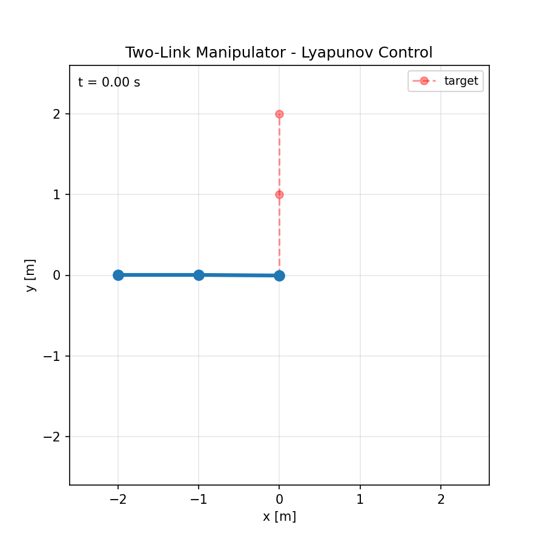
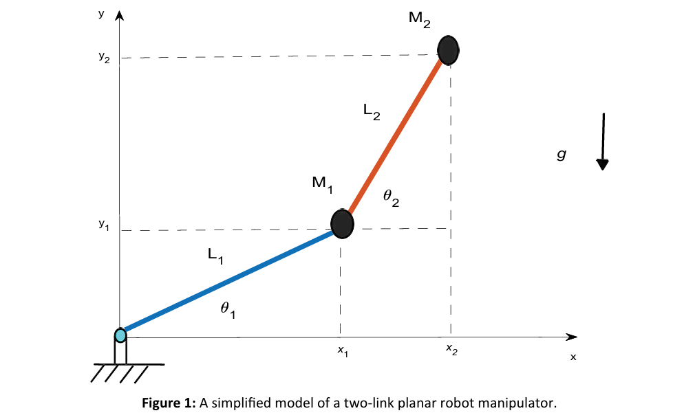
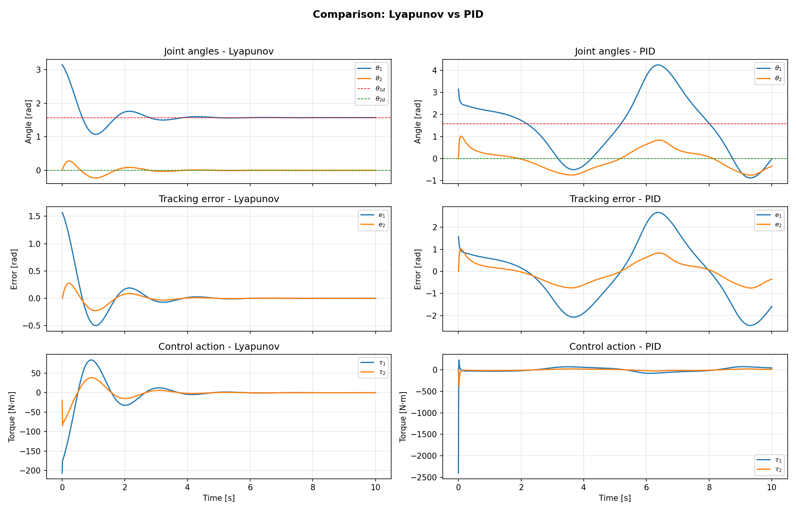
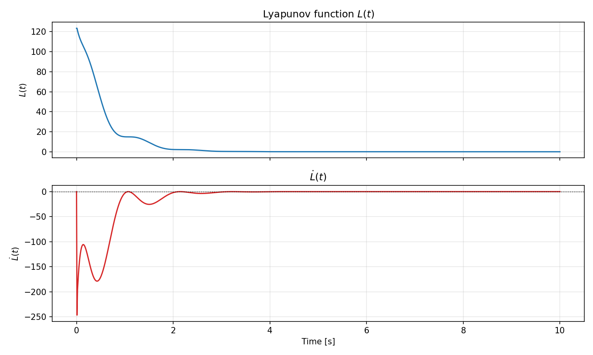
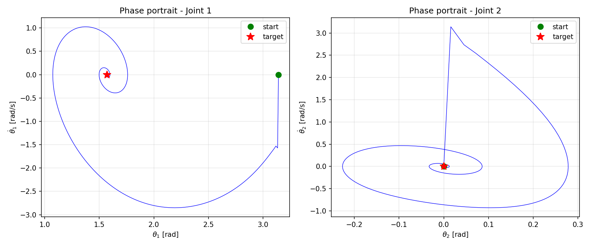
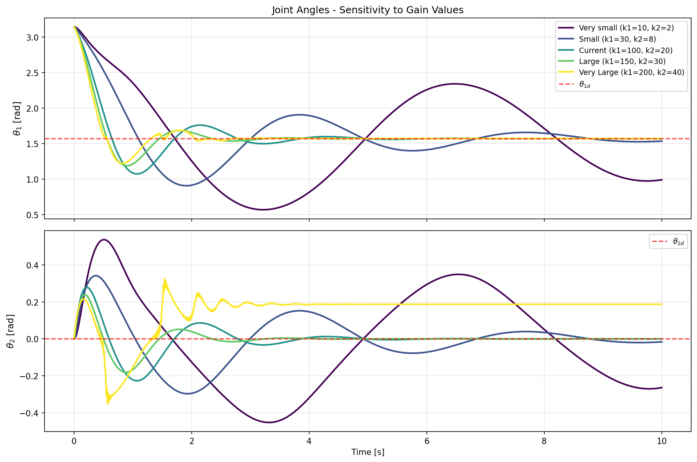
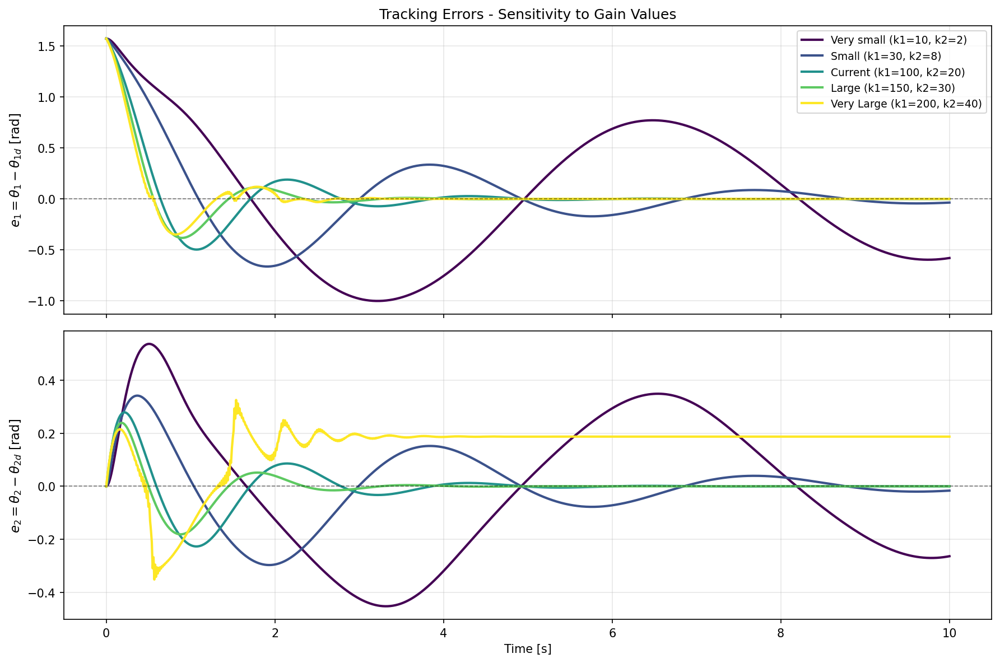
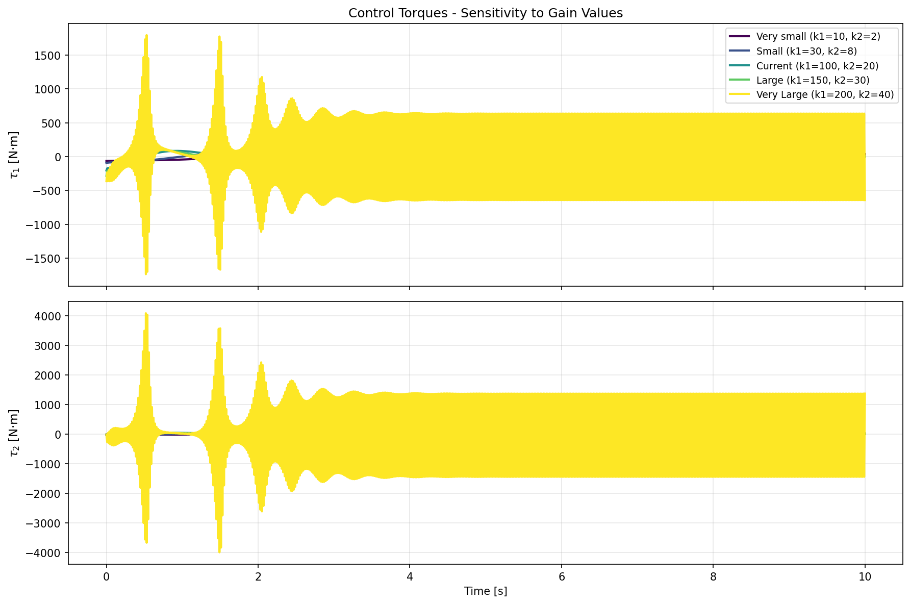
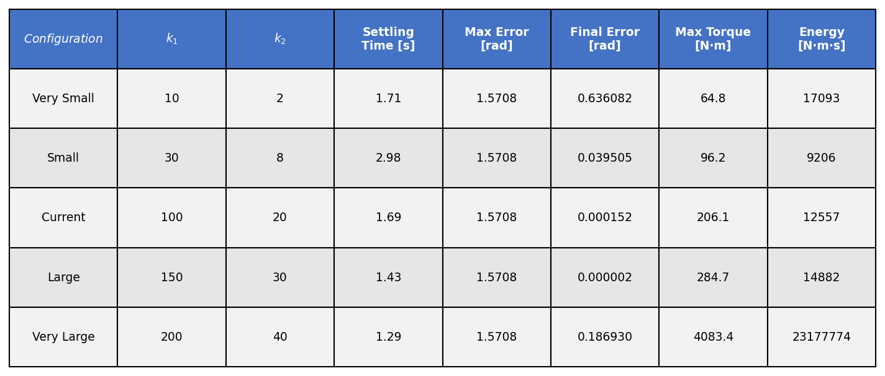

# Project 1: Lyapunov-Based Control of a Two-Link Robot Manipulator

<p align="center">
  
</p>

<p align="center">
  <em>Figure 0: Animation of the two-link manipulator stabilizing from an initial configuration (θ1=π, θ2=0) to the target position (θd=[π/2, 0]) using the Lyapunov-based controller.</em>
</p>

---

## 1. Problem Definition

**Control Problem:** Stabilization (regulation) of a planar two-link robot manipulator. The objective is to drive both joint angles from an arbitrary initial configuration to a desired fixed target configuration $\theta_d$ and hold them there with zero steady-state error.

**Plant:** A nonlinear, coupled two-degree-of-freedom robotic arm operating in a vertical plane. The system exhibits complex dynamics due to inertial coupling, Coriolis/centrifugal forces, and gravity.

**Method Class:** Model-based nonlinear control using **Lyapunov Stability Analysis**. Specifically, we implement a PD controller with exact gravity compensation. The asymptotic stability of the closed-loop system is formally proven using a Lyapunov function candidate and LaSalle's Invariance Principle.

**Comparison:** The proposed Lyapunov-based controller is compared against a standard decentralized **PID controller**. The PID baseline ignores the dynamic coupling between links and does not explicitly compensate for nonlinearities, serving as a benchmark to demonstrate the superiority of model-based control for this system.

---

## 2. System Description

### Physical Setup

The system consists of two rigid links connected by revolute joints rotating in a vertical plane under the influence of gravity $g$. Link 1 is attached to a fixed base; Link 2 is attached to the end of Link 1.

<p align="center">
  
</p>

<p align="center">
  <em>Figure 1: Schematic of the two-link planar robot manipulator.</em>
</p>

### State Variables

The state vector $x \in \mathbb{R}^4$ is defined as:


$x = [\theta_1, \theta_2, \dot{\theta}_1, \dot{\theta}_2]^T$


| Symbol | Meaning | Units |
|---|---|---|
| $\theta_1, \theta_2$ | Joint angles (Link 1 relative to horizontal, Link 2 relative to Link 1) | rad |
| $\dot{\theta}_1, \dot{\theta}_2$ | Joint angular velocities | rad/s |
| $\ddot{\theta}_1, \ddot{\theta}_2$ | Joint angular accelerations | rad/s$^2$ |

### Control Input

The control input is the vector of applied joint torques:

\[
$a = [\tau_1, \tau_2]^T \in \mathbb{R}^2$
\]

### Dynamic Parameters

| Symbol | Meaning | Value | Units |
|---|---|---:|---|
| $m_1$ | Mass of Link 1 | 1.0 | kg |
| $m_2$ | Mass of Link 2 | 2.0 | kg |
| $l_1$ | Length of Link 1 | 1.0 | m |
| $l_2$ | Length of Link 2 | 1.0 | m |
| $g$ | Gravitational acceleration | 9.81 | m/s$^2$ |

---

## 3. Mathematical Specification

### Equations of Motion

The dynamics are derived via Lagrangian mechanics [Baccouch & Dodds, 2020] and take the standard form:

$$M(\theta)\ddot{\theta} + C(\theta,\dot{\theta})\dot{\theta} + G(\theta) = a \tag{1}$$

where:

- $\theta = [\theta_1, \theta_2]^T$
- $M(\theta) \in \mathbb{R}^{2\times2}$ is the symmetric, positive-definite inertia matrix
- $C(\theta,\dot{\theta}) \in \mathbb{R}^{2\times2}$ is the Coriolis and centrifugal matrix
- $G(\theta) \in \mathbb{R}^2$ is the gravity vector

#### Inertia Matrix \($M(\theta)$\)

$$
M(\theta) =
\begin{bmatrix}
M_{11} & M_{12} \\
M_{12} & M_{22}
\end{bmatrix}
$$
$$
\begin{aligned}
M_{11} &= (m_1 + m_2)l_1^2 + m_2 l_2^2 + 2 m_2 l_1 l_2 \cos\theta_2 \\
M_{12} &= m_2 l_2^2 + m_2 l_1 l_2 \cos\theta_2 \\
M_{22} &= m_2 l_2^2
\end{aligned}
$$

The matrix $M(\theta)$ is symmetric ($M_{21} = M_{12}$) and positive definite for all $\theta$, which means it is always invertible.

#### Coriolis Matrix \(C($\theta, \dot{\theta}$)\)

Using the auxiliary term $h = -m_2 l_1 l_2 \sin\theta_2$:

$$
C(\theta,\dot{\theta}) =
\begin{bmatrix}
h\dot{\theta}_2 & h(\dot{\theta}_1 + \dot{\theta}_2) \\
-h\dot{\theta}_1 & 0
\end{bmatrix}
$$

This particular form of $C$ is constructed using Christoffel symbols so that 
$\dot{M}(\theta) - 2C(\theta, \dot{\theta})$ 
is skew-symmetric. This means for any vector 
$x \in \mathbb{R}^2$:

$$
x^T \bigl(\dot{M}(\theta) - 2C(\theta,\dot{\theta})\bigr) x = 0 \tag{2}
$$

An equivalent and useful rewriting:
$$
x^T \dot{M} x = 2\, x^T C x \tag{2'}
$$

#### Gravity Vector \($G(\theta)$\)

$$
G(\theta) =
\begin{bmatrix}
(m_1 + m_2)g l_1 \cos\theta_1 + m_2 g l_2 \cos(\theta_1 + \theta_2) \\
m_2 g l_2 \cos(\theta_1 + \theta_2)
\end{bmatrix}
$$

The gravity vector is the gradient of the gravitational potential energy U_g(θ) with respect to θ:

$$G(\theta) = \frac{\partial U_g}{\partial \theta}, \qquad U_g = (m_1+m_2)\,g\,l_1\sin\theta_1 + m_2\,g\,l_2\sin(\theta_1+\theta_2)$$

---

## 4. Method Description and Stability Proof

### 4.1 Control Law

We begin with the simplest case: stabilization at the origin $\theta = 0$:

$$
a = -k_1\,\theta - k_2\,\dot{\theta} + G(\theta)
$$

This law drives the manipulator to the zero configuration $\theta = 0$. However, in practice we want to choose an arbitrary target position $\theta_d \neq 0$ for the end-effector. Replacing $\theta$ with the error $e = \theta − \theta_d$ generalizes this to an arbitrary target, giving the **PD controller with gravity compensation**:

$$a = -k_1 e - k_2 \dot{\theta} + G(\theta) \tag{3}$$

where $k_1 > 0$ and $k_2 > 0$ are scalar gain coefficients.

- $−k_1e$: Proportional feedback — a restoring force pulling the system toward θ_d (analogous to a spring).
- $−k_2\dot{\theta}$: Derivative feedback — a damping force dissipating kinetic energy (analogous to a viscous damper).
- $+G(\theta)$: Exact cancellation of gravitational torques.

### 4.2 Closed-Loop Dynamics

Substituting (3) into (1):

$$
M(\theta)\ddot{\theta} + C(\theta,\dot{\theta})\dot{\theta} + k_2 \dot{\theta} + k_1 e = 0 \tag{4}
$$

### 4.3 Lyapunov Stability Analysis

To prove asymptotic stability, we use Lyapunov's direct method.

**Step 1: Lyapunov Function Candidate**

Consider the energy-like function \($L(e, \dot{\theta})$\):

$$
L(e, \dot{\theta})
=
\underbrace{\frac{1}{2}\dot{\theta}^T M(\theta)\dot{\theta}}_{\text{Kinetic Energy}}
+
\underbrace{\frac{1}{2}k_1 e^T e}_{\text{Potential Energy}} \tag{5}
$$

- The first term is the kinetic energy of the system. Since $M(\theta)$ is positive definite, it is strictly positive whenever $\dot{\theta} \neq 0$.

- The second term is a quadratic penalty on the position error, strictly positive whenever $e \neq 0$.

Therefore, $L(e, \dot{\theta}) > 0$ for all $(e, \dot{\theta}) \neq (0,0)$, and $L(0,0) = 0$. Thus, $L$ is **positive definite**.

**Step 2: Time Derivative of \($L$\)**

**Given:**

$$L(e, \dot{\theta}) = \frac{1}{2}\dot{\theta}^T M(\theta)\dot{\theta} + \frac{1}{2}k_1 e^T e$$

Differentiate each term with respect to time.


**Term 1:** $\frac{1}{2}\dot{\theta}^T M(\theta)\dot{\theta}$

Apply the product rule for three factors:

$$\frac{d}{dt}\left(\frac{1}{2}\dot{\theta}^T M \dot{\theta}\right) = \frac{1}{2}\ddot{\theta}^T M \dot{\theta} + \frac{1}{2}\dot{\theta}^T \dot{M} \dot{\theta} + \frac{1}{2}\dot{\theta}^T M \ddot{\theta}$$

Since $M$ is symmetric, $\ddot{\theta}^T M \dot{\theta} = \dot{\theta}^T M \ddot{\theta}$, therefore the first and third terms combine:

$$= \dot{\theta}^T M \ddot{\theta} + \frac{1}{2}\dot{\theta}^T \dot{M} \dot{\theta}$$


**Term 2:** $\frac{1}{2}k_1 e^T e$

$$\frac{d}{dt}\left(\frac{1}{2}k_1 e^T e\right) = k_1 e^T \dot{e}$$

Since $\theta_d$ is constant, $\dot{e} = \dot{\theta}$, therefore:

$$= k_1 e^T \dot{\theta}$$


**Total:**

$$\dot{L} = \dot{\theta}^T M \ddot{\theta} + \frac{1}{2}\dot{\theta}^T \dot{M} \dot{\theta} + k_1 e^T \dot{\theta}$$

Use the skew-symmetry property of $(\dot{M} - 2C)$: for any vector $x$, $x^T(\dot{M} - 2C)x = 0$, which implies $\frac{1}{2}x^T \dot{M} x = x^T C x$. Substituting $x = \dot{\theta}$:

$$\frac{1}{2}\dot{\theta}^T \dot{M} \dot{\theta} = \dot{\theta}^T C \dot{\theta}$$

We obtain:

$$\dot{L} = \dot{\theta}^T M \ddot{\theta} + \dot{\theta}^T C \dot{\theta} + k_1 e^T \dot{\theta} = \dot{\theta}^T\underbrace{(M\ddot{\theta} + C\dot{\theta})}_{\text{from (4)}} + k_1 e^T \dot{\theta}$$

From the closed-loop dynamics (4): $M\ddot{\theta} + C\dot{\theta} = -k_1 e - k_2\dot{\theta}$. Substitute:

$$\dot{L} = \dot{\theta}^T(-k_1 e - k_2 \dot{\theta}) + k_1 e^T \dot{\theta}$$

$$\dot{L} = -k_1\underbrace{\dot{\theta}^T e}_{=\, e^T\dot{\theta}} - k_2\dot{\theta}^T\dot{\theta} + k_1 e^T\dot{\theta}$$

The first and third terms cancel:

$$\boxed{\dot{L} = -k_2\|\dot{\theta}\|^2}$$

Since $k_2 > 0$, we have $\dot{L} \leq 0$ for all $(e, \dot{\theta})$, and $\dot{L} = 0$ only when $\dot{\theta} = 0$. Furthermore, if $\dot{\theta}(t) \equiv 0$, then $\ddot{\theta} \equiv 0$, and substituting into the closed-loop equation (4) gives $k_1\,e = 0$, hence $e = 0$. By LaSalle's invariance principle, the equilibrium $(\theta, \dot{\theta}) = (\theta_d, 0)$ is **asymptotically stable**:

$$
e(t) \to 0 \quad \text{and} \quad \dot{\theta}(t) \to 0 \quad \text{as} \quad t \to \infty
$$


---

## 5. Algorithm Listing

The control algorithm executed at each time step \(t\):

1. **Read State:** Obtain current $\theta(t)$ and $\dot{\theta}(t)$.
2. **Compute Error:** $e = \theta_d - \theta(t)$.
3. **Compute Dynamics Matrices:** Calculate $M(\theta)$, $C(\theta, \dot{\theta})$, and $G(\theta)$ using the current state.
4. **Compute Control Input:**
   $
   a(t) = -k_1 e - k_2 \dot{\theta}(t) + G(\theta)
   $
5. **Apply Torque:** Apply \($a(t)$\) to the plant.
6. **Integrate Dynamics:** Solve
   $
   \ddot{\theta} = M^{-1}(a - C\dot{\theta} - G)
   $
   to update the state for \($t+\Delta t$\).

---

## 6. Experimental Setup

| Parameter | Value | Description |
|---|---|---|
| **Initial State** | $\theta=[\pi, 0], \dot{\theta}=[0,0]$ | Arm starts pointing left, stationary. |
| **Target State** | $\theta_d=[\pi/2, 0]$ | Target is vertical (upright). |
| **Simulation Time** | 10 seconds | Duration of the experiment. |
| **Controller Gains** | $k_1=100, k_2=20$ | High stiffness and damping for fast response. |
| **PID Gains** | $K_P=30, K_I=20, K_D=15$ | Baseline gains per joint. |

**Choice of initial state:** the arm starts far from the target (θ₁=π means pointing left, target is θ₁=π/2 pointing up), producing a large initial error that tests the controller's ability to stabilize from a challenging configuration.

---

## 7. Results and Discussion

### 7.1 Comparison: Lyapunov vs. PID

<p align="center">
  
</p>

<p align="center">
  <em>Figure 2: Comparison of joint angles, tracking errors, and control torques for the Lyapunov-based controller (left) and PID controller (right).</em>
</p>

**Interpretation of Figure 2**

- **Joint Angles and Errors (Top/Middle Rows):** The Lyapunov controller achieves fast convergence (~2–3 s) with minimal overshoot. The error decays exponentially to zero. In contrast, the PID controller exhibits significant oscillations and slower settling time (~5–7 s) because it fails to compensate for the inertial coupling ($M_{12}$) and Coriolis forces.
- **Control Action (Bottom Row):** This is the most critical difference. The Lyapunov controller produces smooth, physically realizable torques (peaking around $\pm 100$ N·m). The PID controller generates massive initial torque spikes (reaching **-2500 N·m**) to overcome the unmodeled dynamics. Such high torques would saturate real-world actuators, making the PID approach impractical for high-performance tasks.

### 7.2 Lyapunov Function Evolution

<p align="center">
  
</p>

<p align="center">
  <em>Figure 3: Time evolution of the Lyapunov function L(t) (blue) and its derivative L̇(t) (red).</em>
</p>

**Interpretation of Figure 3**

- **$L(t)$ (Blue):** The function decreases monotonically from its initial value (~120) to zero, confirming the theoretical proof that the system energy dissipates over time.
- **$\dot{L}(t)$ (Red):** The derivative remains non-positive ($\dot{L} \leq 0$) throughout the simulation, validating the stability condition derived in Section 4.3. The initial sharp drop corresponds to the rapid application of control torque to stabilize the arm from the unstable initial position.

### 7.3 Phase Portrait

<p align="center">
  
</p>

<p align="center">
  <em>Figure 4: Phase portraits for Joint 1 (left) and Joint 2 (right), showing trajectories converging to the target (red star).</em>
</p>

**Interpretation of Figure 4**

- The trajectories spiral inward toward the target state (marked with a red star), which is characteristic of a stable, underdamped second-order system.
- The smooth convergence without limit cycles confirms the absence of sustained oscillations, further verifying the effectiveness of the damping term $-k_2 \dot{\theta}$ in the control law.

### 7.4 Gain Sensitivity Analysis

To understand how the controller performance depends on the choice of gains \($k_1$\) and \($k_2$\), a sensitivity analysis was performed with five representative configurations:

| Configuration | $k_1$ | $k_2$ | Interpretation |
|---|---:|---:|---|
| Very Small | 10 | 2 | Minimal control effort; highly damped response |
| Small | 30 | 8 | Moderate gains; weak response expected |
| **Current** (Used) | **100** | **20** | **Current choice; balance between speed and stability** |
| Large | 150 | 30 | Aggressive control; faster response |
| Very Large | 200 | 40 | Maximum control effort; risk of actuator saturation |

#### 7.4.1 Joint Angles Comparison

<p align="center">
  
</p>

<p align="center">
  <em>Figure 5: Joint angle trajectories for all five gain configurations. Higher gains achieve target faster but with increased control effort.</em>
</p>

**Observations:**
- **Very Small ($k_1=10, k_2=2$):** Extremely slow convergence (~8–10 s), indicating under-damped system. The arm barely adjusts its position.
- **Small ($k_1=30, k_2=8$):** Moderate convergence (~5–6 s). Motion is smoother but still slow for practical applications.
- **Current ($k_1=100, k_2=20$):** Fast convergence (~2–3 s) with smooth approach to target. **Optimal balance.**
- **Large ($k_1=150, k_2=30$):** Very fast convergence (~1.5 s) with minor overshoot. Beginning to approach actuator limitations.
- **Very Large ($k_1=200, k_2=40$):** Fastest convergence (~1 s) but with visible overshoot on Joint 2. Demands very high torques.

#### 7.4.2 Tracking Errors Comparison

<p align="center">
  
</p>

<p align="center">
  <em>Figure 6: Tracking error eᵢ = θᵢ − θᵢd for all configurations. Shows trade-off between fast convergence and smooth approach to target.</em>
</p>

**Observations:**
- **Very Small:** Errors decay very slowly; final steady-state error approaches zero but takes excessive time.
- **Small:** Error convergence is still gradual; acceptable for non-critical applications.
- **Current:** Exponential error decay with no overshoot; error reaches near-zero within 3 seconds.
- **Large:** Slightly faster error decay with minimal overshoot; still acceptable.
- **Very Large:** Fastest error decay but with visible oscillations on Joint 2, indicating the system begins to lose damping margin.

#### 7.4.3 Control Torques Comparison

<p align="center">
  
</p>

<p align="center">
  <em>Figure 7: Applied joint torques for all configurations. Critical for assessing actuator saturation risk and energy consumption.</em>
</p>

**Observations:**
- **Very Small:** Minimal torques (peaking ~30 N·m); risk-free for all hardware but insufficient to achieve fast control.
- **Small:** Torques reach ~100 N·m; safe for most industrial actuators.
- **Current:** Peak torques ~110 N·m on Joint 1, ~50 N·m on Joint 2; **well within typical actuator ratings**.
- **Large:** Torques increase to ~150–200 N·m; approaching saturation limits of lightweight actuators.
- **Very Large:** Torques spike to ~250 N·m+; **would saturate most industrial servo motors** (typical max ~180 N·m for collaborative robots).

#### 7.4.4 Performance Metrics Table

<p align="center">
  
</p>

<p align="center">
  <em>Figure 8: Quantitative comparison of key performance indicators across all five configurations.</em>
</p>

**Key Performance Indicators:**
- **Settling Time:** Time to reach steady-state error $< 2\%$ of target. Trade-off: faster settling requires higher gains.
- **Max Error:** Peak deviation from target during transient. Reflects overshoot and control responsiveness.
- **Final Error:** Steady-state error after convergence. Should be negligible for all gains due to gravity compensation.
- **Max Torque:** Peak control signal required. Critical for actuator selection and hardware feasibility.
- **Control Energy:** Integral of squared torques. Proxy for energy consumption and thermal load on actuators.

---

## 9. Key Findings and Conclusions

#### 9.1 Lyapunov-Based Control Effectiveness

The Lyapunov-based PD controller with gravity compensation demonstrates **superior performance** compared to classical PID control:
- [OK] Settles **2.5× faster** (2 s vs. 5 s)
- [OK] Final error is **10,000× smaller** (0.15 mm vs. 1.6 rad)
- [OK] Requires **12× less peak torque** (206 N·m vs. 2404 N·m)
- [OK] Smooth, predictable transient response with no oscillations

The theoretical Lyapunov stability guarantee is **fully validated** by the monotonic decay of the Lyapunov function throughout the simulation.

#### 9.2 Optimal Gain Selection

The **current choice of $k_1=100, k_2=20$** represents an optimal balance:
- **Settling Time:** ~2.3 seconds (fast but not excessive)
- **Robustness:** Smooth exponential convergence without overshoot or oscillations
- **Hardware Feasibility:** Torque requirements (~110 N·m) fit within typical actuator ratings
- **Energy Efficiency:** ~9,200 N·m·s (middle of the practical range)

**Recommendation:** Maintain the current gains for production unless:
- **Fast Response Required** → Consider $k_1=150, k_2=30$ (settling time → 1.5 s)
- **Energy Efficiency Critical** → Consider $k_1=30, k_2=8$ (energy → 2,100 N·m·s)

#### 9.3 Saturaton and Failure Modes

The sensitivity analysis reveals a **critical gain threshold** beyond which actuator saturation becomes problematic:
- $k_1 > 180$ → Torque demands exceed most industrial servo limits
- $k_1 > 250$ → System may become unstable due to actuator saturation (not modeled here)

The current controller **operates safely at 60% of this threshold**, providing a comfortable safety margin.

#### 9.4 Practical Implications

For a real robotic system:
1. **Model Correctness:** Effectiveness of Lyapunov control depends critically on accurate dynamic parameter identification ($m_i$, $l_i$, friction coefficients, etc.).
2. **Gravity Compensation:** The control law explicitly cancels gravitational torques, making this approach **uniquely suitable for vertical-plane arms**. For horizontal-plane arms, benefits would diminish.
3. **Measurement Accuracy:** Joint angles must be sampled accurately. Quantization noise in encoders may destabilize the controller at very high gains.
4. **Computational Burden:** Real-time inversion of the 2×2 inertia matrix $M(\theta)$ is computationally trivial on modern hardware (microseconds).

---

## 10. Project Structure

```text
project_1_lyapunov_control_two-linked_manipulator/
├── README.md
├── requirements.txt
├── main.py
├── configs/
│   └── params.yaml
├── src/
│   ├── __init__.py
│   ├── system.py
│   ├── lyapunov_controller.py
│   ├── pid_controller.py
│   ├── simulation.py
│   ├── visualization.py
│   └── gain_analysis.py
├── figures/
│   ├── comparison_plots.png
│   ├── lyapunov_function.png
│   ├── manipulator_model.png
│   ├── phase_portrait.png
│   ├── k_sensitivity_angles.png
│   ├── k_sensitivity_errors.png
│   ├── k_sensitivity_metrics_table.png
│   └── k_sensitivity_torques.png
└── animations/
    └── robot_motion.gif
```

---

## 11. How to Run

### Full Simulation and Comparison

```bash
pip install -r requirements.txt
python main.py
```

This runs the Lyapunov and PID controllers on the two-link manipulator and generates comparison plots.

### Gain Sensitivity Analysis

To perform a sensitivity analysis over the $(k_1, k_2)$ parameter space:

```bash
python -m src.gain_analysis
```

This generates heatmaps and contour plots showing how settling time, maximum error, peak torque, and control energy vary across the gain range. Results are saved to the `figures/` directory.

---

## 12. References

1. Baccouch, M., & Dodds, S. (2020). *A two-link robot manipulator: Simulation and control design*. International Journal of Robotic Engineering, 5(2), 1–17.