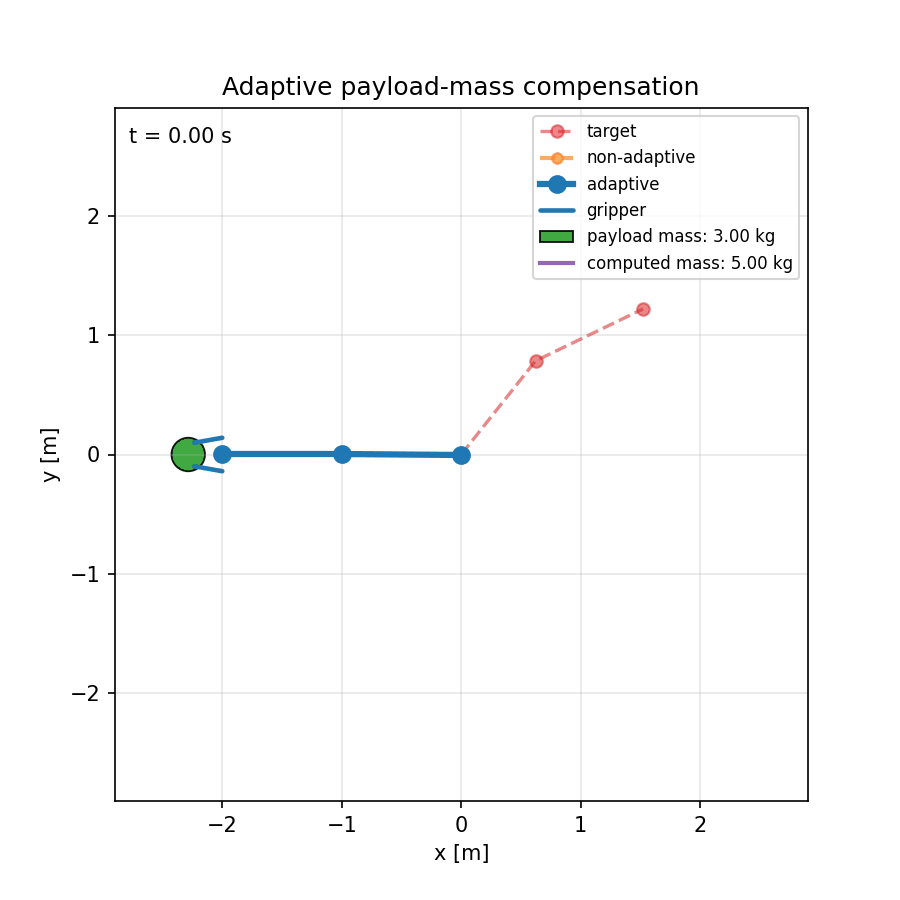
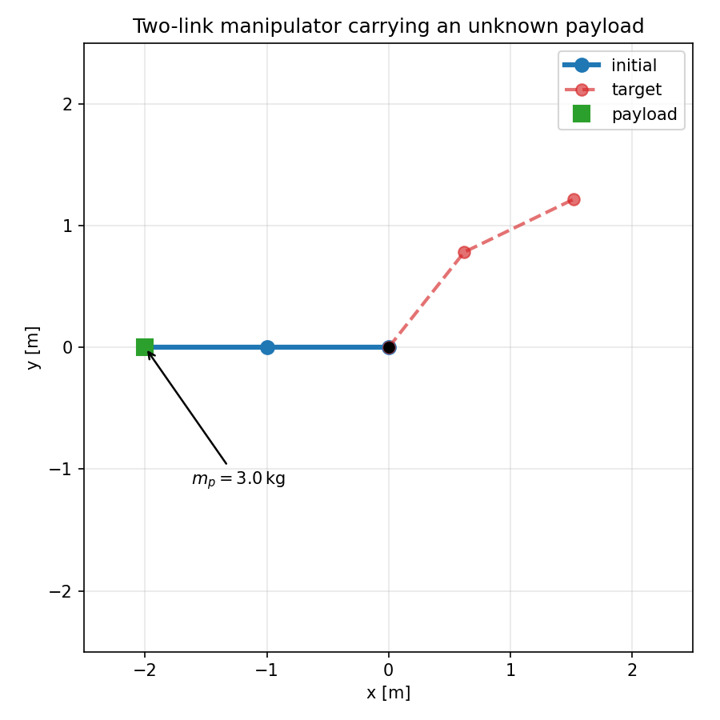
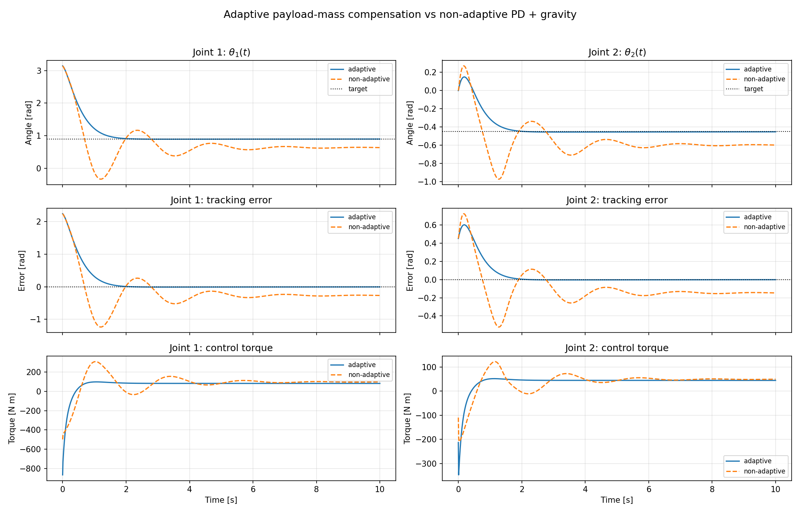
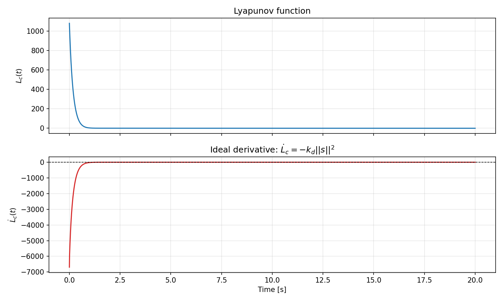
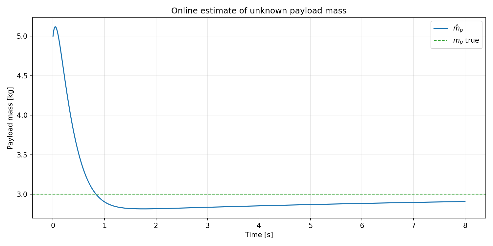
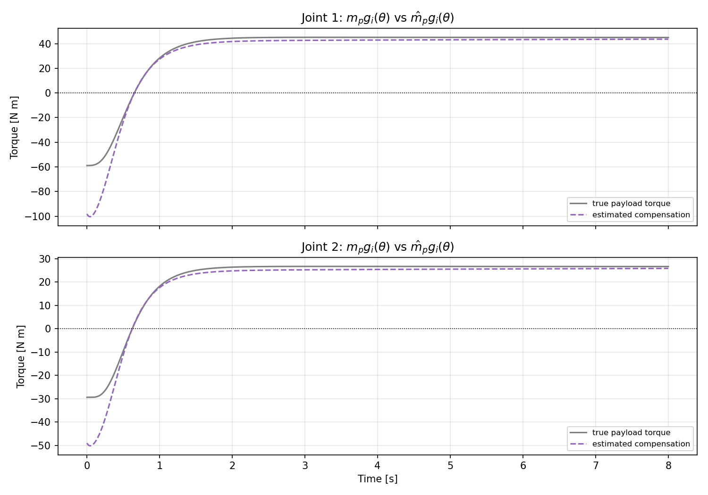
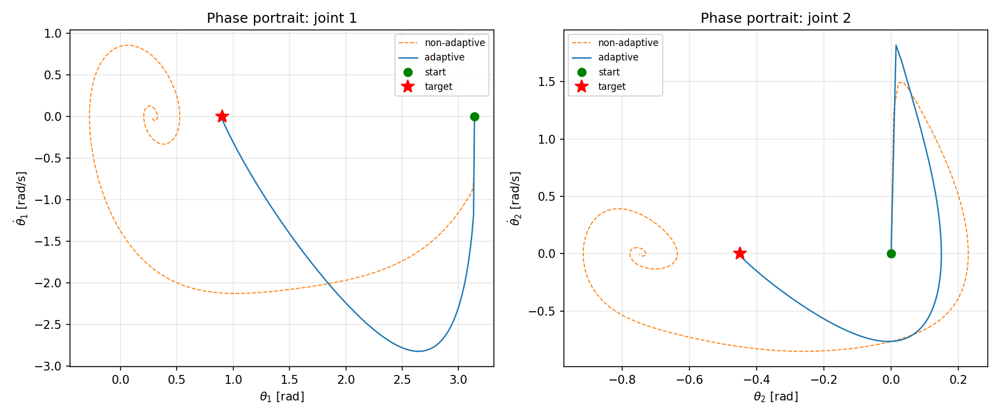

# Project 2: Adaptive Control of a Two-Link Manipulator with Unknown Payload Mass

<p align="center">
  
</p>

<p align="center">
  <em>Adaptive controller (blue) steering the two-link arm to the target while simultaneously estimating the unknown payload mass. The non-adaptive baseline (orange) converges to the wrong position.</em>
</p>

---

## 1. Problem Definition

**Control problem:** stabilize a planar two-link robot manipulator at a desired joint configuration while the robot is carrying an object of unknown mass. The controller knows the link parameters but does not know the payload mass in the gripper.

**Plant:** a nonlinear two-degree-of-freedom arm in a vertical plane. The known robot links contribute the usual inertia, Coriolis/centrifugal, and gravity terms. The carried object is modeled as a point mass at the end effector; its true mass is constant but unknown.

**Method:** model-based adaptive control with a Lyapunov stability proof. The controller introduces a filtered error signal that combines position and velocity deviations, estimates the scalar payload mass online, and uses that estimate in the dynamic compensation term, guaranteeing asymptotic convergence to the desired configuration.

**Comparison:** the adaptive controller is compared with a non-adaptive PD + known-link gravity baseline. The baseline compensates only the robot links and therefore treats the object as an unmodeled load, resulting in a permanent steady-state position error.

---

## 2. System Description

### Physical Setup

The robot has two rigid links of lengths $l_1, l_2$ and known masses $m_1, m_2$. A payload with unknown mass $m_p > 0$ is held at the end effector.

<p align="center">
  
</p>

<p align="center">
  <em>Figure 1: two-link planar manipulator carrying a point payload of unknown mass m<sub>p</sub>.</em>
</p>

### State Variables

The state vector $x \in \mathbb{R}^4$ is defined as:

```math
x = [\theta_1, \theta_2, \dot{\theta}_1, \dot{\theta}_2]^T
```

| Symbol | Meaning | Units |
|---|---|---|
| $\theta_1, \theta_2$ | Joint angles (Link 1 relative to horizontal, Link 2 relative to Link 1) | rad |
| $\dot{\theta}_1, \dot{\theta}_2$ | Joint angular velocities | rad/s |
| $\ddot{\theta}_1, \ddot{\theta}_2$ | Joint angular accelerations | rad/s² |

### Control Input

The control input is the vector of applied joint torques:

```math
a = [\tau_1, \tau_2]^T \in \mathbb{R}^2
```

**Control constraints:** the torques are **unconstrained** in this simulation — no actuator saturation is modeled. In a physical implementation each $|\tau_i|$ would be bounded by the motor's rated torque.

The target is a constant configuration

```math
\theta_d = [\theta_{1d},\theta_{2d}]^T .
```

The unknown parameter, its estimate, and the estimation error are

```math
m_p > 0,\qquad \hat{m}_p(t),\qquad \tilde{m}_p = \hat{m}_p - m_p .
```

### Dynamic Parameters

| Symbol | Meaning | Value | Units |
|---|---|---:|---|
| $m_1$ | Mass of Link 1 | 1.0 | kg |
| $m_2$ | Mass of Link 2 | 2.0 | kg |
| $l_1$ | Length of Link 1 | 1.0 | m |
| $l_2$ | Length of Link 2 | 1.0 | m |
| $g$ | Gravitational acceleration | 9.81 | m/s² |
| $m_p$ | True payload mass (unknown to controller) | 3.0 | kg |
| $\hat{m}_p(t)$ | Online estimate of the payload mass produced by the adaptive controller | — | kg |
| $\tilde{m}_p = \hat{m}_p - m_p$ | Payload mass estimation error | — | kg |

---

## 3. Mathematical Specification

### 3.1 Equations of Motion

The dynamics are derived via Lagrangian mechanics and take the standard form:

```math
M(\theta)\,\ddot{\theta} + C(\theta,\dot{\theta})\,\dot{\theta} + G(\theta) = a \qquad \text{(1)}
```

where:

- $M(\theta) \in \mathbb{R}^{2\times2}$ is the symmetric, positive-definite inertia matrix
- $C(\theta,\dot{\theta}) \in \mathbb{R}^{2\times2}$ is the Coriolis and centrifugal matrix
- $G(\theta) \in \mathbb{R}^2$ is the gravity vector

### 3.2 Effect of the Unknown Payload

The payload mass $m_p$ at the tip of Link 2 contributes to all three terms **linearly**. We decompose each term as:

```math
M(\theta) = M_0(\theta) + m_p\, M_p(\theta)
```
```math
C(\theta,\dot{\theta}) = C_0(\theta,\dot{\theta}) + m_p\, C_p(\theta,\dot{\theta})
```
```math
G(\theta) = G_0(\theta) + m_p\, G_p(\theta)
```

where the subscript $0$ denotes the **known nominal part** (robot links only), and the $p$ terms are **known regressor matrices** that encode how a unit point mass at the tip affects the dynamics.

#### Nominal Inertia Matrix $M_0(\theta)$

```math
M_0(\theta) =
\begin{bmatrix}
M_{11} & M_{12} \\
M_{12} & M_{22}
\end{bmatrix}
```
```math
\begin{aligned}
M_{11} &= (m_1 + m_2)l_1^2 + m_2 l_2^2 + 2 m_2 l_1 l_2 \cos\theta_2 \\
M_{12} &= m_2 l_2^2 + m_2 l_1 l_2 \cos\theta_2 \\
M_{22} &= m_2 l_2^2
\end{aligned}
```

#### Payload Inertia Regressor $M_p(\theta)$

A point mass at the tip of Link 2 contributes:

```math
M_p(\theta) =
\begin{bmatrix}
l_1^2 + l_2^2 + 2 l_1 l_2 \cos\theta_2 & l_2^2 + l_1 l_2 \cos\theta_2 \\
l_2^2 + l_1 l_2 \cos\theta_2 & l_2^2
\end{bmatrix}
```

#### Nominal Coriolis Matrix $C_0(\theta,\dot{\theta})$

Using the auxiliary term $h_0 = -m_2 l_1 l_2 \sin\theta_2$:

```math
C_0(\theta,\dot{\theta}) =
\begin{bmatrix}
h_0\dot{\theta}_2 & h_0(\dot{\theta}_1 + \dot{\theta}_2) \\
-h_0\dot{\theta}_1 & 0
\end{bmatrix}
```

#### Payload Coriolis Regressor $C_p(\theta,\dot{\theta})$

Using $h_p = -l_1 l_2 \sin\theta_2$:

```math
C_p(\theta,\dot{\theta}) =
\begin{bmatrix}
h_p\dot{\theta}_2 & h_p(\dot{\theta}_1 + \dot{\theta}_2) \\
-h_p\dot{\theta}_1 & 0
\end{bmatrix}
```

Both $C_0$ and $C_p$ are constructed via Christoffel symbols so that $\dot{M}_0 - 2C_0$ and $\dot{M}_p - 2C_p$ are each skew-symmetric. Since $m_p$ is a constant scalar, the full matrices $M$ and $C$ inherit this property:

```math
x^T \bigl(\dot{M}(\theta) - 2C(\theta,\dot{\theta})\bigr) x = 0, \quad \forall\, x \in \mathbb{R}^2 \qquad \text{(2)}
```

An equivalent and useful rewriting:

```math
x^T \dot{M}\, x = 2\, x^T C\, x \qquad \text{(2')}
```

#### Nominal Gravity Vector $G_0(\theta)$

```math
G_0(\theta) =
\begin{bmatrix}
(m_1 + m_2)g l_1 \cos\theta_1 + m_2 g l_2 \cos(\theta_1 + \theta_2) \\
m_2 g l_2 \cos(\theta_1 + \theta_2)
\end{bmatrix}
```

#### Payload Gravity Regressor $G_p(\theta)$

```math
G_p(\theta) =
\begin{bmatrix}
g l_1 \cos\theta_1 + g l_2 \cos(\theta_1 + \theta_2) \\
g l_2 \cos(\theta_1 + \theta_2)
\end{bmatrix}
```

### 3.3 Linear Parameterization

The unknown payload contribution enters the dynamics **linearly** through the same channel as the control input. Separating known from unknown parts:

```math
M_0(\theta)\,\ddot{\theta} + C_0(\theta,\dot{\theta})\,\dot{\theta} + G_0(\theta)
+\; m_p\,\underbrace{\bigl(M_p(\theta)\,\ddot{\theta} + C_p(\theta,\dot{\theta})\,\dot{\theta} + G_p(\theta)\bigr)}_{Y_p^{\mathrm{act}}(\theta,\dot{\theta},\ddot{\theta})\;\in\;\mathbb{R}^2}
= a
\qquad \text{(3)}
```

This linear parameterization — $m_p$ enters (3) multiplicatively as a scalar in front of a computable vector — is the structural property that makes exact online cancellation possible.

**Matching condition.** The unknown parameter $m_p$ enters the equations of motion through the same channel as the control input $a$: comparing the left-hand side of (3) with the right-hand side, we can write

```math
a = \underbrace{M_0 \ddot{\theta} + C_0 \dot{\theta} + G_0}_{\text{known}} + m_p\, Y_p^{\mathrm{act}} .
```

Because the unknown term $m_p Y_p^{\mathrm{act}}$ is matched by the control channel, substituting $\hat{m}_p$ for $m_p$ in the control law cancels it exactly up to the estimation error $\tilde{m}_p = \hat{m}_p - m_p$. This is the key structural property exploited by the **certainty-equivalence** approach described in Section 4.2.

---

## 4. Method Description and Stability Proof

### 4.1 Non-Adaptive Controller (Baseline)

For reference, the non-adaptive baseline is the **PD controller with known-link gravity compensation** from Project 1, applied here to the loaded plant:

```math
a = -k_1 e - k_2 \dot{\theta} + G_0(\theta) \qquad \text{(4)}
```

where $e = \theta - \theta_d$ is the joint angle error, $k_1 > 0$ is the proportional (stiffness) gain, and $k_2 > 0$ is the derivative (damping) gain.

When the payload is absent ($m_p = 0$), substituting (4) into (1) gives the closed-loop dynamics:

```math
M_0\,\ddot{\theta} + C_0\,\dot{\theta} + k_2\dot{\theta} + k_1 e = 0 \qquad \text{(5)}
```

The Lyapunov function $L = \tfrac{1}{2}\dot{\theta}^T M_0 \dot{\theta} + \tfrac{1}{2}k_1 e^T e$ satisfies $\dot{L} = -k_2\|\dot{\theta}\|^2 \leq 0$, and by LaSalle's Invariance Principle, $e(t)\to 0$ and $\dot{\theta}(t)\to 0$. [described in project 1](https://github.com/P-r-i-M-e-R/Team_5_Sukhariki/blob/main/project_1_lyapunov_control_two-linked_manipulator/README.md)

#### Failure When $m_p \neq 0$

When the payload is present but the controller ignores it, gravity compensation $G_0(\theta)$ is incomplete — it underestimates the actual gravitational torques by $m_p G_p(\theta)$. The closed-loop dynamics become:

```math
M(\theta)\,\ddot{\theta} + C(\theta,\dot{\theta})\,\dot{\theta} + k_2\dot{\theta} + k_1 e = m_p\, G_p(\theta) \qquad \text{(9)}
```

where the right-hand side is a **persistent disturbance** driven by the uncompensated payload. At any steady state ($\dot\theta = \ddot\theta = 0$), equation (9) reduces to:

```math
k_1 e^* = m_p\, G_p(\theta^*) \qquad \Rightarrow \qquad e^* = \frac{m_p}{k_1} G_p(\theta_d) \neq 0
```

The non-adaptive controller converges to a **wrong equilibrium** that is offset from $\theta_d$ by an amount proportional to $m_p / k_1$. No choice of gains $k_1$ and $k_2$ can remove this error — it is structural, not a tuning problem.

---

### 4.2 Adaptive Controller

**Certainty-Equivalence (CE) principle.** The adaptive controller uses the CE approach: it constructs the nominal control law as if the payload mass were exactly known, then replaces the unknown true value $m_p$ with its current online estimate $\hat{m}_p(t)$ everywhere in the formula. The matching condition from Section 3.3 guarantees that this substitution reduces the closed-loop error to a term proportional to $\tilde{m}_p = \hat{m}_p - m_p$, which the adaptation law drives to zero.

The table below summarises all symbols introduced in this section.

| Symbol | Meaning | Units |
|---|---|---|
| $e = \theta - \theta_d$ | Joint angle tracking error | rad |
| $s = \dot{\theta} + \lambda e$ | Filtered error (combines position and velocity into one signal) | rad/s |
| $\lambda > 0$ | Filtered-error gain; sets the rate of exponential error decay when $s=0$ | s⁻¹ |
| $\dot{\theta}_r = -\lambda e$ | Reference velocity used in the control law | rad/s |
| $\ddot{\theta}_r = -\lambda\dot{\theta}$ | Reference acceleration used in the control law | rad/s² |
| $Y_p \in \mathbb{R}^2$ | Payload regressor vector — encodes the payload contribution per unit mass at the reference trajectory | N·m/kg |
| $\tau_0 \in \mathbb{R}^2$ | Nominal torque from the known link dynamics evaluated at the reference trajectory | N·m |
| $k_d > 0$ | Damping gain; provides dissipation along the filtered-error direction | N·m·s/rad |
| $\alpha > 0$ | Adaptation gain; controls the speed of payload-mass estimation | — |
| $L_c \geq 0$ | Augmented Lyapunov function — sum of filtered kinetic energy and estimation penalty | J |

#### Filtered Error and Reference Trajectories

We introduce a **filtered error** that combines position and velocity deviations into a single signal:

```math
s = \dot{\theta} + \lambda\, e, \qquad \lambda > 0 \qquad \text{(10)}
```

When $s \equiv 0$, the error obeys $\dot{e} = \dot{\theta} = -\lambda e$, so $e(t) \to 0$ exponentially at rate $\lambda$. Therefore $s \to 0$ is a **sufficient condition** for position convergence.

For a constant target $\theta_d$, the corresponding **reference velocity and reference acceleration** are:

```math
\dot{\theta}_r = -\lambda\, e, \qquad \ddot{\theta}_r = -\lambda\, \dot{\theta} \qquad \text{(11)}
```

Note that $s = \dot{\theta} - \dot{\theta}_r$ by construction.

#### Payload Regressor Evaluated at Reference Trajectories

The adaptive law requires the payload regressor evaluated at the **reference** values (11), not at the actual acceleration $\ddot{\theta}$:

```math
\begin{aligned}
Y_p(\theta,\dot{\theta},\dot{\theta}_r,\ddot{\theta}_r)
  &= M_p(\theta)\,\ddot{\theta}_r + C_p(\theta,\dot{\theta})\,\dot{\theta}_r + G_p(\theta) \\
  &= -\lambda\, M_p(\theta)\,\dot{\theta} - \lambda\, C_p(\theta,\dot{\theta})\, e + G_p(\theta)
  \qquad \text{(12)}
\end{aligned}
```

This vector is entirely computable from the measured state; it does **not** require direct measurement of $\ddot{\theta}$.

#### Control Law

The adaptive controller replaces the unknown $m_p$ with its current estimate $\hat{m}_p(t)$:

```math
a = \underbrace{M_0(\theta)\,\ddot{\theta}_r + C_0(\theta,\dot{\theta})\,\dot{\theta}_r + G_0(\theta)}_{\text{known link dynamics at reference}} + \hat{m}_p\, Y_p - k_d\, s \qquad \text{(13)}
```

where $k_d > 0$ is the damping gain.

- The first block cancels the known link dynamics evaluated at the reference trajectory.
- $\hat{m}_p Y_p$: estimated payload compensation.
- $-k_d s$: damping along the filtered-error direction.

#### Closed-Loop Dynamics in Terms of $s$

Since $s = \dot\theta - \dot\theta_r$, we have $\dot{s} = \ddot\theta - \ddot\theta_r$. Using the equations of motion (1):

```math
M\,\dot{s} + C\,s = a - \bigl(M\,\ddot{\theta}_r + C\,\dot{\theta}_r + G\bigr)
```

Substituting the control law (13) and the full decompositions $M = M_0 + m_p M_p$, $C = C_0 + m_p C_p$, $G = G_0 + m_p G_p$:

```math
\begin{aligned}
M\,\dot{s} + C\,s &= \bigl(M_0\ddot{\theta}_r + C_0\dot{\theta}_r + G_0 + \hat{m}_p Y_p - k_d s\bigr) \\
&\quad - \bigl((M_0{+}m_p M_p)\ddot{\theta}_r + (C_0{+}m_p C_p)\dot{\theta}_r + (G_0{+}m_p G_p)\bigr)
\end{aligned}
```

The nominal terms $M_0\ddot\theta_r + C_0\dot\theta_r + G_0$ cancel. Using $Y_p = M_p\ddot\theta_r + C_p\dot\theta_r + G_p$:

```math
M\,\dot{s} + C\,s = (\hat{m}_p - m_p)\,Y_p - k_d\,s = \tilde{m}_p\,Y_p - k_d\,s \qquad \text{(14)}
```

When $\tilde{m}_p = 0$ the filtered error decays purely from damping $k_d$.

#### Augmented Lyapunov Function

To design the adaptation law and prove stability, we augment the kinetic term with a quadratic penalty on the estimation error:

```math
L_c(s,\tilde{m}_p) = \underbrace{\frac{1}{2} s^T M(\theta)\, s}_{\text{filtered kinetic energy}} + \underbrace{\frac{1}{2\alpha}\tilde{m}_p^2}_{\text{estimation penalty}} \qquad \text{(15)}
```

where $\alpha > 0$ is the adaptation gain.

**Positive Definiteness:** $M(\theta) = M_0 + m_p M_p$ is positive definite for all $m_p \geq 0$ (since $M_0$ is positive definite and $M_p$ is positive semi-definite). Therefore $L_c > 0$ for all $(s,\tilde{m}_p)\neq(0,0)$, and $L_c(0,0) = 0$.

**Time Derivative of $L_c$:**

```math
\dot{L}_c = s^T M\,\dot{s} + \frac{1}{2} s^T \dot{M}\, s + \frac{1}{\alpha}\tilde{m}_p\,\dot{\hat{m}}_p
```

Using the skew-symmetry property (2'): $\frac{1}{2} s^T \dot{M} s = s^T C s$:

```math
\dot{L}_c = s^T\bigl(M\,\dot{s} + C\,s\bigr) + \frac{1}{\alpha}\tilde{m}_p\,\dot{\hat{m}}_p
```

Substituting the closed-loop dynamics (14):

```math
\begin{aligned}
\dot{L}_c
  &= s^T\bigl(\tilde{m}_p\,Y_p - k_d\,s\bigr) + \frac{1}{\alpha}\tilde{m}_p\,\dot{\hat{m}}_p \\
  &= -k_d\|s\|^2 + \tilde{m}_p\!\left(s^T Y_p + \frac{1}{\alpha}\dot{\hat{m}}_p\right)
  \qquad \text{(16)}
\end{aligned}
```

The first term provides the desired dissipation. The second term is the cross-term coupling state dynamics to parameter estimation error.

#### Adaptation Law

To cancel the cross-term in (16), we choose:

```math
s^T Y_p + \frac{1}{\alpha}\dot{\hat{m}}_p = 0 \qquad \Rightarrow \qquad {\dot{\hat{m}}_p = -\alpha\,Y_p^T s} \qquad \text{(17)}
```

Substituting (17) into (16):

```math
\dot{L}_c = -k_d\|s\|^2 \leq 0 \qquad \text{(18)}
```

**Stability via LaSalle's Invariance Principle.**

Since $\dot{L}_c = -k_d\|s\|^2 \leq 0$, the function $L_c(t)$ is non-increasing and all signals $s$, $\tilde{m}_p$, $e$ remain bounded for all $t \geq 0$. 
Consider the set where $\dot{L}_c$ vanishes: $\{s = 0\}$. On any trajectory confined to this set, $s(t) \equiv 0$ and therefore $\dot{s}(t) \equiv 0$. 

Three consequences follow: 
(i) the adaptation law gives $\dot{\hat{m}}_p = -\alpha Y_p^T s = 0$, so $\tilde{m}_p$ is constant; 
(ii) substituting $s \equiv 0$ and $\dot{s} \equiv 0$ into the closed-loop equation reduces it to $\tilde{m}_p Y_p = 0$; 
(iii) from $s = 0$ we have $\dot{e} = -\lambda e$, so $e(t) \to 0$ exponentially and the regressor converges to $Y_p \to G_p(\theta_d) \neq 0$, since the payload gravity term is non-zero at any non-degenerate target configuration. 

Combining (i)–(iii): $\tilde{m}_p$ is constant, $Y_p \to G_p(\theta_d) \neq 0$, and $\tilde{m}_p Y_p = 0$ must hold, which forces $\tilde{m}_p = 0$. 
Therefore the largest invariant set contained in $\{s = 0\}$ is the single equilibrium $\{s=0,\, e=0,\, \tilde{m}_p=0\}$, and by LaSalle's Invariance Principle every trajectory converges to it: $e(t)\to 0$, $\dot\theta(t)\to 0$, $\tilde{m}_p(t)\to 0$ as $t\to\infty$. $\blacksquare$

---

## 5. Algorithm Listing

The control algorithm executed at each time step $t$:

1. **Read State:** Obtain current $\theta(t)$, $\dot{\theta}(t)$, and current estimate $\hat{m}_p(t)$.
2. **Compute Error:** $e = \theta - \theta_d$.
3. **Compute Reference Values:**

```math
\dot{\theta}_r = -\lambda\, e, \qquad \ddot{\theta}_r = -\lambda\, \dot{\theta}
```

4. **Compute Filtered Error:** $s = \dot{\theta} - \dot{\theta}_r = \dot{\theta} + \lambda\, e$.
5. **Compute Nominal Dynamics at Reference:**

```math
\tau_0 = M_0(\theta)\,\ddot{\theta}_r + C_0(\theta,\dot{\theta})\,\dot{\theta}_r + G_0(\theta)
```

6. **Compute Payload Regressor:**

```math
Y_p = M_p(\theta)\,\ddot{\theta}_r + C_p(\theta,\dot{\theta})\,\dot{\theta}_r + G_p(\theta)
```

7. **Update Estimate (Euler step):**

```math
\hat{m}_p(t + \Delta t) = \hat{m}_p(t) - \Delta t\cdot\alpha\, Y_p^T s
```

8. **Compute Control Input:**

```math
a(t) = \tau_0 + \hat{m}_p\, Y_p - k_d\, s
```

9. **Apply Torque:** Apply $a(t)$ to the plant.
10. **Integrate Dynamics:** Solve

```math
\ddot{\theta} = M(\theta)^{-1}\bigl(a - C(\theta,\dot{\theta})\dot{\theta} - G(\theta)\bigr)
```

to update the state for $t + \Delta t$, where $M$, $C$, $G$ use the **true** (unknown to the controller) $m_p$ in the simulation.

---

## 6. Experimental Setup

| Parameter | Value | Description |
|---|---|---|
| **Initial State** | $\theta=[\pi,\,0],\; \dot{\theta}=[0,0]$ | Arm starts pointing left, stationary. |
| **Target State** | $\theta_d=[0.9,\,-0.45]\;\mathrm{rad}$ | Arbitrary non-trivial target configuration. |
| **True Payload Mass** | $m_p = 3.0$ kg | Unknown to the controller. |
| **Simulation Time** | 10 seconds | Sufficient to capture the adaptation transient. |
| **Baseline Gains** | $k_1=90,\; k_2=28$ | PD gains for non-adaptive reference controller. |
| **Filtered-Error Gain** | $\lambda = 4.0$ | Sets the bandwidth of the filtered error. |
| **Damping Gain** | $k_d = 80.0$ | Dissipation term in the adaptive control law. |
| **Adaptation Gain** | $\alpha = 0.03$ | Controls speed of payload-mass estimation. |
| **Initial Estimate** | $\hat{m}_p(0) = 5.0$ kg | Controller starts with an overestimate of the true mass. |

**Choice of initial state:** the arm starts far from the target ($\theta_1 = \pi$ means pointing left), producing a large initial error that tests the controller on a challenging configuration.

**Choice of initial estimate:** starting above the true value ($5.0 > 3.0$ kg) is an intentionally pessimistic initialization to demonstrate that the estimator converges downward toward the truth.

---

## 7. Results and Discussion

### 7.1 Comparison: Adaptive vs. Non-Adaptive

<p align="center">
  
</p>

<p align="center">
  <em>Figure 2: Comparison of joint angles (top), tracking errors (middle), and control torques (bottom) for the adaptive controller (blue solid) and non-adaptive baseline (orange dashed).</em>
</p>

**Interpretation of Figure 2**

- **Joint Angles and Errors (Top/Middle Rows):** Both controllers start from the same initial configuration. The non-adaptive controller converges to a wrong equilibrium — the steady-state error matches the theoretical prediction $e^* = \frac{m_p}{k_1}G_p(\theta_d)$ from Section 4.1. The adaptive controller shows a transient as the estimator adjusts, then fully recovers and converges to $\theta_d$ with zero error.
- **Control Torques (Bottom Row):** The adaptive controller requires larger torques during the estimation transient because it must compensate for the large initial error in the payload estimate ($\hat{m}_p(0) = 5.0 > m_p = 3.0$). After convergence, the torques settle to the values needed to hold the correct equilibrium. The non-adaptive controller produces smooth torques but holds the arm permanently at the wrong position.

### 7.2 Lyapunov Function Evolution

<p align="center">
  
</p>

<p align="center">
  <em>Figure 3: Time evolution of the augmented Lyapunov function L<sub>c</sub>(t) (blue) and its ideal time derivative dL<sub>c</sub>/dt = &minus;k<sub>d</sub>&#x2016;s&#x2016;&sup2; (red) for the adaptive controller.</em>
</p>

**Interpretation of Figure 3**

- **$L_c(t)$ (Blue):** Decreases monotonically throughout the simulation, confirming the theoretical result $\dot{L}_c \leq 0$ at all times. The initial value is large because of the large initial position error and the overestimated payload ($\tilde{m}_p(0) = \hat{m}_p(0) - m_p = +2.0$ kg).
- **$\dot{L}_c(t)$ (Red):** Remains non-positive at all times, consistent with equation (18). The initial large negative value corresponds to the rapid dissipation of kinetic energy when the arm begins moving from the far initial configuration.

### 7.3 Parameter Estimation

<p align="center">
  
</p>

<p align="center">
  <em>Figure 4: Online payload-mass estimate m&#x0302;<sub>p</sub>(t) (blue) converging toward the true value m<sub>p</sub> = 3.0 kg (green dashed).</em>
</p>

**Interpretation of Figure 4**

- The estimate starts at $\hat{m}_p(0) = 5.0$ kg — above the true value — and decreases as the arm moves and the regressor $Y_p$ is excited.
- Convergence is driven by the transient motion: while $s \neq 0$, the adaptation law $\dot{\hat{m}}_p = -\alpha Y_p^T s$ continuously corrects the estimate.
- Once the arm reaches the target and $s \to 0$, the adaptation effectively stops and $\hat{m}_p$ holds at a value close to the true $m_p = 3.0$ kg.
- The convergence rate is governed by $\alpha$ and the magnitude of $Y_p^T s$; a larger $\alpha$ produces faster estimation but can amplify measurement noise.

### 7.4 Payload Gravity Compensation

<p align="center">
  
</p>

<p align="center">
  <em>Figure 5: True payload gravitational torque m<sub>p</sub> G<sub>p,i</sub>(&theta;) (grey) vs. the estimated compensation m&#x0302;<sub>p</sub> G<sub>p,i</sub>(&theta;) (purple dashed) for each joint.</em>
</p>

**Interpretation of Figure 5**

- At $t = 0$, the estimated compensation (purple) overestimates the true payload torque (grey) because $\hat{m}_p(0) = 5.0 > 3.0$ kg.
- As the estimator converges, the two curves progressively align, confirming that the adaptive controller learns to cancel exactly the gravity contribution of the unknown load.
- This plot isolates the gravity-compensation channel, which is the dominant correction term at low velocities near the target.

### 7.5 Phase Portrait

<p align="center">
  
</p>

<p align="center">
  <em>Figure 6: Phase portraits for Joint 1 (left) and Joint 2 (right), showing trajectories for the adaptive controller (blue) and the non-adaptive baseline (orange dashed). Red star marks the true target; green dot marks the initial state.</em>
</p>

**Interpretation of Figure 6**

- The adaptive controller (blue) spirals inward and converges to the true target $\theta_d$ (red star), characteristic of a stable, well-damped second-order system.
- The non-adaptive controller (orange) also spirals inward but converges to a **displaced equilibrium** that is visibly offset from the target. The offset matches the steady-state error $e^* = \frac{m_p}{k_1}G_p(\theta_d)$ predicted in Section 4.1.
- The adaptive trajectory shows a wider initial excursion due to the large initial estimation error, then tightens as the estimate improves.

---

## 8. Key Findings and Conclusions

#### 8.1 Necessity of Adaptation

The non-adaptive Lyapunov controller from Project 1 fails in a **structural** way when the payload is unknown: it converges to the wrong position, and the steady-state error grows linearly with $m_p$. This failure cannot be fixed by retuning $k_1$ or $k_2$. The adaptive controller eliminates this failure by learning $m_p$ online and correcting the gravity compensation term in real time.

#### 8.2 What the Adaptive Controller Guarantees

The adaptive scheme provides:

- **Lyapunov stability:** $L_c(t)$ is non-increasing, so $s(t)$, $e(t)$, and $\tilde{m}_p(t)$ remain bounded for all time.
- **Asymptotic state convergence:** $e(t) \to 0$ and $\dot\theta(t) \to 0$ as $t \to \infty$, proven via LaSalle's Invariance Principle (Section 4.2).
- **Asymptotic parameter convergence:** $\hat{m}_p(t)$ converges toward $m_p$, with convergence rate governed by the excitation of $Y_p$ during the motion transient.

#### 8.3 Role of the Filtered Error

The filtered error $s = \dot\theta + \lambda e$ serves a dual purpose:
1. It drives both the control torque ($-k_d s$) and the parameter update ($-\alpha Y_p^T s$) from a single signal.
2. It guarantees exponential convergence of $e$ whenever $s \to 0$, without requiring separate proportional-feedback and integral terms.

#### 8.4 Practical Implications

1. **Model Structure vs. Model Parameters:** the adaptive controller requires knowing the structure of how $m_p$ enters the dynamics (the regressors $M_p$, $C_p$, $G_p$) but not the value of $m_p$ itself. This is a strictly weaker requirement than the full-knowledge assumption in Project 1.
2. **Adaptation Gain $\alpha$:** a larger $\alpha$ speeds up estimation but can amplify sensor noise in the regressor signal. Tuning $\alpha$ requires balancing convergence speed against noise sensitivity.
3. **Filtered-Error Gain $\lambda$:** a larger $\lambda$ accelerates position convergence when $s \to 0$, but also makes $s$ more sensitive to velocity noise. It directly sets the closed-loop bandwidth of the position loop.
4. **Regressor Computation:** the adaptation law (17) uses only measured $\theta$, $\dot\theta$ — no direct acceleration measurement is needed, because $\ddot\theta_r = -\lambda\dot\theta$ is computed from the measured velocity.

#### 8.5 Limitations

- **Parameter convergence is not guaranteed in general.** The LaSalle proof shows $\hat{m}_p \to m_p$ only because $G_p(\theta_d) \neq 0$ at the specific target. For targets where the payload gravity regressor vanishes (e.g., a purely horizontal arm with $\theta_1 = \theta_2 = 0$), the estimator may stall at an incorrect value while position convergence is still achieved. Persistent excitation (PE) of the regressor is required for guaranteed parameter convergence.
- **Unconstrained torques.** No actuator saturation is modeled. Real motors have torque limits; large initial estimation errors (here $\tilde{m}_p(0) = +2.0$ kg) cause large transient torques that may not be physically realizable.
- **Single unknown parameter.** The method as implemented estimates only $m_p$. Link masses, friction, and structural flexibility are assumed perfectly known. Extending to a full parameter vector would require a matrix-valued regressor and a corresponding gain matrix $\Gamma$.
- **Noise sensitivity of the regressor.** $Y_p$ contains $\ddot\theta_r = -\lambda\dot\theta$; velocity noise is amplified by $\lambda$. In practice, velocity must be filtered, which introduces phase lag and degrades the adaptation rate.
- **Constant payload assumption.** The analysis assumes $\dot{m}_p = 0$. Slowly varying or switching payloads would require a modified adaptation law (e.g., leakage or $\sigma$-modification) to remain stable.

---

## 9. Project Structure

```text
project_2_Adaptive_Lyapunov-Based_Control_Two-Link_Robot_Unknown_Payload/
├── README.md
├── requirements.txt
├── main.py
├── configs/
│   └── params.yaml
├── src/
│   ├── __init__.py
│   ├── system.py
│   ├── adaptive_controller.py
│   ├── controller.py
│   ├── simulation.py
│   └── visualization.py
├── figures/
│   ├── manipulator_model.png
│   ├── comparison_plots.png
│   ├── lyapunov_function.png
│   ├── parameter_estimation.png
│   ├── payload_compensation.png
│   └── phase_portrait.png
└── animations/
    └── robot_motion.gif
```

---

## 10. How to Run

```bash
pip install -r requirements.txt
python main.py
```

This runs both the adaptive and non-adaptive controllers on the same loaded manipulator and regenerates all figures and the animation.


---

## 11. References

1. Baccouch, M., & Dodds, S. (2020). *A two-link robot manipulator: Simulation and control design*. International Journal of Robotic Engineering, 5(2), 1–17.
2. Slotine, J.-J. E., & Li, W. (1987). *On the adaptive control of robot manipulators*. The International Journal of Robotics Research, 6(3), 49–59.

---

## 12. Note on AI Usage

AI was used to help check the final code for correctness, to structure files, and to verify the documentation and visualisation.
