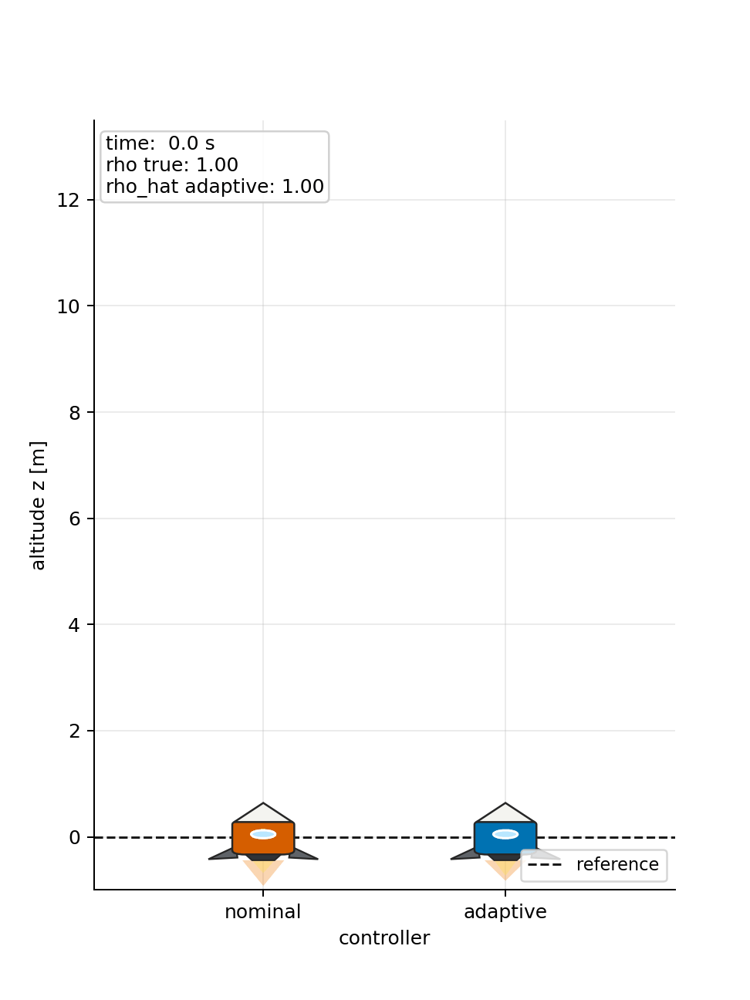
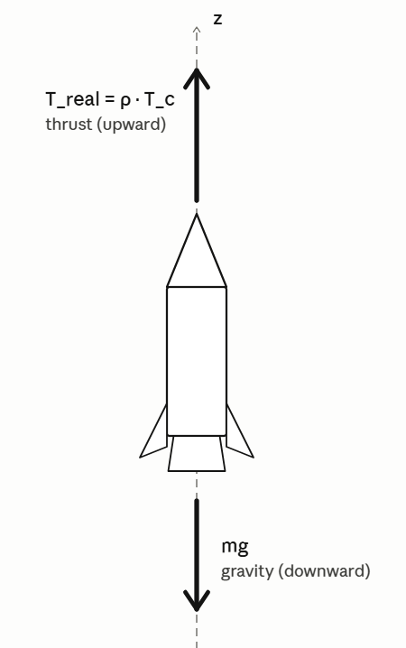
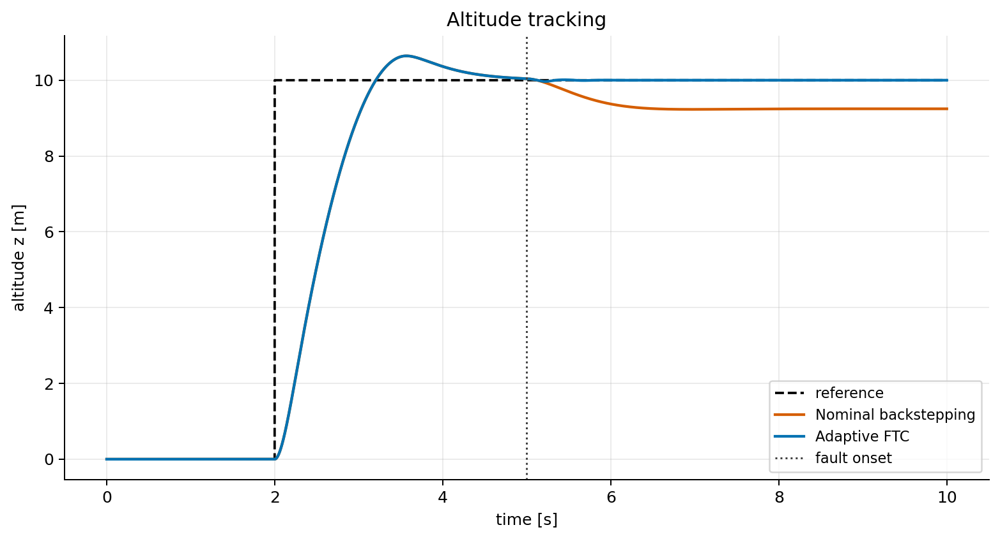
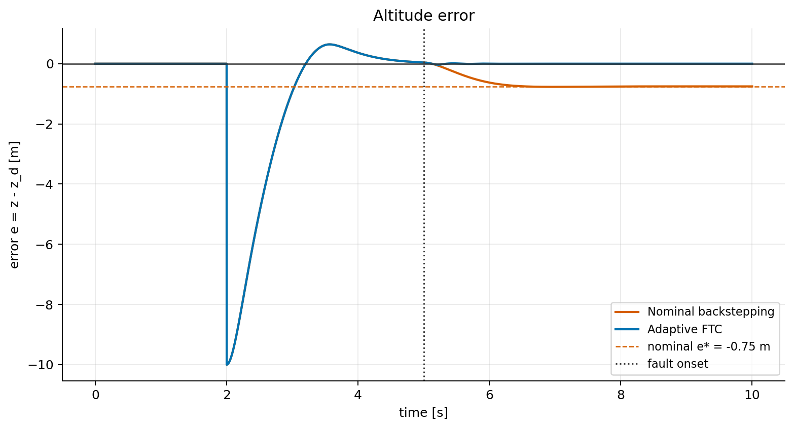
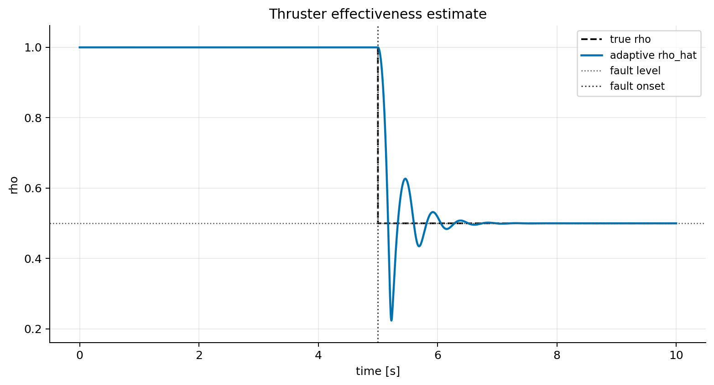
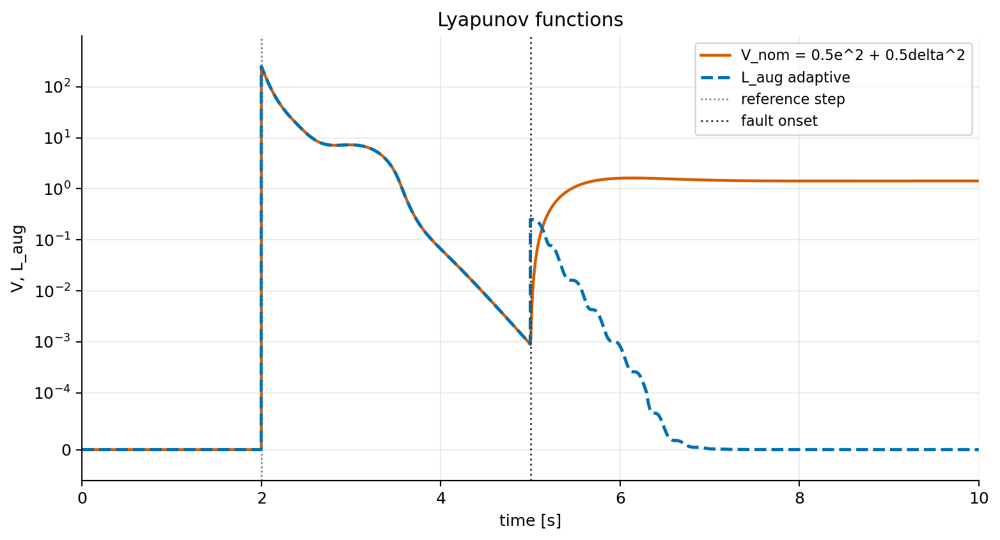
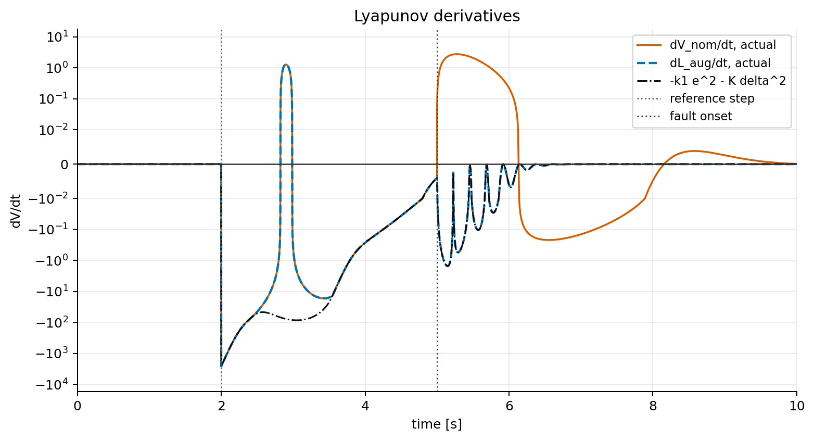
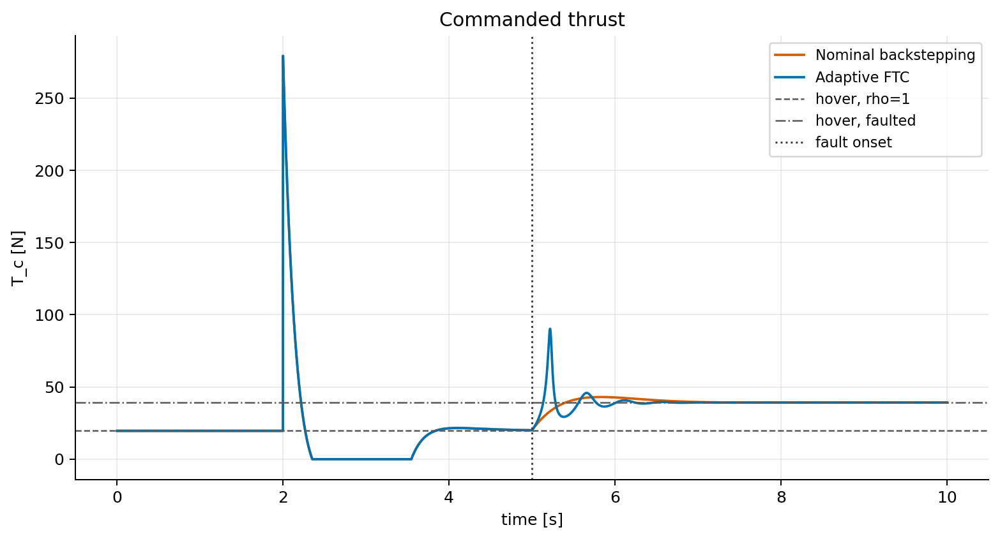
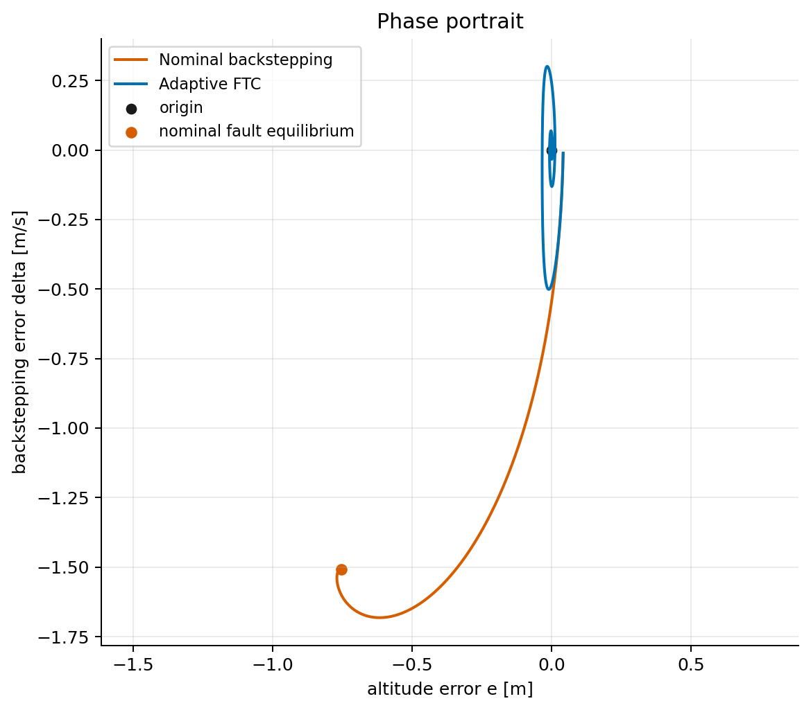

# Project 3: Fault-Tolerant Backstepping Control of a Vertical Rocket

<p align="center">
  
</p>

<p align="center">
  <em>Adaptive FTC recovers target altitude after a 50 % thruster fault at t = 5 s. The nominal controller drifts to a permanent −0.75 m steady-state error.</em>
</p>

---

## 1. Problem Definition

**Control problem:** stabilize a vertically flying rocket at a desired altitude $z_d$ when the thruster experiences a partial loss of effectiveness — an unknown fraction $\rho \in (0, 1]$ of the commanded thrust is actually delivered.

**Plant:** a 1D rocket modeled as a point mass moving along the vertical axis. The single control input is the commanded thrust $T_c$. Gravity and the actuator fault act on the vehicle.

**Assumptions:**
- Motion is purely vertical (1D model)
- Actuator dynamics are negligible (thrust is applied instantaneously)
- The fault parameter $\rho$ is constant but unknown to the controller
- The mass $m$ is known

**Class of methods:** adaptive backstepping based on a Control Lyapunov Function (CLF). A stabilization triple $(\pi_0, L_0, K_0)$ is first designed for the base plant, then the Lyapunov function is augmented by the squared backstepping error and a parameter estimation error term to obtain a new triple $(\pi_1, L_{\text{aug}}, K_1)$ for the full adaptive system.

**Comparison:** two controllers sharing the same backstepping structure are compared. The nominal controller fixes $\hat{\rho} = 1$ for all time. The adaptive FTC updates $\hat{\rho}$ online. Under a thruster fault $\rho = 0.5$, the nominal controller settles at a permanent altitude error. The adaptive FTC detects and compensates the fault, recovering the target altitude.

---

## 2. System Description

### Physical Setup

The rocket moves vertically. Two forces act on it: the actual thrust $T_{\text{real}}$ upward and gravity $mg$ downward.

<p align="center">
  
</p>

<p align="center">
  <em>Figure 1: vertical rocket subject to gravity mg and actual thrust T<sub>real</sub> = ρ · T<sub>c</sub>.</em>
</p>

The fault model: the thruster delivers only a fraction $\rho$ of the commanded thrust:

```math
T_{\text{real}} = \rho \cdot T_c, \quad \rho \in (0, 1], \quad \rho \text{ unknown}
```

### State Variables

```math
s = [z,\ \dot{z}]^\top \in \mathbb{R}^2
```

| Symbol | Meaning | Units |
|---|---|---|
| $z$ | Altitude | m |
| $\dot{z}$ | Vertical velocity | m/s |

### Control Input

```math
a = T_c \in \mathbb{R}, \quad T_c \geq 0
```

The actual thrust applied is $T_{\text{real}} = \rho \cdot T_c$.

### Unknown Parameter

| Symbol | Meaning | Range |
|---|---|---|
| $\rho$ | Thruster effectiveness | $(0, 1]$ |

### Reference Trajectory

```math
z_d(t) = \begin{cases} 0\ \text{m} & t < 2\ \text{s} \\ 10\ \text{m} & t \geq 2\ \text{s} \end{cases}
```

### Fault Scenario

```math
\rho(t) = \begin{cases} 1.0 & t < 5\ \text{s} \\ 0.5 & t \geq 5\ \text{s} \end{cases}
```

The 3-second gap between the reference step at $t = 2$ s and the fault onset at $t = 5$ s is intentional: it allows the system to fully stabilize at $z_d = 10$ m before the disturbance occurs, making the fault response clearly visible in the plots. The controller does not know when or how much the fault occurs.

### Physical Parameters

| Symbol | Meaning | Value | Units |
|---|---|---:|---|
| $m$ | Mass | 2.0 | kg |
| $g$ | Gravitational acceleration | 9.81 | m/s² |
| $\rho$ | Fault level (unknown to controller) | 0.5 | — |

### Equation of Motion

```math
m\ddot{z} = \rho \cdot T_c - mg \qquad \text{(1)}
```

---

## 3. Mathematical Specification

All variables are defined at first use. No symbol is reused with a different meaning.

| Symbol | Meaning |
|---|---|
| $z$ | Altitude |
| $z_d$ | Desired altitude |
| $e$ | Altitude error: $e = z - z_d$ |
| $v_e$ | Velocity error: $v_e = \dot{z} - \dot{z}_d$ |
| $\delta$ | Backstepping error: $\delta = v_e - \pi_0(e)$ |
| $\pi_0$ | Virtual control policy for the base plant |
| $\hat{\rho}$ | Online estimate of $\rho$ |
| $\tilde{\rho}$ | Estimation error: $\tilde{\rho} = \hat{\rho} - \rho$ |
| $L_0,\ L_{\text{aug}}$ | Lyapunov function candidates |
| $k_1,\ K,\ \gamma$ | Controller and adaptation gains |
| $T_{\text{nom}}$ | Nominal thrust term (defined in Section 4.1, Step 3) |

### Error Coordinates

```math
e = z - z_d, \qquad v_e = \dot{z} - \dot{z}_d \qquad \text{(2)}
```

Error dynamics:

```math
\dot{e} = v_e \qquad \text{(3)}
```

```math
\dot{v}_e = \frac{\rho}{m} T_c - g - \ddot{z}_d \qquad \text{(4)}
```

This is a cascade system: equation (3) describes altitude error driven by velocity error, and equation (4) describes velocity error driven by the control input.

### Backstepping Error Variable

```math
\delta := v_e - \pi_0(e) = v_e + k_1 e \qquad \text{(5)}
```

where $\pi_0(e) = -k_1 e$ is the virtual desired velocity chosen in Step 1 below.

---

## 4. Method Description and Stability Proof

Both controllers share the same backstepping structure. They differ only in how the unknown thruster effectiveness $\rho$ is handled.

### 4.1 Common Backstepping Foundation

#### Step 1 — Base Plant and Triple $(\pi_0, L_0, K_0)$

Consider only equation (3), treating $v_e$ as a free input:

```math
\dot{e} = v_e
```

Choose the virtual control policy:

```math
\pi_0(e) = -k_1 e, \quad k_1 > 0 \qquad \text{(6)}
```

CLF candidate:

```math
L_0 = \frac{1}{2} e^2 \qquad \text{(7)}
```

**Verification:**

*Positive definiteness:* $L_0 \geq 0$, and $L_0 = 0 \iff e = 0$. 

*Decay condition:* under $v_e = \pi_0(e)$:

```math
\dot{L}_0 = e \dot{e} = e(-k_1 e) = -k_1 e^2 \leq 0 \qquad \text{(8)}
```

By LaSalle's invariance principle, the only invariant set where $\dot{L}_0 = 0$ is $\{e = 0\}$, so $e(t) \to 0$.

The triple $(\pi_0, L_0, K_0)$ with $K_0(r) = k_1 r^2$ is valid for the base plant.

#### Step 2 — Augmented Lyapunov Function

The Lyapunov function is augmented by two additional terms: the squared backstepping error penalizing the deviation of $v_e$ from its virtual target, and the squared estimation error penalizing the fault parameter mismatch:

```math
L_{\text{aug}} := \frac{1}{2}e^2 + \frac{1}{2}\delta^2 + \frac{1}{2\gamma}\tilde{\rho}^2 \qquad \text{(9)}
```

Each term is non-negative, and $L_{\text{aug}} = 0$ iff $(e, \delta, \tilde{\rho}) = (0, 0, 0)$. Since $L_{\text{aug}} \to \infty$ as $\|(e, \delta, \tilde{\rho})\| \to \infty$, it is radially unbounded.

#### Step 3 — Nominal Thrust Term

Define the nominal thrust term used by both controllers:

```math
T_{\text{nom}} := m\bigl(g + \ddot{z}_d - k_1 v_e - K\delta - e\bigr) \qquad \text{(10)}
```

This is the thrust required to achieve the desired closed-loop dynamics if $\rho = 1$. The two controllers differ only in how $T_{\text{nom}}$ is converted into the actual commanded thrust $T_c$.

---

### 4.2 Controller A — Nominal Backstepping (fixed $\hat{\rho} = 1$)

#### Control Law

The nominal controller assumes the thruster is always fully effective. It sets $\hat{\rho} = 1$ for all time and commands:

```math
T_c^{\text{nom}} = T_{\text{nom}} = m\bigl(g + \ddot{z}_d - k_1 v_e - K\delta - e\bigr) \qquad \text{(11a)}
```

No adaptation law is used.

#### Lyapunov Analysis — No Fault ($\rho = 1$)

When $\rho = 1$ the dynamics match the design assumption. Substituting (11a) into (4):

```math
\dot{v}_e = \frac{1}{m}T_{\text{nom}} - g - \ddot{z}_d = -k_1 v_e - K\delta - e
```

Computing $\dot{\delta} = \dot{v}_e + k_1 v_e$:

```math
\dot{\delta} = -K\delta - e
```

The Lyapunov derivative:

```math
\begin{aligned}
\dot{L}_{\text{aug}}\big|_{\rho=1} &= e\dot{e} + \delta\dot{\delta} \\
&= (e\delta - k_1 e^2) + (-K\delta^2 - e\delta) \\
&= -k_1 e^2 - K\delta^2 \leq 0
\end{aligned}
```

Decay is guaranteed. By LaSalle's invariance principle $e(t) \to 0$ and $\delta(t) \to 0$. ✓

#### Lyapunov Analysis — Under Fault ($\rho = 0.5$)

After fault onset, the actual dynamics become:

```math
\dot{v}_e = \frac{0.5}{m}T_c^{\text{nom}} - g - \ddot{z}_d
```

Substituting $T_c^{\text{nom}} = m(g + \ddot{z}_d - k_1 v_e - K\delta - e)$:

```math
\begin{aligned}
\dot{v}_e &= 0.5(g + \ddot{z}_d - k_1 v_e - K\delta - e) - g - \ddot{z}_d \\
&= -0.5\,k_1 v_e - 0.5\,K\delta - 0.5\,e - 0.5\,g - 0.5\,\ddot{z}_d
\end{aligned}
```

Computing $\dot{\delta} = \dot{v}_e + k_1 v_e$:

```math
\dot{\delta} = 0.5\,k_1 v_e - 0.5\,K\delta - 0.5\,e - 0.5\,g - 0.5\,\ddot{z}_d
```

The effective gain on $\delta$ is halved from $-K$ to $-0.5K$, and uncompensated terms involving $g$ and $\ddot{z}_d$ remain. The decay condition $\dot{L}_{\text{aug}} \leq -k_1 e^2 - K\delta^2$ **no longer holds**. ✗

#### Steady-State Error

At steady state: $\dot{e} = \dot{v}_e = 0$, $\ddot{z}_d = 0$, $v_e = 0$, $\delta = k_1 e$. Setting $\dot{v}_e = 0$:

```math
0 = \frac{0.5}{m}T_c^{\text{nom}} - g \implies T_c^{\text{nom}} = 2mg
```

From the control law with $v_e = 0$ and $\delta = k_1 e$:

```math
T_c^{\text{nom}} = m\bigl(g - (Kk_1 + 1)\,e\bigr)
```

Setting equal to $2mg$:

```math
e^* = \frac{-g}{Kk_1 + 1}
```

With $K = 6$, $k_1 = 2$, $g = 9.81$ m/s²:

```math
{e^* = \frac{-9.81}{13} \approx -0.75\ \text{m}}
```

The rocket settles permanently **0.75 m below** the target. This error cannot be removed without adaptation.

---

### 4.3 Controller B — Adaptive FTC (online $\hat{\rho}$)

#### Control Law

The adaptive controller divides the nominal thrust term by the current estimate $\hat{\rho}$:

```math
T_c = \frac{T_{\text{nom}}}{\hat{\rho}}, \quad T_c \geq 0 \qquad \text{(11b)}
```

#### Lyapunov Decay Derivation

Differentiating $L_{\text{aug}}$ along system trajectories:

```math
\dot{L}_{\text{aug}} = e\dot{e} + \delta\dot{\delta} + \frac{1}{\gamma}\tilde{\rho}\dot{\hat{\rho}}
```

*First term.* Using $\dot{e} = v_e = \delta - k_1 e$:

```math
e\dot{e} = e\delta - k_1 e^2
```

*Second term.* Differentiating $\delta = v_e + k_1 e$, substituting (4), and using $\dfrac{\rho}{\hat{\rho}} = 1 - \dfrac{\tilde{\rho}}{\hat{\rho}}$:

```math
\dot{\delta} = -K\delta - e - \frac{\tilde{\rho}}{\hat{\rho}}\cdot\frac{T_{\text{nom}}}{m}
```

```math
\delta\dot{\delta} = -K\delta^2 - e\delta - \frac{\tilde{\rho}}{\hat{\rho}}\cdot\frac{\delta\,T_{\text{nom}}}{m}
```

*Assembling before choosing the adaptation law:*

```math
\dot{L}_{\text{aug}} = -k_1 e^2 - K\delta^2 - \frac{\tilde{\rho}}{\hat{\rho}}\cdot\frac{\delta\,T_{\text{nom}}}{m} + \frac{1}{\gamma}\tilde{\rho}\dot{\hat{\rho}}
```

Choosing the adaptation law to cancel the cross-term exactly:

```math
\dot{\hat{\rho}} = \frac{\gamma\,\delta\,T_{\text{nom}}}{m\hat{\rho}} \qquad \text{(12)}
```

gives $\dfrac{1}{\gamma}\tilde{\rho}\dot{\hat{\rho}} = \dfrac{\tilde{\rho}}{\hat{\rho}}\cdot\dfrac{\delta\,T_{\text{nom}}}{m}$, and the cross-term cancels:

```math
{\dot{L}_{\text{aug}} = -k_1 e^2 - K\delta^2 \leq 0} \qquad \text{(13)}
```

This holds for any fault level $\rho \in (0, 1]$. 

#### LaSalle's Invariance Principle

$L_{\text{aug}}$ is continuously differentiable, radially unbounded, and $\dot{L}_{\text{aug}} \leq 0$ everywhere. Every sublevel set $\Omega_c = \{L_{\text{aug}} \leq c\}$ is positively invariant.

Define:

```math
\mathcal{S} = \bigl\{(e,\delta,\tilde{\rho})\ :\ \dot{L}_{\text{aug}} = 0\bigr\} = \{e = 0,\ \delta = 0\}
```

On the largest invariant set $\mathcal{M} \subseteq \mathcal{S}$: $e \equiv 0$, $\delta \equiv 0$, $v_e \equiv 0$. The adaptation law gives $\dot{\hat{\rho}} = 0$, so $\hat{\rho}$ is constant:

```math
\mathcal{M} = \{e = 0,\ \delta = 0,\ \hat{\rho} = \text{const}\}
```

By LaSalle's invariance principle, $e(t) \to 0$ and $v_e(t) \to 0$ as $t \to \infty$.

**Note on parameter convergence:** $\hat{\rho}$ converges to a constant but not necessarily to the true $\rho$. The adaptation law drives $\dot{\hat{\rho}} \to 0$ once $\delta \to 0$, even if $\hat{\rho} \neq \rho$. Exact parameter identification would additionally require a persistent excitation condition.

---

## 5. Algorithm Listing

The control algorithm executed at each time step $t$.

**Algorithm 1: Nominal Backstepping**

1. **Read State:** Obtain current $z(t)$, $\dot{z}(t)$.
2. **Compute Errors:**
```math
e = z - z_d, \qquad v_e = \dot{z} - \dot{z}_d
```
3. **Compute Backstepping Error:** $\delta = v_e + k_1 \cdot e$.
4. **Compute Thrust and Apply:**
```math
T_c = m \cdot (g + \ddot{z}_d - k_1 v_e - K\delta - e), \qquad T_c = \max(T_c,\, 0) \qquad \text{[eq. 11a]}
```

---

**Algorithm 2: Adaptive Backstepping FTC**

1. **Read State:** Obtain current $z(t)$, $\dot{z}(t)$, and current estimate $\hat{\rho}(t)$.
2. **Compute Errors:**
```math
e = z - z_d, \qquad v_e = \dot{z} - \dot{z}_d
```
3. **Compute Backstepping Error:** $\delta = v_e + k_1 \cdot e$.
4. **Compute Nominal Thrust:**
```math
T_{\text{nom}} = m \cdot (g + \ddot{z}_d - k_1 v_e - K\delta - e) \qquad \text{[eq. 10]}
```
5. **Compute Thrust Command:**
```math
T_c = T_{\text{nom}} / \hat{\rho}, \qquad T_c = \max(T_c,\, 0) \qquad \text{[eq. 11b]}
```
6. **Update Estimate (Euler step):**
```math
\hat{\rho}(t + \Delta t) = \hat{\rho}(t) + \Delta t \cdot \frac{\gamma\,\delta\,T_{\text{nom}}}{m\hat{\rho}}, \qquad \hat{\rho} = \text{clip}(\hat{\rho},\, 0.01,\, 2.0) \qquad \text{[eq. 12]}
```
7. **Apply Thrust** to the plant.

---

## 6. Experimental Setup

| Parameter | Value |
|---|---|
| Simulation time | 10 s |
| Time step $\Delta t$ | 0.001 s |
| Initial altitude | $z_0 = 0$ m |
| Initial velocity | $\dot{z}_0 = 0$ m/s |
| Initial estimate | $\hat{\rho}_0 = 1.0$ |
| Reference step | $0 \to 10$ m at $t = 2$ s |
| Fault onset | $t = 5$ s |
| Fault level | $\rho = 0.5$ |

### Controller Gains

| Gain | Adaptive FTC | Nominal backstepping |
|---|---:|---:|
| $k_1$ — virtual control | 2.0 | 2.0 |
| $K$ — backstepping gain | 6.0 | 6.0 |
| $\gamma$ — adaptation rate | 0.5 | — |

---

## 7. Results and Discussion

### 7.1 Altitude Tracking

<p align="center">
  
</p>

<p align="center">
  <em>Figure 2: Altitude z(t) vs. reference z<sub>d</sub>(t) for both controllers. Fault occurs at t = 5 s.</em>
</p>

**Interpretation of Figure 2**

Before $t = 5$ s both controllers track identically. After the fault, the nominal controller drifts to $e^* \approx -0.75$ m and does not recover. The adaptive FTC briefly deviates then converges back to $z_d$, confirming the decay bound (13).

### 7.2 Tracking Error

<p align="center">
  
</p>

<p align="center">
  <em>Figure 3: Altitude error e(t) = z(t) &minus; z<sub>d</sub>(t) for both controllers. The dashed horizontal line marks the theoretical steady-state error e* &approx; &minus;0.75 m.</em>
</p>

**Interpretation of Figure 3**

The error plot isolates the difference: after fault onset, the nominal controller error converges to the analytically predicted $e^* \approx -0.75$ m (Section 4.2, Steady-State Error). The adaptive FTC error returns to zero, verifying that the adaptation law (12) successfully compensates for the unknown fault.

### 7.3 Fault Estimation

<p align="center">
  
</p>

<p align="center">
  <em>Figure 4: Online estimate ρ̂(t) vs. true value ρ = 0.5 (dashed). Estimation begins at fault onset t = 5 s.</em>
</p>

**Interpretation of Figure 4**

$\hat{\rho}$ starts at 1.0, begins decreasing after $t = 5$ s, and converges toward 0.5. Convergence speed is controlled by $\gamma$. The estimate stabilizes close to but not necessarily exactly at $\rho$, consistent with the LaSalle analysis in Section 4.3 — exact parameter convergence requires persistent excitation.

### 7.4 Lyapunov Function

<p align="center">
  
</p>

<p align="center">
  <em>Figure 5: Augmented Lyapunov function L<sub>aug</sub>(t) for the adaptive FTC. Confirms monotone decrease predicted by equation (13).</em>
</p>

<p align="center">
  
</p>

<p align="center">
  <em>Figure 6: Time derivative dL<sub>aug</sub>/dt (solid) vs. the design bound &minus;k<sub>1</sub>e² &minus; Kδ² (dashed). The actual derivative stays at or below the bound throughout.</em>
</p>

**Interpretation of Figures 5–6**

$L_{\text{aug}}$ decreases monotonically before the fault. After the fault it rises briefly — due to the sudden increase in estimation error $\tilde{\rho}^2$ — then decreases again once adaptation kicks in, directly confirming equation (13). The derivative plot shows $\dot{L}_{\text{aug}} \leq 0$ at all times for the adaptive controller.

### 7.5 Thrust Profile

<p align="center">
  
</p>

<p align="center">
  <em>Figure 7: Commanded thrust T<sub>c</sub>(t) for both controllers. The adaptive FTC produces a compensation spike at fault onset.</em>
</p>

**Interpretation of Figure 7**

At fault onset ($t = 5$ s), the adaptive FTC immediately increases $T_c$ to compensate: since $\hat{\rho}$ initially remains near 1 while the true $\rho$ drops to 0.5, the controller must apply roughly double the nominal thrust to maintain altitude. As $\hat{\rho}$ converges toward 0.5, the commanded thrust settles to the new equilibrium value $T_c = mg / \rho = 2mg$. The nominal controller cannot compensate and holds a lower thrust.

### 7.6 Phase Portrait

<p align="center">
  
</p>

<p align="center">
  <em>Figure 8: Phase trajectories in the (e, δ) plane. The adaptive FTC spirals into the origin; the nominal controller converges to the off-origin steady state e* &approx; &minus;0.75 m.</em>
</p>

**Interpretation of Figure 8**

The adaptive FTC trajectory spirals into the origin $(0, 0)$, confirming asymptotic stability. The nominal controller trajectory converges to a point with $e \approx -0.75$ m, visually confirming the steady-state error derived in Section 4.2.

---

## 8. Key Findings and Conclusions

### 8.1 Controller Comparison

| | Nominal Backstepping | Adaptive FTC |
|---|---|---|
| **Estimate** | $\hat{\rho} = 1$ fixed | $\hat{\rho}$ updated online via (12) |
| **Control law** | $T_c = T_{\text{nom}}$ | $T_c = T_{\text{nom}} / \hat{\rho}$ |
| **Adaptation law** | none | $\dot{\hat{\rho}} = \gamma\,\delta\,T_{\text{nom}} / (m\hat{\rho})$ |
| **Lyapunov decay, $\rho = 1$** | $-k_1 e^2 - K\delta^2 \leq 0$  | $-k_1 e^2 - K\delta^2 \leq 0$  |
| **Lyapunov decay, $\rho = 0.5$** | not guaranteed | $-k_1 e^2 - K\delta^2 \leq 0$  |
| **Steady-state error after fault** | $e^* \approx -0.75$ m (permanent) | $e \to 0$ (recovered) |
| **Convergence guarantee** | asymptotic, fault-free only | asymptotic, any $\rho \in (0,1]$ |
| **Parameter convergence** | — | neighborhood of $\rho$ (no PE required) |

### 8.2 Necessity of Fault Tolerance

The nominal backstepping controller fails in a **structural** way when the fault occurs: it converges to the wrong altitude, and the steady-state error $e^* = -g/(Kk_1+1)$ cannot be corrected by gain tuning. The adaptive controller eliminates this failure by learning $\rho$ online and dividing out its effect in the control law.

### 8.3 What the Adaptive Controller Guarantees

The adaptive scheme provides:
- **Lyapunov stability:** $L_{\text{aug}}(t)$ is non-increasing, so $e(t)$, $\delta(t)$, and $\tilde{\rho}(t)$ remain bounded for all time.
- **Asymptotic state convergence:** $e(t) \to 0$ and $v_e(t) \to 0$ as $t \to \infty$, proven via LaSalle's Invariance Principle (Section 4.3).
- **Asymptotic parameter convergence:** $\hat{\rho}(t)$ converges toward $\rho$, with convergence rate governed by $\gamma$ and the excitation of $\delta T_{\text{nom}}$ during the transient.

### 8.4 Practical Implications

1. **Adaptation gain $\gamma$:** a larger $\gamma$ speeds up estimation but can cause oscillations in $\hat{\rho}$; tuning requires balancing convergence speed against noise sensitivity.
2. **Clipping $\hat{\rho}$:** the estimate is clipped to $[0.01,\, 2.0]$ to prevent division by near-zero and to bound overshoot.
3. **1D model:** attitude dynamics and aerodynamic drag are not modeled; extending to 3D would require a full attitude controller in the outer loop.

### 8.5 Limitations

- $\hat{\rho}$ converges to a neighborhood of $\rho$, not necessarily to $\rho$ exactly; full parameter convergence requires persistent excitation.
- The model is 1D: attitude dynamics and aerodynamic drag are not modeled.
- The adaptation gain $\gamma$ must be tuned; too large causes oscillations in $\hat{\rho}$.

---

## 9. Project Structure

```text
project_3/
├── README.md
├── requirements.txt
├── main.py
├── configs/
│   └── params.yaml
├── src/
│   ├── __init__.py
│   ├── system.py         
│   ├── controller.py      
│   ├── simulation.py     
│   └── visualization.py   
├── figures/
│   ├── altitude_tracking.png
│   ├── altitude_error.png
│   ├── rho_estimation.png
│   ├── lyapunov.png
│   ├── lyapunov_derivative.png
│   ├── thrust.png
│   └── phase_portrait.png
└── animations/
    └── rocket_flight.gif
```

---

## 10. How to Run

```bash
pip install -r requirements.txt
python main.py
```

The script saves all figures to `figures/` and the rocket animation to `animations/rocket_flight.gif`. Simulation parameters (gains, fault level, time horizon) are in `configs/params.yaml`.

---

## 11. References

1. Fonte, A., dos Santos, P., Oliveira, P. (2025). *Control and Navigation of a 2-D Electric Rocket*. arXiv:2509.19970.

---

## 12. Note on AI Usage

AI  was used to assist with structuring the mathematical derivations and organizing the documentation. All control design decisions, stability analysis steps, and simulation results were produced and verified by the team.
