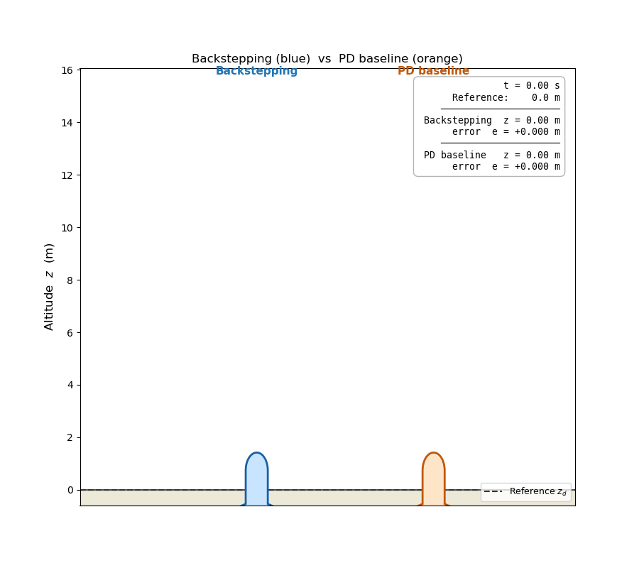
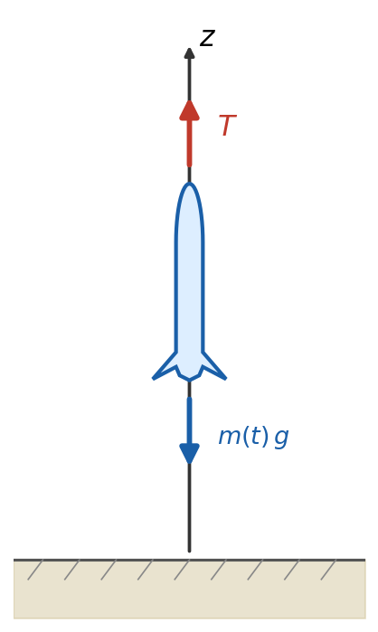
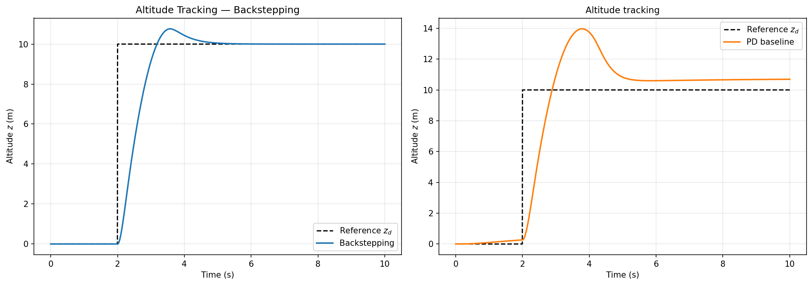
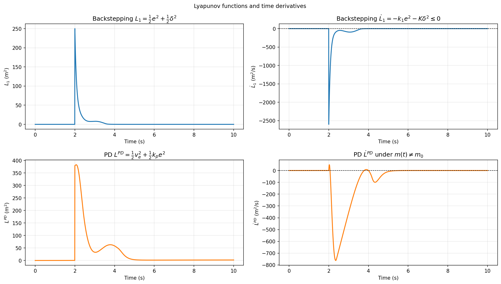
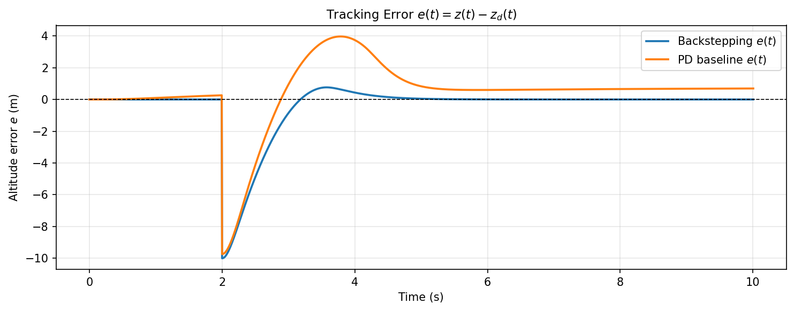
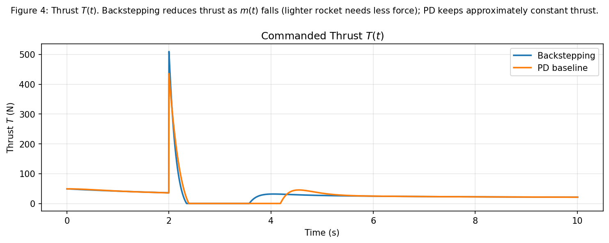
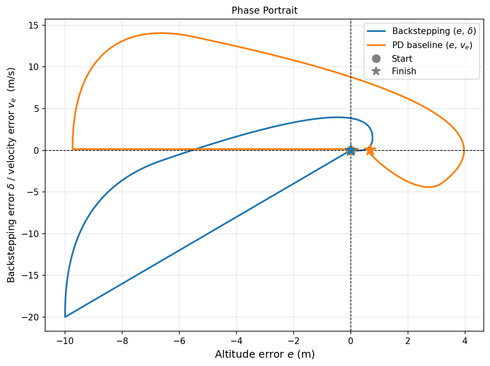

# Project 3: Backstepping Control of a Rocket with Decreasing Mass

<p align="center">
  
</p>

<p align="center">
  <em>Backstepping controller (blue) tracks the reference altitude despite the nonlinear decrease in rocket mass during fuel burn. The PD baseline (orange) accumulates a growing tracking error as mass changes.</em>
</p>

---

## 1. Problem Definition

**Control problem:** stabilize a rocket at a desired altitude $z_d$ while its mass decreases over time due to fuel consumption. The mass change is a known nonlinear function of time. The controller must handle this time-varying nonlinearity explicitly and maintain tracking performance throughout the burn.

**Plant:** a rocket modeled as a point mass moving along a vertical axis. The single control input is the thrust force $T$. The forces acting on the rocket are thrust $T$ upward and gravity $m(t)g$ downward, where $m(t)$ is the time-varying mass.

**Class of methods:** backstepping control based on a Control Lyapunov Function (CLF). The procedure exploits the cascade structure of the altitude dynamics: a stabilization triple $(\pi_0, L_0, K_0)$ is first designed for the base plant, then the Lyapunov function is augmented by the squared backstepping error to obtain a new triple $(\pi_1, L_1, K_1)$ for the full system. Formal asymptotic stability is proved via LaSalle's invariance principle.

**Comparison:** the backstepping controller is compared with a PD controller. The PD controller ignores the mass change in its law and therefore accumulates a growing steady-state error as $m(t)$ decreases. The backstepping controller uses $m(t)$ explicitly and maintains tracking accuracy. 

---

## 2. System Description

### Physical Setup

The rocket moves vertically. The thrust $T$ acts upward, and the gravitational force $m(t)g$ acts downward.



*Figure 1: Free-body diagram. The $z$-axis points upward. Red arrow — thrust $T$; blue arrow — gravitational force $m(t)g$.*

### Mass Model

The mass decreases according to a nonlinear exponential law:

```math
m(t) = m_f + (m_0 - m_f)\,e^{-\beta t} \tag{1}
```

where $m_0 > 0$ is the initial total mass (rocket body plus fuel) in kg, $m_f > 0$ is the final dry mass (rocket without fuel) in kg, and $\beta > 0$ is the burn rate constant in s⁻¹ that controls how quickly fuel is consumed. The time derivative of the mass is obtained by differentiating (1):

```math
\dot{m}(t) = -\beta(m_0 - m_f)\,e^{-\beta t} \tag{2}
```

Both $m(t)$ and $\dot{m}(t)$ are known to the backstepping controller at every time step. The PD controller does not use them.

### State Variables

The state vector $s \in \mathbb{R}^2$ contains the altitude and vertical velocity:

```math
s = [z,\; \dot{z}]^T
```

| Symbol | Meaning | Units |
|---|---|---|
| $z$ | Altitude above ground | m |
| $\dot{z}$ | Vertical velocity, positive upward | m/s |

### Control Input

```math
a = T \in \mathbb{R}, \quad T \geq 0
```

### Reference Trajectory

```math
z_d(t) = \begin{cases} 0\;\text{m} & t < 2\;\text{s} \\ 10\;\text{m} & t \geq 2\;\text{s} \end{cases}
```

The desired velocity is $\dot{z}_d = 0$ and the desired acceleration is $\ddot{z}_d = 0$ everywhere except at the jump.

### Physical Parameters

| Symbol | Meaning | Value | Units |
|---|---|---:|---|
| $m_0$ | Initial mass | 5.0 | kg |
| $m_f$ | Final dry mass | 2.0 | kg |
| $\beta$ | Burn rate constant | 0.3 | s⁻¹ |
| $g$ | Gravitational acceleration | 9.81 | m/s² |

---

## 3. Mathematical Specification


| Symbol | Meaning |
|---|---|
| $z$ | Altitude (m) |
| $z_d$ | Desired altitude (m) |
| $\dot{z}_d$ | Desired vertical velocity (m/s) |
| $\ddot{z}_d$ | Desired vertical acceleration (m/s²) |
| $e$ | Altitude error: $e = z - z_d$ (m) |
| $v_e$ | Velocity error: $v_e = \dot{z} - \dot{z}_d$ (m/s) |
| $\pi_0$ | Desired value for $v_e$ in the base plant (m/s) |
| $\delta$ | Backstepping error: $\delta = v_e - \pi_0(e)$ (m/s) |
| $L_0$ | CLF candidate for the base plant (m²) |
| $L_1$ | Augmented CLF for the full system (m²) |
| $k_1$ | Virtual control gain (s⁻¹) |
| $K$ | Backstepping damping gain (s⁻¹) |
| $k_p$ | PD proportional gain (s⁻²) |
| $k_d$ | PD derivative gain (s⁻¹) |
| $T$ | Thrust force (N) |
| $m(t)$ | Time-varying rocket mass (kg) |
| $\mu(t)$ | Mass ratio: $\mu(t) = m_0 / m(t)$ (dimensionless) |

### 3.1 Equation of Motion

Applying Newton's second law to the rocket along the vertical axis:

```math
m(t)\,\ddot{z} = T - m(t)\,g \tag{3}
```

Dividing both sides by $m(t) > 0$:

```math
\ddot{z} = \frac{T}{m(t)} - g \tag{4}
```

This is a second-order system with one input $T$ and a time-varying coefficient $1/m(t)$.

### 3.2 Error Coordinates

Define the altitude tracking error $e$ and the velocity tracking error $v_e$:

```math
e = z - z_d, \qquad v_e = \dot{z} - \dot{z}_d \tag{5}
```

Differentiating $e$ with respect to time:

```math
\dot{e} = \dot{z} - \dot{z}_d = v_e \tag{6}
```

Differentiating $v_e$ and substituting equation (4):

```math
\dot{v}_e = \ddot{z} - \ddot{z}_d = \frac{T}{m(t)} - g - \ddot{z}_d \tag{7}
```

Equations (6) and (7) form a cascade: the altitude error $e$ is driven by the velocity error $v_e$, and $v_e$ is driven by the actual thrust $T$ through the time-varying gain $1/m(t)$.

### 3.3 Backstepping Error Variable

In Step 1 below, the desired value for $v_e$ is chosen as $\pi_0(e) = -k_1 e$. The backstepping error variable $\delta$ measures how far the actual velocity error is from this desired value:

```math
\delta := v_e - \pi_0(e) = v_e + k_1 e \tag{8}
```

When $\delta = 0$, the velocity error behaves as needed to drive $e \to 0$ at rate $k_1$.

---

## 4. Method Description and Stability Proof

### 4.1 Step 1 — Base Plant and Stabilization Triple $(\pi_0, L_0, K_0)$

**Base plant.** Consider only equation (6), treating $v_e$ as a free designable input:

```math
\dot{e} = v_e
```

**Choice of desired velocity.** We want $e(t) \to 0$. Choose:

```math
\pi_0(e) = -k_1 e, \quad k_1 > 0 \tag{9}
```

where $k_1$ is a positive gain in s⁻¹ and $\pi_0(e)$ is the desired value for $v_e$. If $v_e = \pi_0(e)$, then $\dot{e} = -k_1 e$ and the altitude error converges to zero exponentially at rate $k_1$.

**CLF candidate for the base plant.**

```math
L_0 = \frac{1}{2}e^2 \tag{10}
```

$L_0$ is positive definite: $L_0 \geq 0$ for all $e$, and $L_0 = 0$ if and only if $e = 0$.

**Time derivative of $L_0$.** Differentiating (10) and substituting $\dot{e} = \pi_0(e) = -k_1 e$:

```math
\dot{L}_0 = e\,\dot{e} = e\,(-k_1 e) = -k_1 e^2 \leq 0 \tag{11}
```

with equality only at $e = 0$.

**Convergence via LaSalle's invariance principle.** The set where $\dot{L}_0 = 0$ is $\mathcal{S}_0 = \{0\}$. The only trajectory of $\dot{e} = -k_1 e$ that stays in $\mathcal{S}_0$ is $e(t) \equiv 0$. Since $L_0$ is positive definite and $\dot{L}_0 \leq 0$ everywhere, LaSalle's invariance principle guarantees $e(t) \to 0$ as $t \to \infty$.

The triple $(\pi_0,\, L_0,\, K_0)$ with $K_0(r) = k_1 r^2$ is a valid stabilization triple for the base plant.

### 4.2 Step 2 — Augmented System and New Triple $(\pi_1, L_1, K_1)$

**Why a second step is needed.** In the full system, $v_e$ is a state variable governed by equation (7). The backstepping error $\delta = v_e + k_1 e$ measures the mismatch between the actual $v_e$ and the desired value $\pi_0(e)$.

**Augmented Lyapunov function.**

```math
L_1 := L_0 + \frac{1}{2}\delta^2 = \frac{1}{2}e^2 + \frac{1}{2}\delta^2 \tag{12}
```

$L_1$ is positive definite: $L_1 \geq 0$, and $L_1 = 0$ if and only if $e = 0$ and $\delta = 0$.

**Time derivative of $L_1$.**

```math
\dot{L}_1 = e\,\dot{e} + \delta\,\dot{\delta} \tag{13}
```

*First term.* From (6): $\dot{e} = v_e$. From (8): $v_e = \delta - k_1 e$. Therefore:

```math
e\,\dot{e} = e\,(\delta - k_1 e) = e\delta - k_1 e^2 \tag{14}
```

*Second term.* Differentiating $\delta = v_e + k_1 e$:

```math
\dot{\delta} = \dot{v}_e + k_1\,\dot{e} \tag{15}
```

Substituting $\dot{e} = v_e$ from (6) and $\dot{v}_e$ from (7) into (15):

```math
\dot{\delta} = \left(\frac{T}{m(t)} - g - \ddot{z}_d\right) + k_1\,v_e = \frac{T}{m(t)} - g - \ddot{z}_d + k_1 v_e \tag{16}
```

**Control law.** Substituting (14) and (16) into (13):

```math
\dot{L}_1 = e\delta - k_1 e^2 + \delta\!\left(\frac{T}{m(t)} - g - \ddot{z}_d + k_1 v_e\right) \tag{17}
```

To make $\dot{L}_1$ negative definite, we need the term multiplying $\delta$ in the second part to cancel $e\delta$ from the first part and add damping $-K\delta^2$. We require:

```math
\delta\!\left(\frac{T}{m(t)} - g - \ddot{z}_d + k_1 v_e\right) = -K\delta^2 - e\delta \tag{18}
```

Dividing both sides by $\delta$ and solving for $T$:

```math
\frac{T}{m(t)} - g - \ddot{z}_d + k_1 v_e = -K\delta - e
```

```math
T = m(t)\bigl(g + \ddot{z}_d - k_1 v_e - K\delta - e\bigr) \tag{19}
```

where $K > 0$ is the backstepping damping gain in s⁻¹. The factor $m(t)$ in (19) explicitly cancels the time-varying coefficient $1/m(t)$ from equation (7). Since $m(t)$ is known analytically from (1), this cancellation is exact.

**Substituting into $\dot{L}_1$.** With condition (18) satisfied, substituting (14) and (18) into (13):

```math
\dot{L}_1 = \bigl(e\delta - k_1 e^2\bigr) + \bigl(-K\delta^2 - e\delta\bigr)
```

```math
= e\delta - k_1 e^2 - K\delta^2 - e\delta = -k_1 e^2 - K\delta^2 \tag{20}
```

Since $k_1 > 0$ and $K > 0$, using $e^2 + \delta^2 = 2L_1$:

```math
\dot{L}_1 = -k_1 e^2 - K\delta^2 \leq -\min(k_1, K)\,(e^2 + \delta^2) = -2\min(k_1, K)\,L_1 \tag{21}
```

so $\dot{L}_1 < 0$ for all $(e, \delta) \neq (0, 0)$.

**Convergence via LaSalle's invariance principle.** The set where $\dot{L}_1 = 0$ is $\mathcal{S}_1 = \{(e, \delta) : \dot{L}_1 = 0\}$. From (20), $\dot{L}_1 = 0$ requires $e = 0$ and $\delta = 0$ simultaneously, so $\mathcal{S}_1 = \{(0,0)\}$. Since $L_1$ is positive definite and $\dot{L}_1 \leq 0$ everywhere, LaSalle's invariance principle guarantees $(e(t), \delta(t)) \to (0,0)$ as $t \to \infty$. Since $\delta = v_e + k_1 e$, convergence $(e,\delta) \to (0,0)$ implies $v_e \to 0$. Therefore $z(t) \to z_d$ and $\dot{z}(t) \to \dot{z}_d$.

**Why the time-varying mass does not break stability.** After substituting (19) into (16):

```math
\dot{\delta} = -K\delta - e \tag{22}
```

This is linear and time-invariant with decay rate $K$, regardless of how $m(t)$ changes. Inequality (21) holds for all $t \geq 0$ under the single condition $m(t) > 0$, which is guaranteed since $m(t) \geq m_f > 0$ from (1).

### 4.3 PD Controller — Derivation, Stability, and Failure

**Control law.** The PD controller is designed for a rocket of constant nominal mass $m_0$, ignoring fuel burn. For constant mass, equation (3) gives $m_0 \ddot{z} = T - m_0 g$, so:

```math
\ddot{z} = \frac{T}{m_0} - g
```

Since $\ddot{z} = \ddot{e}$ for $\ddot{z}_d = 0$:

```math
\ddot{e} = \frac{T}{m_0} - g
```

Assigning the desired closed-loop error dynamics $\ddot{e} = -k_p e - k_d v_e$ and solving for $T$:

```math
T_{\text{PD}} = m_0\bigl(g - k_p\,e - k_d\,v_e\bigr) \tag{23}
```

where $k_p > 0$ is the proportional gain in s⁻² and $k_d > 0$ is the derivative gain in s⁻¹.

**Nominal case ($m(t) = m_0$).** Substituting (23) into (4) with $m(t) = m_0$:

```math
\ddot{e} = g - k_p e - k_d v_e - g = -k_p e - k_d v_e \tag{24}
```

which reads:

```math
\ddot{e} + k_d \dot{e} + k_p e = 0 \tag{25}
```

Define the Lyapunov candidate:

```math
L^{\text{PD}} = \frac{1}{2}v_e^2 + \frac{1}{2}k_p\,e^2 \tag{26}
```

$L^{\text{PD}}$ is positive definite: $L^{\text{PD}} \geq 0$, and $L^{\text{PD}} = 0$ if and only if $e = 0$ and $v_e = 0$.

Differentiating (26) along trajectories of (25):

```math
\dot{L}^{\text{PD}} = v_e\,\dot{v}_e + k_p\,e\,v_e = v_e\bigl(-k_p e - k_d v_e\bigr) + k_p\,e\,v_e = -k_d v_e^2 \leq 0 \tag{27}
```

The set where $\dot{L}^{\text{PD}} = 0$ is $\{v_e = 0\}$. On any trajectory confined to this set, $v_e \equiv 0$ and $\dot{v}_e \equiv 0$. Substituting into (25): $k_p e = 0$, which forces $e = 0$. The largest invariant subset of $\{v_e = 0\}$ is $\{e = 0,\, v_e = 0\}$. By LaSalle's invariance principle, $e(t) \to 0$ and $v_e(t) \to 0$ as $t \to \infty$.

#### Failure When $m(t) \neq m_0$

When the mass decreases but the controller still applies (23), the actual acceleration is:

```math
\ddot{z} = \frac{T_{\text{PD}}}{m(t)} - g = \frac{m_0}{m(t)}\bigl(g - k_p e - k_d v_e\bigr) - g \tag{28}
```

Define the mass ratio $\mu(t) := m_0/m(t) \geq 1$. Since $\ddot{z} = \ddot{e}$, expanding (28):

```math
\ddot{e} = (\mu(t)-1)\,g - \mu(t)\,k_p\,e - \mu(t)\,k_d\,v_e \tag{29}
```

The term $(\mu(t)-1)g > 0$ is a **persistent forcing term** driven by the uncompensated mass change. Computing $\dot{L}^{\text{PD}}$ along trajectories of (29):

```math
\dot{L}^{\text{PD}} = v_e\,\ddot{e} + k_p\,e\,v_e
```

```math
= v_e\bigl((\mu-1)g - \mu k_p e - \mu k_d v_e\bigr) + k_p\,e\,v_e
```

```math
= -\mu k_d v_e^2 + k_p\,e\,v_e(1-\mu) + (\mu-1)g\,v_e \tag{30}
```

The first term $-\mu k_d v_e^2$ provides dissipation. However, the term $(\mu-1)g\,v_e$ is a persistent input that prevents the system from reaching $e = 0$, $v_e = 0$.

At any steady state ($\ddot{e} = 0$, $v_e = 0$), equation (29) reduces to:

```math
0 = (\mu(t)-1)g - \mu(t)\,k_p\,e^*
```

```math
\mu(t)\,k_p\,e^* = g\!\left(\frac{m_0}{m(t)} - 1\right) = g\,\frac{m_0 - m(t)}{m(t)}
```

```math
e^* = \frac{g}{k_p}\!\left(1 - \frac{m(t)}{m_0}\right) \tag{31}
```

Since $m(t) < m_0$ for all $t > 0$, we have $e^* > 0$: the rocket holds altitude above the reference, with an error that grows as fuel burns. As $t \to \infty$ and $m(t) \to m_f$:

```math
e^*_{\max} = \frac{g}{k_p}\!\left(1 - \frac{m_f}{m_0}\right) = \frac{9.81}{8}\!\left(1 - \frac{2}{5}\right) \approx 0.74\;\text{m} \tag{32}
```

The PD controller converges to a **wrong equilibrium** offset from $z_d$ by an amount growing with the fuel consumed. This failure cannot be corrected by retuning $k_p$ or $k_d$, because the steady-state error (31) is structural: it vanishes only when $m(t) = m_0$. Only a controller that uses $m(t)$ explicitly — as in equation (19) — can guarantee zero steady-state error.

---

## 5. Algorithm

The control algorithm is executed at each time step $t$. Both controllers run in parallel on independent copies of the state; the simulation loop (`src/simulation.py → Simulation.run`) integrates both forward simultaneously.

### Algorithm 1 — Backstepping Controller (`src/controller.py → BacksteppingController.compute`)

Read state: obtain current $z(t)$, $\dot{z}(t)$, and time $t$.

1. **Compute current mass** from the known burn model:

```math
m(t) = m_f + (m_0 - m_f)\,e^{-\beta t}
```

2. **Compute tracking errors:**

```math
e = z - z_d, \qquad v_e = \dot{z} - \dot{z}_d
```

3. **Compute desired velocity** (virtual control for the base plant):

```math
\pi_0 = -k_1\,e
```

4. **Compute backstepping error:**

```math
\delta = v_e - \pi_0 = v_e + k_1\,e
```

5. **Compute thrust** and clamp to non-negative values:

```math
T = m(t)\bigl(g + \ddot{z}_d - k_1 v_e - K\delta - e\bigr), \qquad T \leftarrow \max(T,\,0)
```

   The factor $m(t)$ cancels the time-varying coefficient $1/m(t)$ in the dynamics exactly, making the closed-loop $\dot{\delta} = -K\delta - e$ time-invariant.

6. **Apply thrust** to the plant and integrate $\ddot{z} = T/m(t) - g$.

---

### Algorithm 2 — PD Baseline Controller (`src/controller.py → PDController.compute`)

Read state: obtain current $z(t)$, $\dot{z}(t)$. **No time, no mass information is passed.**

1. **Compute tracking errors:**

```math
e = z - z_d, \qquad v_e = \dot{z} - \dot{z}_d
```

2. **Compute thrust** using the fixed nominal mass $m_0$ and clamp:

```math
T = m_0\bigl(g - k_p\,e - k_d\,v_e\bigr), \qquad T \leftarrow \max(T,\,0)
```

   The controller has no access to $m(t)$ or $\dot{m}(t)$. When $m(t) < m_0$ the uncompensated forcing term $(\mu-1)g\,v_e$ in equation (30) prevents convergence to $e=0$ and drives the system to the nonzero steady state $e^* = \tfrac{g}{k_p}\!\left(1-\tfrac{m(t)}{m_0}\right)$ derived in equation (31).

3. **Apply thrust** to the plant and integrate $\ddot{z} = T/m(t) - g$.

Both algorithms are run simultaneously on the same reference trajectory and their results are compared in Section 7.

---

## 6. Experimental Setup

| Parameter | Value |
|---|---|
| Simulation time | 10 s |
| Time step $\Delta t$ | 0.005 s |
| Initial altitude $z(0)$ | 0 m |
| Initial velocity $\dot{z}(0)$ | 0 m/s |
| Reference step | 0 → 10 m at $t = 2$ s |

### Controller Gains

| Gain | Backstepping | PD baseline |
|---|---:|---:|
| $k_1$ — virtual control gain | 2.0 | — |
| $K$ — backstepping damping gain | 6.0 | — |
| $k_p$ — proportional gain | — | 8.0 |
| $k_d$ — derivative gain | — | 4.0 |

---

## 7. Results and Discussion

### 7.1 Altitude Tracking

<p align="center">
  
</p>

<p align="center">
  <em>Figure 2: Altitude z(t) vs. reference z_d(t) for both controllers.</em>
</p>

**Interpretation of Figure 2**

Both controllers track the step at $t = 2$ s when the mass is still close to $m_0$. As fuel burns and $m(t)$ decreases, the PD controller develops a growing positive altitude error consistent with equation (31). By $t = 10$ s, $m(10) \approx 2.15$ kg and the instantaneous steady-state error from (31) reaches approximately $0.70$ m. The backstepping controller maintains near-zero error because inequality (21) guarantees $\dot{L}_1 < 0$ regardless of the value of $m(t)$.

### 7.2 Lyapunov Functions and Derivatives

<p align="center">
  
</p>

<p align="center">
  <em>Figure 3: Lyapunov functions L₁(t), L<sup>PD</sup>(t) and their time derivatives for both controllers.</em>
</p>

**Interpretation of Figure 3**

$L_1(t)$ (top-left) decreases monotonically, confirming inequality (20). Its derivative $\dot{L}_1 = -k_1 e^2 - K\delta^2$ (top-right) is everywhere $\leq 0$, which is the analytical bound from equation (20). For the PD controller (bottom row), $L^{PD}(t)$ initially decreases after the step but stabilises at a nonzero value. Its derivative $\dot{L}^{PD}$ (bottom-right) becomes positive once $m(t)$ has decreased enough, showing that the term $(\mu-1)g\,v_e$ in equation (30) dominates and prevents convergence to zero.

### 7.3 Tracking Error

<p align="center">
  
</p>

<p align="center">
  <em>Figure: Altitude tracking error e(t) = z(t) − z_d(t) for both controllers.</em>
</p>

**Interpretation**

The backstepping error converges to zero after the initial transient following the step at $t=2$ s. The PD error also peaks at the step but then grows monotonically instead of returning to zero, which is the structural steady-state offset predicted by equation (31).

### 7.5 Thrust Profile

<p align="center">
  
</p>

<p align="center">
  <em>Figure 4: Commanded thrust T(t) for both controllers.</em>
</p>

**Interpretation of Figure 4**

The backstepping controller gradually reduces thrust as $m(t)$ decreases: less force is needed to support the lighter rocket, following directly from equation (19). The PD controller maintains approximately constant thrust and cannot track the changing weight, consistent with the accumulating steady-state error.

### 7.6 Phase Portrait

<p align="center">
  
</p>

<p align="center">
  <em>Figure 5: Phase trajectories in the (e, δ) plane. The backstepping controller spirals into the origin; the PD controller converges to the off-origin steady state e* ≈ 0.74 m.</em>
</p>

**Interpretation of Figure 5**

The backstepping trajectory (left panel, coordinates $(e, \delta)$) spirals into the origin $(0,0)$ with a time gradient from dark to light, confirming convergence $(e,\delta)\to(0,0)$ proved in Section 4.2. Circle = start; star = finish. The PD trajectory (right panel, coordinates $(e, v_e)$) converges to a point with $e \approx 0.70$ m at $t=10$ s, visually confirming the steady-state offset derived in equation (31).

---

## 8. Key Findings and Conclusions

### 8.1 Necessity of Mass Compensation

The PD controller fails in a **structural** way when the mass changes: it converges to the wrong altitude, and the steady-state error grows linearly with fuel burn. This failure cannot be fixed by retuning $k_p$ or $k_d$. The backstepping controller eliminates this failure by using $m(t)$ explicitly in the control law and canceling the time-varying coefficient exactly.

### 8.2 What the Backstepping Controller Guarantees

- **Lyapunov stability:** $L_1(t)$ is strictly decreasing, so $e(t)$ and $\delta(t)$ remain bounded for all time.
- **Asymptotic state convergence:** $e(t) \to 0$ and $v_e(t) \to 0$ as $t \to \infty$, proven via LaSalle's Invariance Principle (Section 4.2).
- **Mass-independent proof:** inequality (21) holds for all $t \geq 0$ without any assumption on the magnitude or rate of mass change, as long as $m(t) > 0$.

### 8.3 Limitations

- The mass model must be known exactly; an unknown burn rate $\beta$ would require adaptive extensions.
- The model is 1-D: attitude dynamics and aerodynamic drag are not included.
- The constraint $T \geq 0$ is enforced by clipping; for very large initial errors this breaks the Lyapunov proof locally.

---

## 9. Project Structure

```text
project_3_backstepping_rocket/
├── README.md
├── requirements.txt
├── main.py
├── configs/
│   └── params.yaml
├── src/
│   ├── __init__.py
│   ├── system.py
│   ├── controller.py
│   ├── simulation.py
│   └── visualization.py
├── figures/
│   ├── system_diagram.png
│   ├── altitude_tracking.png
│   ├── tracking_error.png
│   ├── lyapunov.png
│   ├── thrust.png
│   └── phase_portrait.png
└── animations/
    └── rocket_flight.gif
```

---

## 10. How to Run

```bash
pip install -r requirements.txt
python main.py
```

This runs both the backstepping and PD controllers and regenerates all figures and the animation.

---

## 11. References

1. Rios-Garcia, N. et al. (2025). *Control and Navigation of a 2-D Electric Rocket*. arXiv:2509.19970.

---

## 12. Note on AI Usage

AI was used to assist with structuring the mathematical derivations and organizing the documentation. All control design decisions, stability analysis steps, and simulation results were produced and verified by the team.
