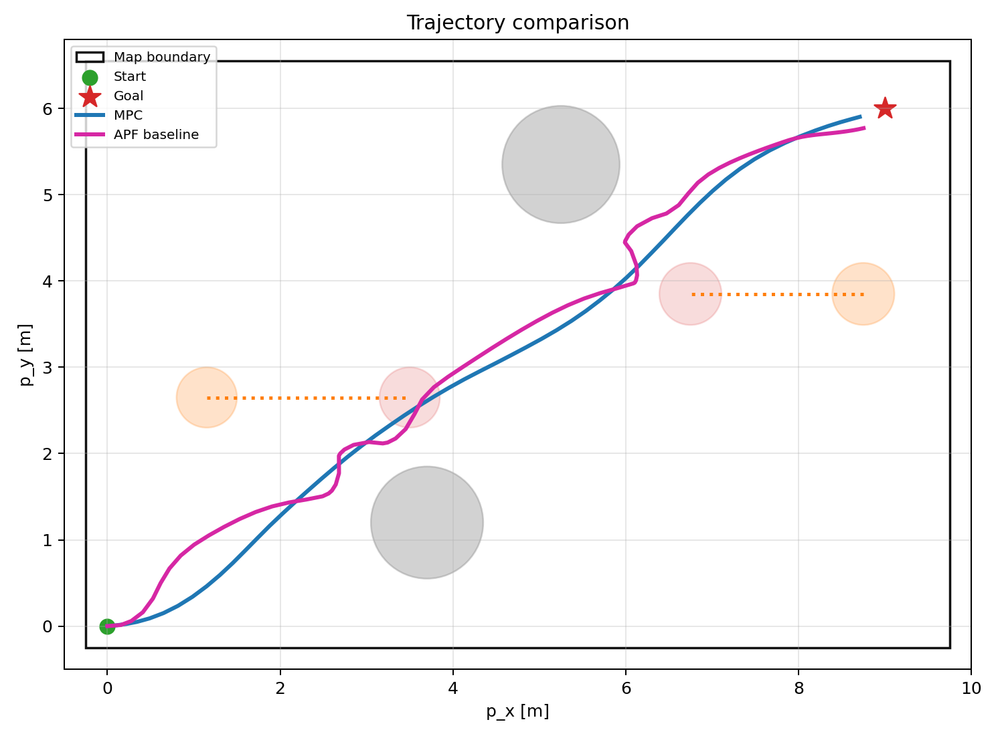
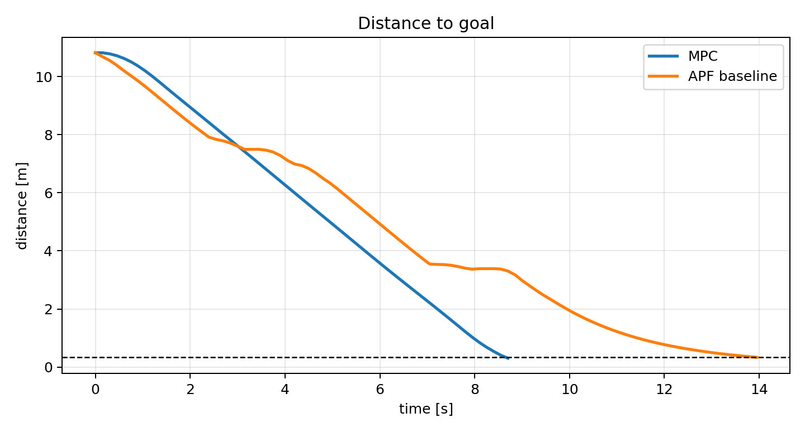
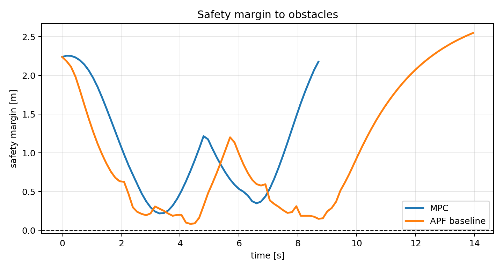
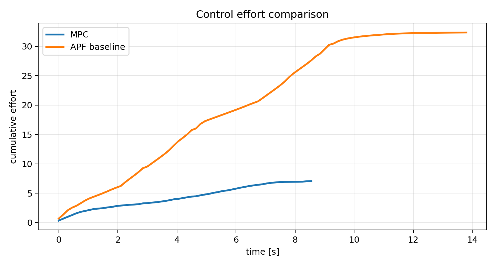
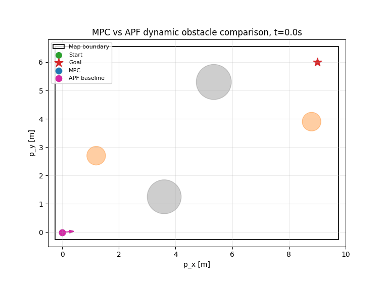
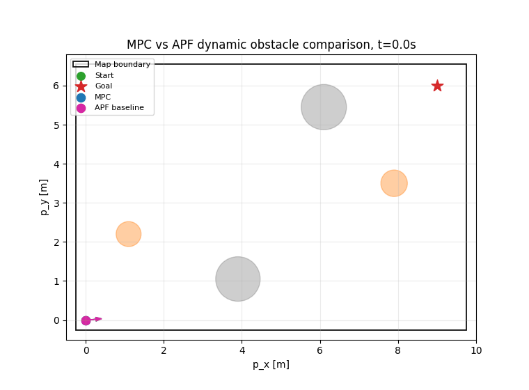
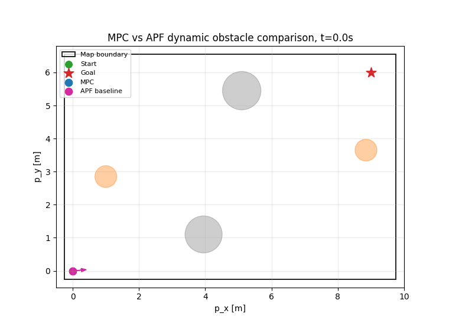
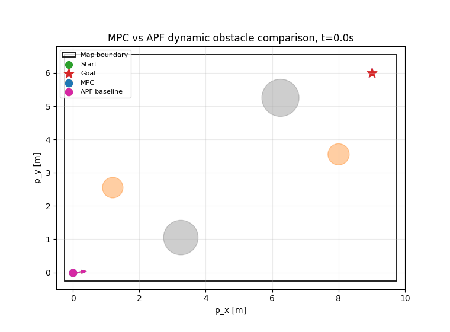
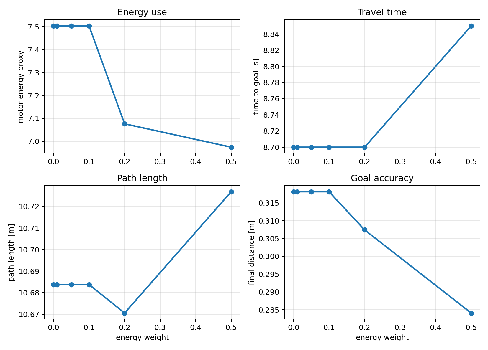

# Project 4: Torque-Based MPC for Dynamic Obstacle Avoidance


**Animation.** Representative comparison on map 1. The MPC robot is blue, the APF baseline is magenta, static obstacles are gray, and moving obstacles are orange.

---

## 1. Problem Statement

**Control problem:** drive a differential-drive mobile robot from a start position to a desired goal position in a 2D workspace with static and moving circular obstacles. The obstacle motion is known and predicted over the MPC horizon. The controller must explicitly handle dynamic obstacle avoidance, map boundary constraints, and actuator limits while maintaining efficient and smooth motion.

**Plant:** a differential-drive mobile robot moving in a planar workspace. The robot state includes planar position, heading angle, linear velocity, and angular velocity. The control inputs are left and right wheel torques. The robot is affected by actuator limits, damping, map boundaries, and collision constraints with static and dynamic obstacles.

**Class of methods:** torque-based Model Predictive Control. At each time step, the controller predicts future robot states over a finite horizon, evaluates predicted obstacle positions, rejects infeasible trajectories that violate safety constraints, and selects a torque sequence minimizing goal-tracking error, path length, control effort, smoothness, and energy-related cost. Only the first torque input is applied, and the optimization is repeated at the next step.

**Comparison:** the MPC controller is compared with an Artificial Potential Field baseline. APF uses attractive forces toward the goal and repulsive forces from obstacles. Unlike MPC, APF is reactive and does not optimize a future torque sequence over a horizon. The comparison evaluates goal reaching, obstacle clearance, near-obstacle events, path length, path efficiency, smoothness, heading aggressiveness, control effort, and boundary violations.

---

## 2. System Model


**Figure 1.** Differential-drive robot model with center position, heading, linear velocity, angular velocity, and wheel torque inputs.

The state vector is

$$
x_k=\begin{bmatrix}p_{x,k}&p_{y,k}&\theta_k&v_k&\omega_k\end{bmatrix}^{T}.
\tag{1}
$$

where:

- $x_k$ is the robot state at time step $k$;
- $p_{x,k}$ and $p_{y,k}$ are planar coordinates;
- $\theta_k$ is the heading angle;
- $v_k$ is the linear velocity;
- $\omega_k$ is the angular velocity.

The MPC control input is

$$
u_k=\begin{bmatrix}\tau_{R,k}&\tau_{L,k}\end{bmatrix}^{T}.
\tag{2}
$$

where:

- $u_k$ is the wheel torque input;
- $\tau_{R,k}$ is the right wheel torque;
- $\tau_{L,k}$ is the left wheel torque.

The simplified torque dynamics are

$$
\dot v=k_v(\tau_R+\tau_L)-c_vv.
\tag{3}
$$

where:

- $\dot v$ is the linear acceleration;
- $k_v=0.85$ is the torque-to-acceleration gain;
- $\tau_R$ and $\tau_L$ are wheel torques;
- $c_v=0.55$ is the linear damping coefficient;
- $v$ is the current linear velocity.

The angular acceleration is

$$
\dot\omega=k_\omega(\tau_R-\tau_L)-c_\omega\omega.
\tag{4}
$$

where:

- $\dot\omega$ is the angular acceleration;
- $k_\omega=1.25$ is the angular torque gain;
- $\tau_R-\tau_L$ is the torque difference;
- $c_\omega=0.65$ is the angular damping coefficient;
- $\omega$ is the angular velocity.

The planar kinematics are

$$
\dot p_x=v\cos\theta,\qquad \dot p_y=v\sin\theta,\qquad \dot\theta=\omega.
\tag{5}
$$

where:

- $\dot p_x$ and $\dot p_y$ are Cartesian velocity components;
- $v$ is the linear velocity;
- $\theta$ is the heading angle;
- $\dot\theta$ is the heading rate;
- $\omega$ is the angular velocity.

The code uses Euler integration:

$$
\begin{aligned}
p_{x,k+1}&=p_{x,k}+v_k\cos(\theta_k)\Delta t,\\
p_{y,k+1}&=p_{y,k}+v_k\sin(\theta_k)\Delta t,\\
\theta_{k+1}&=\operatorname{wrap}(\theta_k+\omega_k\Delta t),\\
v_{k+1}&=\operatorname{clip}(v_k+\dot v_k\Delta t,-v_{\max},v_{\max}),\\
\omega_{k+1}&=\operatorname{clip}(\omega_k+\dot\omega_k\Delta t,-\omega_{\max},\omega_{\max}).
\end{aligned}
\tag{6}
$$

where:

- $\Delta t=0.15$ s is the time step;
- $v_{\max}=1.35$ m/s is the velocity bound;
- $\omega_{\max}=1.9$ rad/s is the angular velocity bound;
- $\operatorname{wrap}$ maps angles to $[-\pi,\pi]$;
- $\operatorname{clip}$ applies the stated bounds.

---

## 3. Obstacle Model and Constraints

Each obstacle is circular. Static obstacles have zero velocity, while moving obstacles follow known deterministic motion:

$$
c_j(t)=c_{j,0}+\nu_jt.
\tag{7}
$$

where:

- $c_j(t)$ is the center of obstacle $j$ at time $t$;
- $c_{j,0}$ is its initial center;
- $\nu_j$ is its velocity vector;
- $t$ is time.

The predicted safe set is

$$
\begin{aligned}
\mathcal X_{\mathrm{safe}}(t)=\{x:\;&x_{\min}+r_{\mathrm{robot}}\le p_x\le x_{\max}-r_{\mathrm{robot}},\\
&y_{\min}+r_{\mathrm{robot}}\le p_y\le y_{\max}-r_{\mathrm{robot}},\\
&\|p-c_j(t)\|\ge r_{\mathrm{robot}}+r_j+r_{\mathrm{margin}}\;\text{for all }j,\\
&|v|\le v_{\max},\;|\omega|\le\omega_{\max}\}.
\end{aligned}
\tag{8}
$$

where:

- $\mathcal X_{\mathrm{safe}}(t)$ is the time-dependent safe set;
- $p=[p_x,p_y]^T$ is robot position;
- $x_{\min},x_{\max},y_{\min},y_{\max}$ are map bounds;
- $r_{\mathrm{robot}}=0.18$ m is the robot radius;
- $r_j$ is obstacle radius;
- $r_{\mathrm{margin}}=0.12$ m is the safety buffer.

The torque constraints are

$$
-\tau_{\max}\le \tau_{R,k}\le\tau_{\max},\qquad
-\tau_{\max}\le \tau_{L,k}\le\tau_{\max}.
\tag{9}
$$

where:

- $\tau_{\max}=1.35$ is the maximum absolute wheel torque;
- $\tau_{R,k}$ and $\tau_{L,k}$ are right and left wheel torques.

---

## 4. MPC Design

At each time step, the controller optimizes a finite sequence:

$$
U_k=\{u_{0|k},u_{1|k},\ldots,u_{N-1|k}\}.
\tag{10}
$$

where:

- $U_k$ is the planned input sequence;
- $u_{i|k}$ is the predicted input at horizon index $i$;
- $N=50$ is the prediction horizon.

The finite-horizon cost is

$$
J_N(x_k,U_k)=\sum_{i=0}^{N-1}\ell(\hat x_{i|k},u_{i|k})+E_f(\hat x_{N|k}).
\tag{11}
$$

where:

- $J_N$ is the finite-horizon objective;
- $\ell(\hat x_{i|k},u_{i|k})$ is the stage cost;
- $E_f(\hat x_{N|k})$ is the terminal error cost;
- $\hat x_{i|k}$ is the predicted state.

The energy term is

$$
J_{\mathrm{energy}}=w_E\sum_{i=0}^{N-1}(\tau_{R,i|k}^{2}+\tau_{L,i|k}^{2})\Delta t.
\tag{12}
$$

where:

- $J_{\mathrm{energy}}$ is the motor-energy proxy in the cost;
- $w_E$ is the energy penalty weight;
- $\tau_{R,i|k}$ and $\tau_{L,i|k}$ are predicted wheel torques;
- $\Delta t$ is the time step.

The implemented stage cost also includes goal tracking, terminal goal error, path length, torque effort, control smoothness, obstacle shaping, and boundary shaping. Hard feasibility is handled separately: candidate trajectories violating (8), (9), velocity bounds, or the terminal constraint are rejected before cost comparison.

The terminal error metric used for the terminal constraint is

$$
E(x)=\frac{1}{2}\|p-p_g\|^2+\frac{1}{2}q_\theta e_\theta^2+\frac{1}{2}q_vv^2+\frac{1}{2}q_\omega\omega^2.
\tag{13}
$$

where:

- $E(x)$ is the terminal error metric;
- $p$ is robot position;
- $p_g$ is the goal position;
- $e_\theta$ is the heading error to the goal direction;
- $q_\theta=0.60$, $q_v=0.18$, and $q_\omega=0.12$ are positive weights.

The terminal set is

$$
\mathcal S_{\mathrm{term}}=\{x:E(x)\le\rho_{\mathrm{term}}\}.
\tag{14}
$$

where:

- $\mathcal S_{\mathrm{term}}$ is the terminal set;
- $E(x)$ is the terminal error metric from (13);
- $\rho_{\mathrm{term}}=2.0$ is the implemented terminal threshold.

The shifted candidate sequence used for recursive feasibility logic is

$$
U_{k+1}^{\mathrm{cand}}=\{u^*_{1|k},u^*_{2|k},\ldots,u^*_{N-1|k},\eta(x^*_{N|k})\}.
\tag{15}
$$

where:

- $U_{k+1}^{\mathrm{cand}}$ is the candidate sequence at the next step;
- $u^*_{i|k}$ are inputs from the previous accepted sequence;
- $\eta(x^*_{N|k})$ is the local terminal policy applied at the previous terminal state.

In the implemented runs, candidate sequences are checked against the safe set, input bounds, velocity bounds, and terminal set. The shifted sequence is included as a fallback candidate. If dynamic obstacle predictions make the shifted sequence infeasible, an emergency braking sequence is available and logged. In the final five-map validation, emergency action count is zero.

This gives a practical version of the lecture guarantee logic: with accurate obstacle predictions over the horizon, a reachable terminal set, and enough candidate resolution to find a feasible sequence, the controller preserves constraint satisfaction in simulation and repeatedly drives the robot toward the goal. This is not a global proof for every possible dynamic-obstacle scene; it is a constraint-based MPC design validated on the five tested maps.

---

## 5. APF Baseline

The APF controller commands linear and angular velocity directly. It combines attraction to the goal with local repulsion from current obstacle positions. It does not predict future obstacle positions and does not optimize wheel torques over a horizon. This makes APF computationally light but more reactive in moving-obstacle scenarios.

---

## 6. Algorithm Pipeline

1. Initialize the scenario, robot state, goal, static obstacles, and moving obstacles.
2. Validate that obstacle disks do not overlap over the full simulation time.
3. Predict future robot states and moving-obstacle positions over the MPC horizon.
4. Reject infeasible MPC candidates that violate safety, input, velocity, or terminal constraints.
5. Select the feasible torque sequence with the lowest cost and apply only its first input.
6. Run APF on the same scenario using the same robot model limits.
7. Log goal distance, clearance, safety margin, path length, smoothness, effort, time, collisions, and boundary violations.
8. Repeat this procedure for five obstacle maps and generate GIFs and plots.

---

## 7. Simulation Setup

| Quantity | Value |
|---|---:|
| Start state | $[0.0,0.0,0.08,0.0,0.0]^T$ |
| Goal | $[9.0,6.0]^T$ m |
| Time step | 0.15 s |
| Maximum steps | 180 |
| Goal tolerance | 0.35 m |
| Map bounds | $x\in[-0.25,9.75]$ m, $y\in[-0.25,6.55]$ m |
| Robot radius | 0.18 m |
| Safety buffer | 0.12 m |
| MPC horizon | 50 |
| Torque limit | 1.35 |

Motion smoothness is measured by

$$
S_p=\sum_{k=1}^{K-1}\|p_{k+1}-2p_k+p_{k-1}\|.
\tag{16}
$$

where:

- $S_p$ is the cumulative second-difference smoothness metric;
- $p_{k-1}$, $p_k$, and $p_{k+1}$ are consecutive robot positions;
- lower $S_p$ means smoother motion.

Path efficiency is

$$
\eta=\frac{\|p_g-p_0\|}{L}.
\tag{17}
$$

where:

- $\eta$ is path efficiency;
- $p_g$ is the goal position;
- $p_0$ is the initial position;
- $L$ is total traveled path length.

Control effort is

$$
E_u=\sum_{k=0}^{K-1}\|u_k\|^2\Delta t.
\tag{18}
$$

where:

- $E_u$ is cumulative control effort;
- $u_k$ is a wheel-torque input for MPC or a velocity command for APF;
- $\Delta t$ is the simulation time step.

---

## 8. Representative Map Results



**Figure 2.** Representative map 1 trajectory comparison. MPC moves through the corridor with a shorter, smoother path, while APF reacts later to the moving obstacles.



**Figure 3.** Distance to goal on map 1. Both methods reach the target, but MPC reaches it earlier.



**Figure 4.** Safety margin on map 1. MPC keeps a larger safety margin for most of the run.


**Figure 5.** Heading and position-based smoothness on map 1. MPC has much lower accumulated heading change and second-difference smoothness.



**Figure 6.** Cumulative control effort on map 1. MPC uses substantially less effort than APF.

---

## 9. Robustness Validation on Five Maps


**Map 1.** Central crossing obstacle corridor.



**Map 2.** Offset static bottleneck with a horizontal moving obstacle pair.



**Map 3.** Upper corridor with diagonal and vertical moving obstacle motion.



**Map 4.** Lower corridor with delayed crossing obstacles.



**Map 5.** Wider passage with two separated moving obstacle interactions.

| Map | Method | Reached goal | Final dist. | Time | Min clearance | Avg margin | Near events | Path length | Efficiency | Smoothness | Effort | Boundary violations | Collision |
|---|---|---:|---:|---:|---:|---:|---:|---:|---:|---:|---:|---:|---:|
| 1 | MPC | True | 0.307 | 8.70 | 0.338 | 1.066 | 6 | 10.671 | 1.014 | 0.595 | 7.076 | 0 | False |
| 1 | APF | True | 0.337 | 13.95 | 0.204 | 1.013 | 30 | 11.387 | 0.950 | 2.805 | 32.352 | 0 | False |
| 2 | MPC | True | 0.338 | 8.85 | 0.273 | 1.088 | 7 | 10.687 | 1.012 | 0.644 | 7.045 | 0 | False |
| 2 | APF | True | 0.339 | 14.55 | 0.200 | 0.975 | 34 | 11.487 | 0.942 | 3.073 | 34.274 | 0 | False |
| 3 | MPC | True | 0.339 | 8.55 | 0.546 | 0.992 | 0 | 10.610 | 1.019 | 0.495 | 7.258 | 0 | False |
| 3 | APF | True | 0.343 | 12.00 | 0.372 | 0.867 | 3 | 11.357 | 0.952 | 1.803 | 26.894 | 0 | False |
| 4 | MPC | True | 0.317 | 8.70 | 0.601 | 1.240 | 0 | 10.693 | 1.012 | 0.598 | 7.295 | 0 | False |
| 4 | APF | True | 0.346 | 11.10 | 0.575 | 1.222 | 0 | 10.880 | 0.994 | 1.030 | 18.306 | 0 | False |
| 5 | MPC | True | 0.340 | 8.55 | 0.289 | 1.013 | 6 | 10.627 | 1.018 | 0.554 | 7.417 | 0 | False |
| 5 | APF | True | 0.339 | 13.50 | 0.330 | 0.790 | 20 | 11.392 | 0.949 | 2.732 | 33.150 | 0 | False |

| Metric | MPC average | APF average | MPC advantage |
|---|---:|---:|---:|
| Time to goal | 8.670 s | 13.020 s | 33.4% lower |
| Average safety margin | 1.080 m | 0.973 m | 11.0% higher |
| Near-obstacle events | 3.800 | 17.400 | 78.2% lower |
| Path length | 10.658 m | 11.301 m | 5.7% lower |
| Motion smoothness | 0.577 m | 2.289 m | 74.8% lower |
| Control effort | 7.218 | 28.995 | 75.1% lower |
| Heading aggressiveness | 3.985 | 32.189 | 87.6% lower |

Across the five maps, both methods reach the goal with no collisions and no boundary violations. MPC is consistently smoother and lower effort. APF remains a valid baseline, but its local repulsive field causes sharper turns, more near-obstacle events, and higher cumulative effort.

---

## 10. Energy-Efficiency Analysis



**Figure 7.** Energy penalty sweep on map 1.

| Energy weight | Final dist. | Time | Path length | Motor energy | Effort | Smoothness | Avg margin |
|---:|---:|---:|---:|---:|---:|---:|---:|
| 0.00 | 0.318 | 8.70 | 10.684 | 7.503 | 7.503 | 0.601 | 1.068 |
| 0.01 | 0.318 | 8.70 | 10.684 | 7.503 | 7.503 | 0.601 | 1.068 |
| 0.05 | 0.318 | 8.70 | 10.684 | 7.503 | 7.503 | 0.601 | 1.068 |
| 0.10 | 0.318 | 8.70 | 10.684 | 7.503 | 7.503 | 0.601 | 1.068 |
| 0.20 | 0.307 | 8.70 | 10.671 | 7.076 | 7.076 | 0.595 | 1.066 |
| 0.50 | 0.284 | 8.85 | 10.727 | 6.975 | 6.975 | 0.628 | 1.091 |

Increasing the energy penalty reduces the motor-energy proxy from 7.503 to 6.975 in this representative map. The highest tested weight gives the lowest energy use but slightly increases time and path length. The selected value, 0.20, balances energy consumption, tracking, safety margin, and smoothness.

---

## 11. Project Structure

```text
project_4_mpc_obstacle_navigation/
├── README.md
├── main.py
├── robot_model.py
├── environment.py
├── mpc_controller.py
├── potential_field_controller.py
├── metrics.py
├── visualization.py
├── experiments.py
├── requirements.txt
└── results/
```

| File | Purpose |
|---|---|
| `environment.py` | five scenarios, robot parameters, obstacles, and validation |
| `robot_model.py` | differential-drive dynamics and rollout functions |
| `mpc_controller.py` | constrained sampling MPC with torque inputs |
| `potential_field_controller.py` | APF baseline |
| `experiments.py` | simulation loops and metrics |
| `visualization.py` | plots, robot schematic, and GIF generation |
| `main.py` | reproducible experiment pipeline |

---

## 12. How to Run

Install dependencies:

```bash
pip install -r requirements.txt
```

Run the project:

```bash
cd project_4_mpc_obstacle_navigation
python main.py
```

The command regenerates five comparison GIFs, representative plots, and the energy-weight study in `results/`.

---

## 13. Conclusion

This project implements a torque-based Model Predictive Controller for a differential-drive robot navigating among static and moving circular obstacles. The controller predicts future robot motion and future obstacle positions, rejects unsafe candidate trajectories, and optimizes wheel torques for goal tracking, smoothness, path efficiency, and motor-energy use.

The five-map validation shows that the MPC controller reaches the goal in all tested scenarios while satisfying map boundaries and avoiding collisions. APF also reaches the goal in all scenarios, which makes the comparison fair, but MPC provides a better safety-efficiency trade-off: fewer near-obstacle events, lower effort, smoother motion, and shorter travel time on average.

The main limitation is computational cost. The sampling-based MPC is much slower than APF, and the guarantees are practical and scenario-tested rather than global. Future work could use a deterministic constrained optimizer, add uncertainty in obstacle prediction, and test denser multi-agent environments.

---

## 14. References

[1] Huang, J., Liu, Z., Zeng, J., Chi, X., & Su, H. (2023). Obstacle Avoidance for Unicycle-Modelled Mobile Robots with Time-varying Control Barrier Functions. arXiv:2307.08227.

[2] Advanced Control Methods course lecture notes. Model Predictive Control, 2026.

---

## 15. AI Usage Declaration

This project used AI assistance to support code structuring, documentation drafting, experiment organization, and README editing. All mathematical formulations, simulation results, generated figures, and final project decisions were reviewed and validated by the authors.
