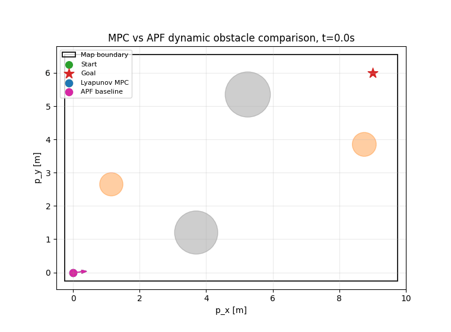

# Project 4: Lyapunov-Based Torque MPC for Dynamic Obstacle Avoidance



**Animation.** Lyapunov-based torque MPC and the APF baseline navigate the same constrained corridor with moving circular obstacles.

---

## 1. Problem Definition

The goal is to drive a differential-drive mobile robot from a start state to a target point while avoiding static and moving circular obstacles. The final comparison is intentionally simple and focused:

- **Lyapunov MPC** is the main controller. It predicts future robot motion and future obstacle positions, then optimizes a sequence of wheel torques.
- **Artificial Potential Field (APF)** is the baseline. It uses attractive and repulsive local fields and directly commands linear and angular velocity.

The scenario is designed so that a direct start-goal path crosses the motion bands of the moving obstacles. Two static obstacles create a readable loose bottleneck, and two moving obstacles cross the passage at different times. This makes the benefit of prediction visible: MPC can begin turning before an obstacle is immediately close, while APF reacts to the current field around the robot.

---

## 2. System Description

The robot starts near the lower-left corner of the map and the target is near the upper-right corner. The robot body is modeled as a disk for collision checking, while the controlled dynamics use a simplified differential-drive model with wheel torques.


**Figure 1.** Differential-drive robot schematic. The velocity vector points forward along the robot heading, the angular velocity is shown as a curved rotation arrow, and the left and right wheel torque commands are shown at the wheel locations.

The robot state is

$$
x_k =
\begin{bmatrix}
p_{x,k} & p_{y,k} & \theta_k & v_k & \omega_k
\end{bmatrix}^{T}.
\tag{1}
$$

where:

- $x_k$ is the robot state at discrete step $k$;
- $p_{x,k}$ and $p_{y,k}$ are the robot coordinates in meters;
- $\theta_k$ is the robot heading angle in radians;
- $v_k$ is the robot linear velocity in meters per second;
- $\omega_k$ is the robot angular velocity in radians per second.

The MPC input is

$$
u_k =
\begin{bmatrix}
\tau_{R,k} & \tau_{L,k}
\end{bmatrix}^{T}.
\tag{2}
$$

where:

- $u_k$ is the wheel-torque input at step $k$;
- $\tau_{R,k}$ is the right wheel torque command;
- $\tau_{L,k}$ is the left wheel torque command.

The APF baseline directly commands velocity:

$$
a_k =
\begin{bmatrix}
v^c_k & \omega^c_k
\end{bmatrix}^{T}.
\tag{3}
$$

where:

- $a_k$ is the velocity command used by APF;
- $v^c_k$ is the commanded linear velocity;
- $\omega^c_k$ is the commanded angular velocity.

This distinction is important. MPC handles actuator-like torque inputs, while APF is a simpler velocity-level controller.

---

## 3. Differential-Drive Dynamic Model

The simplified torque-to-acceleration model is

$$
\dot{v}=k_v(\tau_R+\tau_L)-c_v v.
\tag{4}
$$

where:

- $\dot{v}$ is the linear acceleration;
- $k_v=0.85$ maps summed wheel torque to linear acceleration;
- $\tau_R$ and $\tau_L$ are right and left wheel torques;
- $c_v=0.55$ is the linear velocity damping coefficient;
- $v$ is the current linear velocity.

The angular acceleration model is

$$
\dot{\omega}=k_{\omega}(\tau_R-\tau_L)-c_{\omega}\omega.
\tag{5}
$$

where:

- $\dot{\omega}$ is the angular acceleration;
- $k_{\omega}=1.25$ maps wheel torque difference to angular acceleration;
- $\tau_R-\tau_L$ is the torque imbalance between wheels;
- $c_{\omega}=0.65$ is the angular velocity damping coefficient;
- $\omega$ is the current angular velocity.

The planar kinematics are

$$
\dot{p}_x=v\cos\theta,\qquad
\dot{p}_y=v\sin\theta,\qquad
\dot{\theta}=\omega.
\tag{6}
$$

where:

- $\dot{p}_x$ and $\dot{p}_y$ are Cartesian velocity components;
- $v$ is the linear velocity;
- $\theta$ is the robot heading;
- $\dot{\theta}$ is the heading rate;
- $\omega$ is the angular velocity.

The code uses Euler integration with map projection for the robot center:

$$
\begin{aligned}
\tilde{p}_{k+1}&=
\begin{bmatrix}
p_{x,k}+v_k\cos(\theta_k)\Delta t\\
p_{y,k}+v_k\sin(\theta_k)\Delta t
\end{bmatrix},\\
p_{k+1}&=\Pi_{\mathcal{B}}(\tilde{p}_{k+1}),\\
\theta_{k+1}&=\operatorname{wrap}(\theta_k+\omega_k\Delta t),\\
v_{k+1}&=\operatorname{clip}(v_k+\dot{v}_k\Delta t,\,-v_{\max},\,v_{\max}),\\
\omega_{k+1}&=\operatorname{clip}(\omega_k+\dot{\omega}_k\Delta t,\,-\omega_{\max},\,\omega_{\max}).
\end{aligned}
\tag{7}
$$

where:

- $\tilde{p}_{k+1}$ is the unconstrained next position;
- $p_{k+1}$ is the map-constrained next position;
- $\Pi_{\mathcal{B}}$ clips the robot center into the map bounds with a robot-radius margin;
- $p_{x,k+1}$, $p_{y,k+1}$, $\theta_{k+1}$, $v_{k+1}$, and $\omega_{k+1}$ are next-step states;
- $\dot{v}_k$ and $\dot{\omega}_k$ are computed from (4) and (5);
- $\Delta t=0.15$ s is the integration time step;
- $v_{\max}=1.35$ m/s and $\omega_{\max}=1.9$ rad/s are velocity limits;
- $\operatorname{wrap}$ maps an angle to the interval $[-\pi,\pi]$;
- $\operatorname{clip}$ applies the velocity bounds.

---

## 4. Dynamic Obstacle Model

Each obstacle is a disk. Static obstacles have zero velocity, and moving obstacles use deterministic constant-velocity motion:

$$
c_j(t)=c_{j,0}+\nu_j t.
\tag{8}
$$

where:

- $c_j(t)$ is the center of obstacle $j$ at time $t$;
- $c_{j,0}$ is the initial center of obstacle $j$;
- $\nu_j$ is the constant obstacle velocity vector;
- $t$ is time in seconds.

The implemented obstacle layout is:

| Obstacle | Initial center | Velocity | Radius | Type |
|---|---:|---:|---:|---|
| `static_lower_gate` | (3.7, 1.20) | (0.00, 0.00) | 0.65 m | static |
| `static_upper_gate` | (5.25, 5.35) | (0.00, 0.00) | 0.68 m | static |
| `moving_east_crossing` | (1.15, 2.65) | (0.27, 0.00) | 0.35 m | dynamic |
| `moving_west_crossing` | (8.75, 3.85) | (-0.23, 0.00) | 0.36 m | dynamic |

The obstacle validation margin is

$$
m_{ab}(t)=\|c_a(t)-c_b(t)\|-r_a-r_b.
\tag{9}
$$

where:

- $m_{ab}(t)$ is the signed disk-to-disk margin between obstacles $a$ and $b$;
- $c_a(t)$ and $c_b(t)$ are obstacle centers;
- $r_a$ and $r_b$ are obstacle radii.

The validation checks all obstacle pairs over the full simulation. If the minimum margin is below 0.08 m, the program raises an error. In the final scenario, the minimum obstacle-obstacle margin is 0.450 m, so the moving obstacles do not collide with static obstacles or with each other. The obstacles are deliberately more spread out than in the previous version, but the moving disks still cross the natural start-goal route.

---

## 5. Control Objective

The target point is

$$
p_g =
\begin{bmatrix}
9.0 & 6.0
\end{bmatrix}^{T}.
\tag{10}
$$

where:

- $p_g$ is the desired target position;
- 9.0 is the target x-coordinate in meters;
- 6.0 is the target y-coordinate in meters.

The MPC objective is to reach $p_g$, keep a safety buffer around obstacles, stay inside the map, reduce unnecessary path length, reduce wheel-torque energy, and encourage Lyapunov decrease when feasible.

The wheel torque bounds are

$$
-\tau_{\max}\leq \tau_{R,k}\leq \tau_{\max},\qquad
-\tau_{\max}\leq \tau_{L,k}\leq \tau_{\max}.
\tag{11}
$$

where:

- $\tau_{\max}=1.35$ is the maximum absolute torque command;
- $\tau_{R,k}$ is the right wheel torque command;
- $\tau_{L,k}$ is the left wheel torque command.

The APF velocity command bounds are

$$
0\leq v^c_k\leq v_{\max},\qquad
-\omega_{\max}\leq \omega^c_k\leq \omega_{\max}.
\tag{12}
$$

where:

- $v^c_k$ and $\omega^c_k$ are APF velocity commands;
- $v_{\max}=1.35$ m/s is the linear velocity limit;
- $\omega_{\max}=1.9$ rad/s is the angular velocity limit.

The map bounds are $x\in[-0.25,9.75]$ m and $y\in[-0.25,6.55]$ m. Both robot models clip the robot center to these bounds with a radius margin of $r_{\text{robot}}=0.18$ m. MPC also includes a strong soft boundary penalty near the map edge, while APF includes boundary repulsion before the state projection is applied.

---

## 6. Lyapunov-Based MPC Design

At each simulation step $k$, MPC optimizes a finite torque sequence:

$$
U_k=\{u_{0|k},u_{1|k},\ldots,u_{N-1|k}\}.
\tag{13}
$$

where:

- $U_k$ is the planned input sequence at simulation step $k$;
- $u_{i|k}$ is the torque input planned for prediction step $i$;
- $N=14$ is the prediction horizon.

Predicted states satisfy

$$
\hat{x}_{i+1|k}=f(\hat{x}_{i|k},u_{i|k}),\qquad \hat{x}_{0|k}=x_k.
\tag{14}
$$

where:

- $\hat{x}_{i|k}$ is the predicted robot state $i$ steps ahead;
- $f$ is the Euler-discretized dynamics from (7);
- $x_k$ is the current measured state.

The Lyapunov candidate used in the code and MPC cost is

$$
V(x)=\frac{1}{2}\|p-p_g\|^2+\frac{1}{2}q_{\theta}e_{\theta}^{2}
+\frac{1}{2}q_v v^2+\frac{1}{2}q_{\omega}\omega^2.
\tag{15}
$$

where:

- $V(x)$ is the Lyapunov candidate;
- $p=[p_x,p_y]^T$ is the robot position;
- $p_g$ is the target position;
- $e_\theta$ is the heading error to the target direction;
- $v$ and $\omega$ are the linear and angular velocities;
- $q_\theta=0.60$, $q_v=0.18$, and $q_\omega=0.12$ are positive weights.

The heading error is

$$
e_{\theta}=\operatorname{wrap}(\theta_g-\theta).
\tag{16}
$$

where:

- $e_\theta$ is the wrapped heading error;
- $\theta$ is the robot heading;
- $\theta_g$ is the heading from the robot to the target.

The target-facing heading is

$$
\theta_g=\operatorname{atan2}(p_{g,y}-p_y,\;p_{g,x}-p_x).
\tag{17}
$$

where:

- $\theta_g$ is the target-facing heading;
- $p_{g,x}$ and $p_{g,y}$ are target coordinates;
- $p_x$ and $p_y$ are robot coordinates.

The predicted clearance from obstacle $j$ is

$$
d_{i,j}=\|\hat{p}_{i|k}-c_j(t_k+i\Delta t)\|-r_j-r_{\text{robot}}.
\tag{18}
$$

where:

- $d_{i,j}$ is the signed robot-obstacle clearance;
- $\hat{p}_{i|k}$ is the predicted robot position;
- $c_j(t_k+i\Delta t)$ is the predicted obstacle center;
- $r_j$ is the obstacle radius;
- $r_{\text{robot}}=0.18$ m is the robot radius.

The total MPC cost is

$$
J=J_g+J_T+J_V+J_{\Delta V}+J_o+J_L+J_b+J_u+J_s+J_E.
\tag{19}
$$

where:

- $J$ is the cost of one candidate torque sequence;
- $J_g$ is the running goal-tracking cost;
- $J_T$ is the terminal goal cost;
- $J_V$ is the Lyapunov value cost;
- $J_{\Delta V}$ penalizes positive Lyapunov increases;
- $J_o$ is the obstacle avoidance cost;
- $J_L$ is the predicted path-length cost;
- $J_b$ is the map-boundary cost;
- $J_u$ is the torque effort cost;
- $J_s$ is the torque smoothness cost;
- $J_E$ is the torque-energy proxy.

The goal and Lyapunov terms are

$$
\begin{aligned}
J_g&=q_g\sum_{i=1}^{N}\|\hat{p}_{i|k}-p_g\|^2,\\
J_T&=q_T\|\hat{p}_{N|k}-p_g\|^2,\\
J_V&=q_V\sum_{i=1}^{N}V(\hat{x}_{i|k}),\\
J_{\Delta V}&=q_{\Delta V}\sum_{i=0}^{N-1}\max(0,V(\hat{x}_{i+1|k})-V(\hat{x}_{i|k}))^2.
\end{aligned}
\tag{20}
$$

where:

- $q_g=1.40$, $q_T=12.0$, $q_V=1.0$, and $q_{\Delta V}=18.0$ are cost weights;
- $\hat{p}_{i|k}$ is the predicted robot position;
- $\hat{x}_{i|k}$ is the predicted robot state;
- $V(\hat{x}_{i|k})$ is the Lyapunov value from (15).

The obstacle term is

$$
J_o=\sum_{i=1}^{N}\sum_j
q_c\max(0,-d_{i,j})^2+
q_o\left(\frac{\max(0,d_{\text{inf}}-d_{i,j})}{d_{\text{inf}}}\right)^4.
\tag{21}
$$

where:

- $q_c=16000.0$ is the collision penalty weight;
- $q_o=60.0$ is the soft obstacle penalty weight;
- $d_{\text{inf}}=2.35$ m is the obstacle influence distance;
- $d_{i,j}$ is the predicted clearance from (18).

The path-length, boundary, torque effort, smoothness, and energy terms are

$$
\begin{aligned}
J_L&=q_L\sum_{i=0}^{N-1}\|\hat{p}_{i+1|k}-\hat{p}_{i|k}\|,\\
J_b&=q_b\sum_{i=1}^{N}
\left[
\max(0,x_{\min}+r_{\text{robot}}+\epsilon_b-\hat{p}_{x,i|k})^2\right.\\
&\qquad\left.
+\max(0,\hat{p}_{x,i|k}-x_{\max}+r_{\text{robot}}+\epsilon_b)^2\right.\\
&\qquad\left.
+\max(0,y_{\min}+r_{\text{robot}}+\epsilon_b-\hat{p}_{y,i|k})^2\right.\\
&\qquad\left.
+\max(0,\hat{p}_{y,i|k}-y_{\max}+r_{\text{robot}}+\epsilon_b)^2
\right],\\
J_u&=q_u\sum_{i=0}^{N-1}\|u_{i|k}\|^2,\\
J_s&=q_s\sum_{i=0}^{N-1}\|u_{i|k}-u_{i-1|k}\|^2,\\
J_E&=q_E\sum_{i=0}^{N-1}(\tau_{R,i|k}^{2}+\tau_{L,i|k}^{2})\Delta t.
\end{aligned}
\tag{22}
$$

where:

- $q_L=0.55$ is the path-length weight;
- $q_b=20000.0$ is the map-boundary weight;
- $x_{\min}$, $x_{\max}$, $y_{\min}$, and $y_{\max}$ are the map bounds;
- $\epsilon_b=0.22$ m is the soft boundary influence width;
- $q_u=0.05$, $q_s=0.38$, and $q_E=0.18$ are effort, smoothness, and energy weights;
- $u_{i|k}$ is the planned torque input;
- $u_{-1|k}$ is the previously applied torque input;
- $\tau_{R,i|k}$ and $\tau_{L,i|k}$ are planned wheel torques.

The optimizer is intentionally lightweight. It warm-starts from the shifted previous solution, samples candidate torque sequences, clips them to (11), rolls out (7), evaluates (19), and applies only the first input.

---

## 7. Lyapunov Stability Analysis

The Lyapunov candidate in (15) is positive definite with respect to goal position, heading alignment, and zero velocity because it is a weighted sum of squared terms with positive weights.

The discrete Lyapunov difference is

$$
\Delta V_k=V(x_{k+1})-V(x_k).
\tag{23}
$$

where:

- $\Delta V_k$ is the one-step Lyapunov difference;
- $V(x_{k+1})$ is the Lyapunov value after applying the selected control;
- $V(x_k)$ is the Lyapunov value at the current state.

The MPC cost penalizes positive values of

$$
\max(0,\Delta V_k)^2.
\tag{24}
$$

where:

- $\Delta V_k$ is the Lyapunov difference from (23);
- the maximum operator ignores negative Lyapunov differences and penalizes increases.

For the full moving-obstacle, input-constrained problem, global asymptotic stability is not claimed. The stability argument is conditional and applies when obstacle avoidance is feasible, no active safety conflict remains near the target, and MPC selects controls satisfying

$$
\Delta V_k\leq 0.
\tag{25}
$$

where:

- $\Delta V_k$ is the discrete Lyapunov difference from (23).

The zero-change set is

$$
\mathcal{S}=\{x:\Delta V_k=0\}.
\tag{26}
$$

where:

- $\mathcal{S}$ is the set of states where the Lyapunov value does not change;
- $x$ is the robot state.

In nominal goal-reaching mode, the largest invariant subset is

$$
\mathcal{M}=\{x:p=p_g,\;e_{\theta}=0,\;v=0,\;\omega=0\}.
\tag{27}
$$

where:

- $\mathcal{M}$ is the invariant goal set;
- $p=p_g$ means the robot is at the target position;
- $e_\theta=0$ means the heading is aligned with the target direction convention;
- $v=0$ and $\omega=0$ mean the robot is at rest.

By the discrete-time LaSalle invariance principle, under these assumptions the closed-loop state converges locally and practically to $\mathcal{M}$. Moving obstacles and torque limits can temporarily force detours, so the analysis is used as a careful nominal convergence argument rather than a global safety proof.

---

## 8. Artificial Potential Field Baseline

The APF baseline is a simple local method. It combines attraction to the target with repulsion from nearby obstacles, then converts the resulting direction into an admissible velocity command.

The attractive direction is

$$
a_g=k_g\frac{p_g-p}{\|p_g-p\|+\varepsilon}.
\tag{28}
$$

where:

- $a_g$ is the normalized attraction vector;
- $k_g=1.05$ is the attraction bias;
- $p_g$ is the target position;
- $p$ is the robot position;
- $\varepsilon=10^{-9}$ avoids division by zero.

The repulsive contribution is

$$
a_o=\sum_{j:d_j<d_{\text{rep}}}
k_{\text{rep}}\left(\frac{1}{\max(d_j,0.08)}-\frac{1}{d_{\text{rep}}}\right)
\frac{p-c_j(t)}{\|p-c_j(t)\|^3}.
\tag{29}
$$

where:

- $a_o$ is the summed obstacle repulsion vector;
- $d_j$ is the current robot-obstacle clearance;
- $d_{\text{rep}}=2.20$ m is the repulsion radius;
- $k_{\text{rep}}=0.90$ is the repulsion gain;
- $p$ is the robot position;
- $c_j(t)$ is the obstacle center at the current time.

The desired direction is

$$
a=a_g+a_o.
\tag{30}
$$

where:

- $a$ is the direction used to compute the APF velocity command;
- $a_g$ is the attractive direction;
- $a_o$ is the repulsive direction.

Unlike MPC, APF does not predict future obstacle positions. It reacts to the current obstacle configuration, which makes it fast but less structured in the moving-obstacle corridor. The implementation adds boundary repulsion, no extra velocity-command smoothing beyond the current APF command, angular gain 5.2, and the same map projection as the robot model, so APF also remains inside the rectangular workspace. These tuned values let APF reach the goal without removing its reactive behavior.

---

## 9. Algorithm / Pipeline

1. Initialize robot parameters, start state, target, static obstacles, and moving obstacles.
2. Validate static-static, moving-static, and moving-moving obstacle separation over the full simulation interval.
3. Run Lyapunov MPC: predict future robot states and obstacle positions, optimize torque sequences, and apply the first torque input.
4. Log trajectory, torque inputs, cost, obstacle clearance, safety margin, heading change, computation time, Lyapunov value, and Lyapunov difference.
5. Run the APF baseline on the same scene using velocity commands.
6. Compute final distance, minimum clearance, safety margin, path length, smoothness, heading aggressiveness, near-obstacle events, progress efficiency, control effort, torque energy, time to goal, collision flag, and average computation time.
7. Generate the two-method GIF and the final comparison figures.

---

## 10. Simulation Setup

| Quantity | Value |
|---|---:|
| Start state | $[0.0, 0.0, 0.08, 0.0, 0.0]^T$ |
| Target | $[9.0, 6.0]^T$ m |
| Time step | 0.15 s |
| Maximum steps | 180 |
| Goal tolerance | 0.35 m |
| Robot radius | 0.18 m |
| Map bounds | $x\in[-0.25,9.75]$ m, $y\in[-0.25,6.55]$ m |
| MPC horizon | 14 |
| Torque limit | 1.35 |
| Linear velocity limit | 1.35 m/s |
| Angular velocity limit | 1.9 rad/s |

The path length metric is

$$
L=\sum_{k=0}^{K-1}\|p_{k+1}-p_k\|.
\tag{31}
$$

where:

- $L$ is total path length;
- $K$ is the number of applied simulation steps;
- $p_k$ and $p_{k+1}$ are consecutive robot positions.

The control effort metric is

$$
E_u=\sum_{k=0}^{K-1}\|u_k\|^2\Delta t.
\tag{32}
$$

where:

- $E_u$ is the reported cumulative control effort;
- $u_k$ is a torque input for MPC or a velocity command for APF;
- $\Delta t$ is the simulation time step.

The torque-energy proxy for MPC is

$$
E_{\tau}=\sum_{k=0}^{K-1}(\tau_{R,k}^{2}+\tau_{L,k}^{2})\Delta t.
\tag{33}
$$

where:

- $E_{\tau}$ is the torque-energy proxy;
- $\tau_{R,k}$ and $\tau_{L,k}$ are wheel torque commands;
- $\Delta t$ is the simulation time step.

The safety margin is

$$
s_k=d_k-r_{\text{margin}}.
\tag{34}
$$

where:

- $s_k$ is the safety margin at step $k$;
- $d_k$ is the nearest robot-obstacle clearance;
- $r_{\text{margin}}=0.12$ m is the required extra safety buffer.

The path smoothness metric is

$$
S_{\theta}=\sum_{k=0}^{K-1}|\operatorname{unwrap}(\theta_{k+1})-\operatorname{unwrap}(\theta_k)|.
\tag{35}
$$

where:

- $S_{\theta}$ is cumulative absolute heading change;
- $\theta_k$ and $\theta_{k+1}$ are consecutive heading angles;
- $\operatorname{unwrap}$ removes artificial jumps at the $-\pi$ and $\pi$ boundary.

The heading-change aggressiveness metric is

$$
A_{\omega}=\sum_{k=0}^{K-1}|\omega_{k+1}-\omega_k|.
\tag{36}
$$

where:

- $A_{\omega}$ is cumulative angular-velocity change;
- $\omega_k$ and $\omega_{k+1}$ are consecutive angular velocity values.

The progress efficiency metric is

$$
\eta=\frac{\|p_g-p_0\|}{L}.
\tag{37}
$$

where:

- $\eta$ is progress efficiency;
- $p_g$ is the target position;
- $p_0$ is the initial robot position;
- $L$ is the path length from (31).

The average progress rate is

$$
\rho=\frac{\|p_g-p_0\|-\|p_g-p_K\|}{T}.
\tag{38}
$$

where:

- $\rho$ is average progress toward the target per second;
- $p_K$ is the final robot position;
- $T$ is the simulated travel time.

---

## 11. Results and Comparison

The final scenario is a simplified dynamic-obstacle corridor. Two static obstacles define a loose passage, while two moving obstacles sweep across the route that a direct start-goal controller would naturally use. The comparison focuses on quantities that are directly useful for both methods: trajectory, distance to goal, safety margin, heading smoothness, and cumulative control effort.

### 11.1 Quantitative Summary

Near-obstacle events count time steps where the robot-obstacle clearance is below 0.45 m.

| Metric | Lyapunov MPC | APF baseline |
|---|---:|---:|
| Reached goal | True | True |
| Final distance to goal | 0.287 m | 0.337 m |
| Travel time | 8.700 s | 13.950 s |
| Minimum obstacle clearance | 0.337 m | 0.204 m |
| Minimum safety margin | 0.217 m | 0.084 m |
| Average safety margin | 1.076 m | 1.013 m |
| Boundary violations | 0 | 0 |
| Path length | 10.873 m | 11.387 m |
| Cumulative control effort | 10.580 | 32.352 |
| MPC motor-energy proxy | 10.580 | not torque-driven |
| Path smoothness | 2.880 rad | 12.445 rad |
| Heading aggressiveness | 4.997 rad/s | 37.215 rad/s |
| Near-obstacle events | 5 | 30 |
| Progress efficiency | 0.995 | 0.950 |
| Average progress rate | 1.210 m/s | 0.751 m/s |
| Average computation time | about 90 ms | below 0.1 ms |
| Collision | False | False |

The table shows the main trade-off. Both methods now reach the goal and stay inside the map. APF is cheaper computationally, but its late reactive corrections make its route longer, slower, and less smooth. MPC arrives sooner, keeps a larger safety margin, has fewer near-obstacle events, uses less cumulative control effort, and produces smoother heading behavior.


**Figure 2.** Trajectory comparison for Lyapunov MPC and APF. MPC is shown in blue and APF in magenta. The rectangular map boundary is shown explicitly, and both robots remain inside it. The simplified map is easier to read than the previous crowded layout: two static disks form a loose bottleneck with more free space, and two moving disks cross the natural route. MPC follows a smoother predictive arc through the corridor because it evaluates future obstacle positions. APF reacts locally and accumulates extra curvature around the moving crossings.


**Figure 3.** Distance to goal over time. Both methods reach the target tolerance. APF follows a shorter local route, but its reactive corrections reduce progress during the dynamic-obstacle interaction. MPC makes an earlier predictive adjustment, then resumes structured progress and reaches the tolerance sooner in this run.


**Figure 4.** Safety margin over time. Zero is the required safety boundary. MPC maintains a higher average safety margin, while APF comes much closer to the boundary during its reactive avoidance maneuvers. This is the clearest safety result: prediction allows MPC to preserve buffer distance before the moving obstacles become immediate threats, while APF only responds to the current potential field.


**Figure 5.** Cumulative heading change over time. Lower values indicate a smoother path. MPC has far less accumulated heading change because the torque sequence is optimized with smoothness and energy terms. APF turns much more aggressively in the corridor, which is typical for local potential fields when attraction and repulsion directions change quickly.


**Figure 6.** Cumulative control effort over time. MPC uses less cumulative effort than APF even though it optimizes a torque-driven model. The smoothness and motor-energy terms distribute steering over the horizon. APF is computationally lightweight, but local obstacle and boundary repulsion create sharper corrections and a higher squared-input total.

---

## 12. Discussion

The simplified comparison makes the difference between prediction and local reaction clearer. APF is a useful baseline because it has very little computation and no trajectory optimization. After tuning, it reaches the goal and remains collision-free, so the comparison is fair. However, it only reacts to the current obstacle geometry. In the moving-obstacle corridor, this makes APF turn strongly when a repulsive field becomes large, which explains the higher heading-change metric and the larger number of near-obstacle time steps.

Lyapunov MPC is slower to compute, but it uses the prediction horizon to reason about where the moving obstacles will be. This explains the larger average safety margin in Figure 4, the smoother heading profile in Figure 5, and the lower cumulative effort in Figure 6. The controller starts adjusting before it reaches the crossing point, so it avoids the late aggressive correction that appears in the APF trajectory.

The boundary constraints improve realism because the robot body is not allowed to leave the rectangular workspace. MPC handles this through projected rollouts and a strong boundary cost, while APF uses boundary repulsion and the same final projection. Both methods therefore report zero boundary violations. The slightly larger obstacle spacing also improves readability: the map is not cluttered, but the moving obstacles still cross the route and create a real interaction region.

The torque-based input model also matters. Instead of assuming perfect velocity tracking, the main controller chooses right and left wheel torques and accounts for velocity damping. The cost now explicitly penalizes predicted path length and torque energy, so the controller is encouraged to reach the goal without unnecessary detours or excessive motor effort. The result is not just a shortest-path planner; it is a predictive controller that balances progress, clearance, smoothness, map constraints, and energy use.

The main trade-off is computation. APF runs almost instantly, while sampling-based MPC takes roughly 90 ms per step in this Python implementation. MPC reaches the tolerance earlier while preserving a larger safety buffer, producing fewer near-obstacle events, using less cumulative effort, and following a smoother path. The Lyapunov analysis remains conditional because moving obstacles and input constraints can temporarily dominate pure goal convergence. Future work could add uncertainty in obstacle prediction, use a deterministic nonlinear optimizer, or combine MPC with hard safety constraints.

---

## 13. Project Structure

```text
project_4_mpc_obstacle_navigation/
├── README.md
├── main.py
├── robot_model.py
├── environment.py
├── mpc_controller.py
├── potential_field_controller.py
├── metrics.py
├── visualization.py
├── experiments.py
├── requirements.txt
└── results/
```

| File | Purpose |
|---|---|
| `robot_model.py` | torque-driven differential-drive model and APF velocity-step model |
| `environment.py` | robot parameters, target, obstacles, and obstacle-overlap validation |
| `mpc_controller.py` | Lyapunov-based MPC with wheel torque inputs |
| `potential_field_controller.py` | APF baseline |
| `metrics.py` | distance, clearance, smoothness, effort, energy, and Lyapunov metrics |
| `experiments.py` | simulation loops for MPC and APF |
| `visualization.py` | schematic, comparison plots, and GIF generation |
| `main.py` | reproducible experiment pipeline |

---

## 14. How to Run

Install dependencies:

```bash
pip install -r requirements.txt
```

Run the project:

```bash
cd project_4_mpc_obstacle_navigation
python main.py
```

The command regenerates the final plots and GIF in `results/`.

---

## 15. Conclusion

This project implements a Lyapunov-based Model Predictive Controller for a torque-driven differential-drive robot in a dynamic obstacle environment. The controller optimizes wheel torque sequences, predicts moving obstacle positions, penalizes unsafe clearances, and includes Lyapunov, smoothness, and torque-energy terms in the cost.

The final comparison against APF shows why predictive control is useful in this scenario. APF is extremely fast and reaches the goal, but it is reactive: the local field changes strongly near the moving obstacles and map boundary, producing smaller safety margins, more near-obstacle events, higher heading variation, and higher cumulative effort. MPC computes more slowly, but it anticipates the moving corridor, respects the map boundary, minimizes both path length and motor-energy-related cost terms, reaches the goal, and produces smoother, lower-effort behavior.

The result is a compact and self-contained demonstration of Lyapunov-based torque MPC for dynamic obstacle avoidance. The main limitations are the sampling-based optimizer, deterministic obstacle predictions, and the conditional nature of the stability argument. Future improvements could use a stronger nonlinear optimizer, model uncertainty in moving obstacles, and add formal hard safety constraints.

---

## 16. References

[1] Huang, J., Liu, Z., Zeng, J., Chi, X., & Su, H. (2023). Obstacle Avoidance for Unicycle-Modelled Mobile Robots with Time-varying Control Barrier Functions. arXiv:2307.08227.

[2] E. D. Sontag, *Mathematical Control Theory: Deterministic Finite Dimensional Systems*, Springer, 1998.

[3] J. B. Rawlings, D. Q. Mayne, and M. Diehl, *Model Predictive Control: Theory, Computation, and Design*, Nob Hill Publishing, 2017.
