# Project 4: Torque-Based MPC for Dynamic Obstacle Avoidance


**Animation.** Representative comparison on map 1. The MPC robot is blue, the APF baseline is magenta, static obstacles are gray, and moving obstacles are orange.

---

## 1. Problem Statement

**Control problem:** drive a differential-drive mobile robot from a start position to a desired goal position in a 2D workspace with static and moving circular obstacles. The obstacle motion is known and predicted over the MPC horizon. The controller must explicitly handle dynamic obstacle avoidance, map boundary constraints, and actuator limits while maintaining efficient and smooth motion.

**Plant:** a differential-drive mobile robot moving in a planar workspace. The robot state includes planar position, heading angle, linear velocity, and angular velocity. The control inputs are left and right wheel torques. The robot is affected by actuator limits, damping, map boundaries, and collision constraints with static and dynamic obstacles.

**Class of methods:** torque-based Model Predictive Control. At each time step, the controller predicts future robot states over a finite horizon, evaluates predicted obstacle positions, rejects infeasible trajectories that violate safety constraints, and selects a torque sequence minimizing goal-tracking error, path length, control effort, smoothness, and energy-related cost. Only the first torque input is applied, and the optimization is repeated at the next step.

**Comparison:** the MPC controller is compared with an Artificial Potential Field baseline. APF uses attractive forces toward the goal and repulsive forces from obstacles. Unlike MPC, APF is reactive and does not optimize a future torque sequence over a horizon. The comparison evaluates goal reaching, obstacle clearance, path length, path efficiency, smoothness, heading aggressiveness, control effort, and boundary violations.

---

## 2. System Model

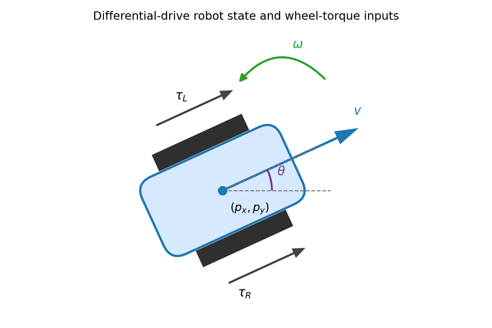

**Figure 1.** Differential-drive robot model with center position, heading, linear velocity, angular velocity, and wheel torque inputs.

The robot state is

```math
x_k = [p_{x,k},\;p_{y,k},\;\theta_k,\;v_k,\;\omega_k]^T \qquad\text{(1)}
```

where $x_k$ is the robot state at discrete step $k$, $p_{x,k}$ and $p_{y,k}$ are the robot coordinates in meters, $\theta_k$ is the heading angle in radians, $v_k$ is the linear velocity, and $\omega_k$ is the angular velocity.

The MPC control input is

```math
u_k = [\tau_{R,k},\;\tau_{L,k}]^T \qquad\text{(2)}
```

where $u_k$ is the control input, $\tau_{R,k}$ is the right wheel torque, and $\tau_{L,k}$ is the left wheel torque.

The discrete robot model used in `robot_model.py` is

```math
p_{x,k+1} = p_{x,k} + v_k \cos(\theta_k)\Delta t \qquad\text{(3)}
```

where $p_{x,k}$ is the current x-coordinate, $v_k$ is the linear velocity, $\theta_k$ is the heading angle, and $\Delta t$ is the simulation time step.

```math
p_{y,k+1} = p_{y,k} + v_k \sin(\theta_k)\Delta t \qquad\text{(4)}
```

where $p_{y,k}$ is the current y-coordinate, $v_k$ is the linear velocity, $\theta_k$ is the heading angle, and $\Delta t$ is the simulation time step.

```math
\theta_{k+1} = \theta_k + \omega_k\Delta t \qquad\text{(5)}
```

where $\theta_k$ is the current heading angle, $\omega_k$ is the angular velocity, and $\Delta t$ is the simulation time step. The implementation wraps the updated angle to the interval $[-\pi,\pi]$.

```math
v_{k+1} = v_k + \left(k_v(\tau_{R,k}+\tau_{L,k}) - c_v v_k\right)\Delta t \qquad\text{(6)}
```

where $v_k$ is the current linear velocity, $k_v=0.85$ is the longitudinal acceleration gain, $\tau_{R,k}$ and $\tau_{L,k}$ are wheel torques, $c_v=0.55$ is the linear damping coefficient, and $\Delta t$ is the simulation time step.

```math
\omega_{k+1} = \omega_k + \left(k_\omega(\tau_{R,k}-\tau_{L,k}) - c_\omega\omega_k\right)\Delta t \qquad\text{(7)}
```

where $\omega_k$ is the current angular velocity, $k_\omega=1.25$ is the angular acceleration gain, $\tau_{R,k}-\tau_{L,k}$ is the torque difference, $c_\omega=0.65$ is the angular damping coefficient, and $\Delta t$ is the simulation time step.

---

## 3. Obstacle Model and Constraints

Map boundary constraints are enforced with the robot radius included:

```math
x_{\min}+r_{\mathrm{robot}} \le p_x \le x_{\max}-r_{\mathrm{robot}} \qquad\text{(8)}
```

where $x_{\min}$ and $x_{\max}$ are the map bounds along the x-axis, $p_x$ is the robot x-coordinate, and $r_{\mathrm{robot}}$ is the robot radius.

```math
y_{\min}+r_{\mathrm{robot}} \le p_y \le y_{\max}-r_{\mathrm{robot}} \qquad\text{(9)}
```

where $y_{\min}$ and $y_{\max}$ are the map bounds along the y-axis, $p_y$ is the robot y-coordinate, and $r_{\mathrm{robot}}$ is the robot radius.

The predicted obstacle clearance constraint is

```math
\|p_k - c_{j,k}\| \ge r_{\mathrm{robot}} + r_j + r_{\mathrm{margin}} \qquad\text{(10)}
```

where $p_k=[p_{x,k},p_{y,k}]^T$ is the robot position, $c_{j,k}$ is the center of obstacle $j$ at step $k$, $r_j$ is the obstacle radius, and $r_{\mathrm{margin}}=0.12$ m is the additional safety margin.

The velocity constraints are

```math
0 \le v_k \le v_{\max} \qquad\text{(11)}
```

where $v_k$ is the robot linear velocity and $v_{\max}=1.35$ m/s is the maximum allowed forward velocity.

```math
-\omega_{\max} \le \omega_k \le \omega_{\max} \qquad\text{(12)}
```

where $\omega_k$ is the robot angular velocity and $\omega_{\max}=1.9$ rad/s is the maximum allowed absolute angular velocity.

The wheel torque constraints are

```math
-\tau_{\max} \le \tau_{R,k} \le \tau_{\max} \qquad\text{(13)}
```

where $\tau_{R,k}$ is the right wheel torque and $\tau_{\max}=1.35$ is the maximum allowed torque magnitude.

```math
-\tau_{\max} \le \tau_{L,k} \le \tau_{\max} \qquad\text{(14)}
```

where $\tau_{L,k}$ is the left wheel torque and $\tau_{\max}=1.35$ is the maximum allowed torque magnitude.

Moving obstacles have deterministic constant-velocity motion:

```math
c_j(t) = c_{j,0} + v_j t \qquad\text{(15)}
```

where $c_j(t)$ is the center of moving obstacle $j$ at time $t$, $c_{j,0}$ is its initial position, and $v_j$ is its constant velocity vector.

The implementation validates every map before simulation by sampling the full time interval and checking static-static, static-moving, and moving-moving disk separation.

---

## 4. MPC Design

The finite-horizon objective is

```math
J_N(x_k,U_k)=\sum_{i=0}^{N-1}\ell(x_{i|k},u_{i|k}) + J_f(x_{N|k}) \qquad\text{(16)}
```

where $J_N$ is the finite-horizon MPC cost, $x_k$ is the current state, $U_k$ is the candidate control sequence, $\ell$ is the stage cost, $J_f$ is the terminal cost, and $N=50$ is the prediction horizon.

The stage cost is written compactly as

```math
\ell(x_{i|k},u_{i|k}) = w_g J_g + w_o J_o + w_e J_e + w_c J_c + w_s J_s + w_p J_p \qquad\text{(17)}
```

where $J_g$ is the goal-tracking term, $J_o$ is the obstacle and boundary shaping term, $J_e$ is the energy-related term, $J_c$ is the control-effort term, $J_s$ is the smoothness term, $J_p$ is the path-length term, and $w_g,w_o,w_e,w_c,w_s,w_p$ are positive weights. Hard safety, input, velocity, and terminal feasibility checks are applied before this cost is used for comparison.

Goal tracking is

```math
J_g = \|p_{i|k}-p_{\mathrm{goal}}\|^2 \qquad\text{(18)}
```

where $J_g$ is the predicted position error, $p_{i|k}$ is the predicted robot position at horizon index $i$, and $p_{\mathrm{goal}}$ is the goal position.

The motor-energy term is

```math
J_e = (\tau_{R,i|k}^2+\tau_{L,i|k}^2)\Delta t \qquad\text{(19)}
```

where $J_e$ is the torque-based energy proxy for one prediction step, $\tau_{R,i|k}$ and $\tau_{L,i|k}$ are the predicted wheel torques, and $\Delta t$ is the simulation time step.

The control-effort term is

```math
J_c = \tau_{R,i|k}^2+\tau_{L,i|k}^2 \qquad\text{(20)}
```

where $J_c$ is the one-step wheel-torque effort, $\tau_{R,i|k}$ is the predicted right wheel torque, and $\tau_{L,i|k}$ is the predicted left wheel torque.

The path-length term is

```math
J_p = \|p_{i+1|k}-p_{i|k}\| \qquad\text{(21)}
```

where $J_p$ is the predicted one-step path-length contribution, $p_{i|k}$ is the predicted position at horizon index $i$, and $p_{i+1|k}$ is the next predicted position.

The smoothness term is

```math
J_s = \|u_{i|k}-u_{i-1|k}\|^2 \qquad\text{(22)}
```

where $J_s$ penalizes changes in the planned input sequence, $u_{i|k}$ is the predicted control input, and $u_{i-1|k}$ is the previous predicted control input. For the first horizon step, the previous applied control is used.

The terminal cost is

```math
J_f(x_{N|k}) = w_f\|p_{N|k}-p_{\mathrm{goal}}\|^2 \qquad\text{(23)}
```

where $J_f$ is the terminal position cost, $p_{N|k}$ is the predicted terminal position, $p_{\mathrm{goal}}$ is the goal position, and $w_f$ is the terminal cost weight.

The terminal distance constraint is

```math
\|p_{N|k}-p_{\mathrm{goal}}\| \le r_{\mathrm{term}} \qquad\text{(24)}
```

where $p_{N|k}$ is the predicted terminal position, $p_{\mathrm{goal}}$ is the goal position, and $r_{\mathrm{term}}=2.25$ m is the implemented terminal radius.

In each MPC step, the controller samples candidate torque sequences, rolls out the model, rejects candidates that violate the hard constraints, evaluates only feasible candidates, applies the first torque input, and stores the feasible sequence for warm starting the next step.

---

## 5. APF Baseline

The APF controller commands linear and angular velocity directly. It combines attraction to the goal with local repulsion from current obstacle positions. It does not predict future obstacle positions and does not optimize wheel torques over a horizon. This makes APF computationally light but more reactive in moving-obstacle scenarios.

The attractive potential is

```math
U_{\mathrm{att}}(p)=\frac{1}{2}k_{\mathrm{att}}\|p-p_{\mathrm{goal}}\|^2 \qquad\text{(25)}
```

where $U_{\mathrm{att}}$ is the attractive potential, $k_{\mathrm{att}}$ is the attraction gain, $p$ is the robot position, and $p_{\mathrm{goal}}$ is the goal position.

The repulsive potential is

```math
U_{\mathrm{rep},j}(p)=\frac{1}{2}k_{\mathrm{rep}}\left(\frac{1}{d_j(p)}-\frac{1}{d_0}\right)^2 \qquad\text{(26)}
```

where $U_{\mathrm{rep},j}$ is the repulsive potential from obstacle $j$, $k_{\mathrm{rep}}$ is the repulsion gain, $d_j(p)$ is the distance to obstacle $j$, and $d_0$ is the repulsion radius. This repulsive term is active only when $d_j(p)<d_0$.

---

## 6. Algorithm Pipeline

1. Initialize the scenario, robot state, goal, static obstacles, and moving obstacles.
2. Validate that obstacle disks do not overlap over the full simulation time.
3. Predict future robot states and moving-obstacle positions over the MPC horizon.
4. Reject infeasible MPC candidates that violate safety, input, velocity, or terminal constraints.
5. Select the feasible torque sequence with the lowest cost and apply only its first input.
6. Run APF on the same scenario using the same robot model limits.
7. Log goal distance, clearance, path length, smoothness, effort, time, collisions, and boundary violations.
8. Repeat this procedure for ten obstacle maps and generate GIFs and plots.

---

## 7. Simulation Setup and Metrics

**Table 1.** Simulation parameters used for all validation maps.

| Quantity | Value |
|---|---:|
| Start state | $[0.0,0.0,0.08,0.0,0.0]^T$ |
| Goal | $[9.0,6.0]^T$ m |
| Time step | 0.15 s |
| Maximum steps | 180 |
| Goal tolerance | 0.35 m |
| Map bounds | $x\in[-0.25,9.75]$ m, $y\in[-0.25,6.55]$ m |
| Robot radius | 0.18 m |
| Safety buffer | 0.12 m |
| MPC horizon | 50 |
| Torque limit | 1.35 |

Path length is

```math
L_{\mathrm{path}} = \sum_{k=0}^{T-1}\|p_{k+1}-p_k\| \qquad\text{(27)}
```

where $L_{\mathrm{path}}$ is the total path length, $p_k$ is the robot position at step $k$, and $T$ is the final simulated step index.

Path efficiency is

```math
\eta_{\mathrm{path}}=\frac{\|p_{\mathrm{goal}}-p_0\|}{L_{\mathrm{path}}} \qquad\text{(28)}
```

where $\eta_{\mathrm{path}}$ is the path efficiency, $p_{\mathrm{goal}}$ is the goal position, $p_0$ is the initial position, and $L_{\mathrm{path}}$ is the total path length.

The position-based smoothness metric is

```math
S_{\mathrm{pos}}=\sum_{k=1}^{T-2}\|p_{k+1}-2p_k+p_{k-1}\| \qquad\text{(29)}
```

where $S_{\mathrm{pos}}$ is the position-based smoothness metric, $p_{k-1}$, $p_k$, and $p_{k+1}$ are consecutive robot positions, and lower values indicate smoother motion.

Control effort is

```math
E_{\mathrm{ctrl}}=\sum_{k=0}^{T-1}\|u_k\|^2\Delta t \qquad\text{(30)}
```

where $E_{\mathrm{ctrl}}$ is the cumulative control effort, $u_k$ is the applied input, and $\Delta t$ is the simulation time step. For MPC, $u_k$ is a torque input; for APF, $u_k$ is a velocity command.

Safety margin is

```math
m_{\mathrm{safe},k}=\min_j\left(\|p_k-c_{j,k}\|-r_{\mathrm{robot}}-r_j\right) \qquad\text{(31)}
```

where $m_{\mathrm{safe},k}$ is the minimum obstacle clearance at step $k$, $p_k$ is the robot position, $c_{j,k}$ is the center of obstacle $j$, $r_{\mathrm{robot}}$ is the robot radius, and $r_j$ is the obstacle radius.

Near-obstacle events are counted as

```math
N_{\mathrm{near}} = \sum_{k=0}^{T} I_k \qquad\text{(32)}
```

where $N_{\mathrm{near}}$ is the number of near-obstacle events, and $I_k$ is the binary indicator at step $k$.

The binary indicator is

```math
I_k = 1\;\mathrm{if}\;m_{\mathrm{safe},k}<m_{\mathrm{threshold}},\;\mathrm{and}\;I_k = 0\;\mathrm{otherwise} \qquad\text{(33)}
```

where $m_{\mathrm{safe},k}$ is the minimum obstacle clearance at step $k$, and $m_{\mathrm{threshold}}=0.45$ m is the implemented near-obstacle threshold.

The energy study uses the grid

```math
w_{\mathrm{energy}}\in\mathrm{round}_2(\mathrm{linspace}(0.00,1.50,25)) \qquad\text{(34)}
```

where $w_{\mathrm{energy}}$ is the weight of the motor-energy term in the MPC cost, $\mathrm{linspace}(0.00,1.50,25)$ is a uniform grid of 25 values, and $\mathrm{round}_2$ means rounding each value to two decimal places in the implementation.

The motor energy proxy is

```math
E_{\mathrm{motor}}=\sum_{k=0}^{T-1}(\tau_{R,k}^2+\tau_{L,k}^2)\Delta t \qquad\text{(35)}
```

where $E_{\mathrm{motor}}$ is the torque-based motor-energy proxy, $\tau_{R,k}$ and $\tau_{L,k}$ are applied right and left wheel torques, and $\Delta t$ is the simulation time step.

---

## 8. Representative Map Results


**Figure 2.** Representative map 1 trajectory comparison. MPC moves through the corridor with a shorter, smoother path, while APF reacts later to the moving obstacles.


**Figure 3.** Distance to goal on map 1. Both methods reach the target, but MPC reaches it earlier.

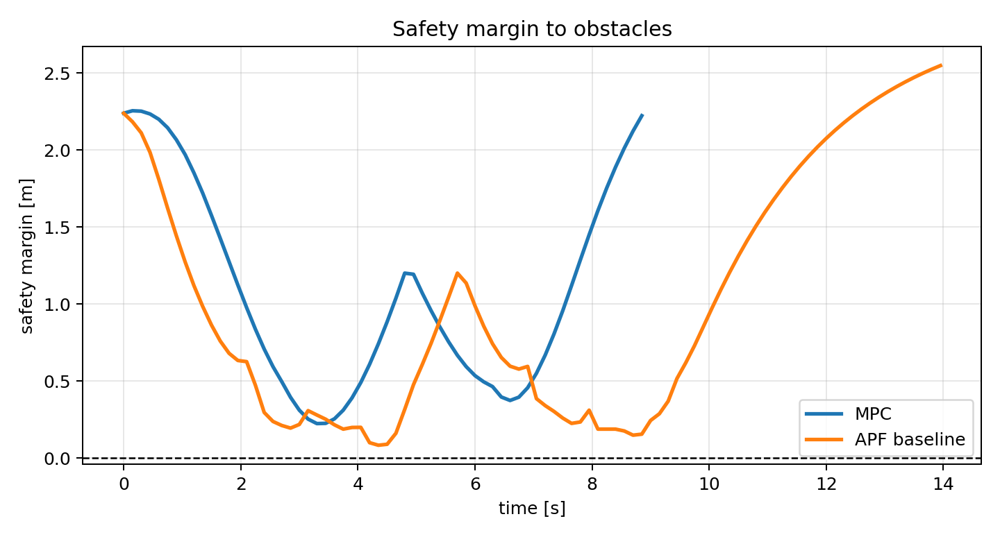

**Figure 4.** Safety margin on map 1. MPC keeps a larger safety margin for most of the run.

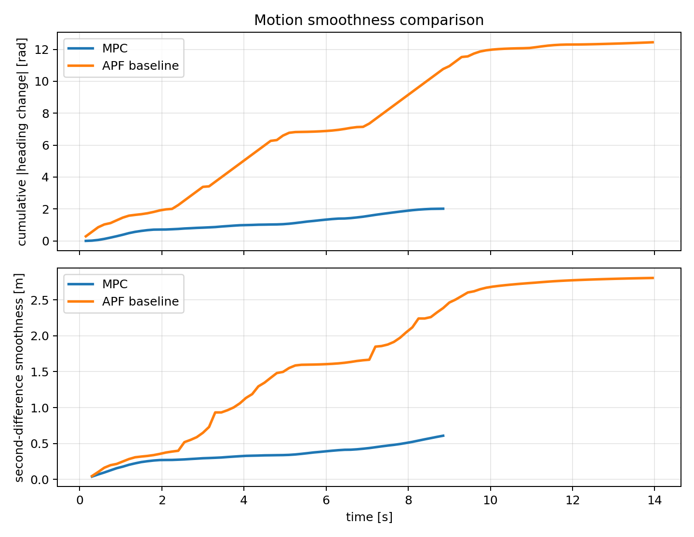

**Figure 5.** Heading and position-based smoothness on map 1. MPC has much lower accumulated heading change and second-difference smoothness.


**Figure 6.** Cumulative control effort on map 1. MPC uses substantially less effort than APF.

The representative map is a dynamic timing problem: moving obstacles cross the natural lower-left to upper-right route. MPC reacts earlier because it evaluates future obstacle locations across the horizon. APF still reaches the goal, but its local repulsion produces sharper steering corrections, more near-obstacle events, and larger accumulated effort.

---

## 9. Validation on Ten Maps

Ten maps are used to check that the comparison is not tied to one obstacle layout. Map 1 and map 3 are preserved from the previous validation set, while the other maps cover staggered corridors, narrow passages, delayed moving obstacles, diagonal motion, offset bottlenecks, open crossings, and final-approach interactions. All maps are checked for obstacle-obstacle separation before simulation.


**Map 1.** Central crossing obstacle corridor.

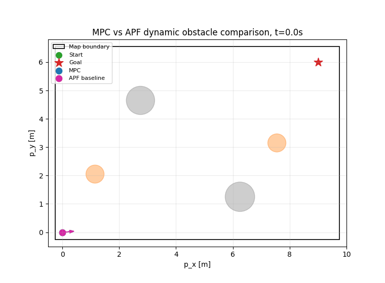

**Map 2.** Staggered corridor with diagonal and vertical crossings.

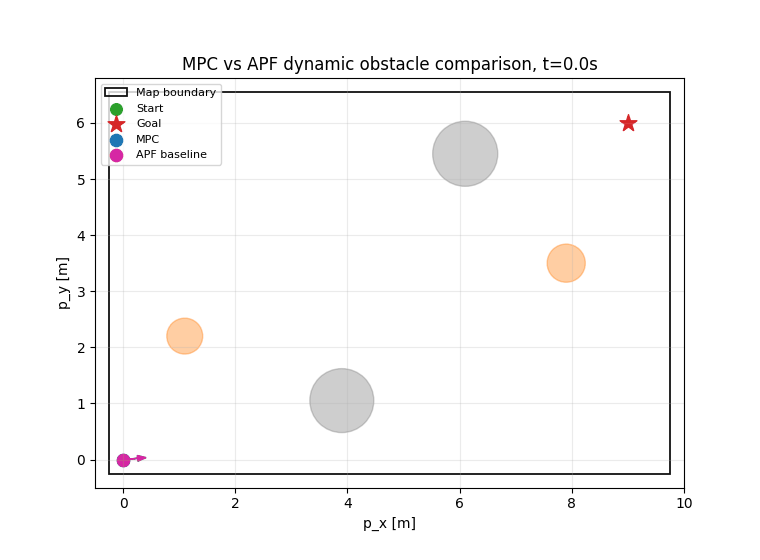

**Map 3.** Upper corridor with diagonal and vertical moving obstacle motion.

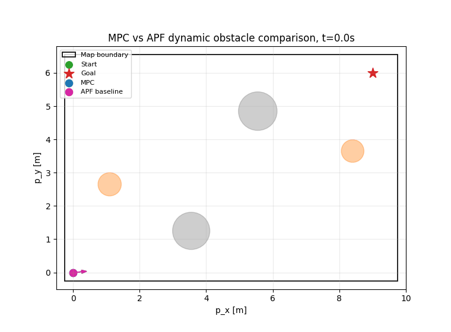

**Map 4.** Narrow feasible corridor with two crossing moving obstacles.

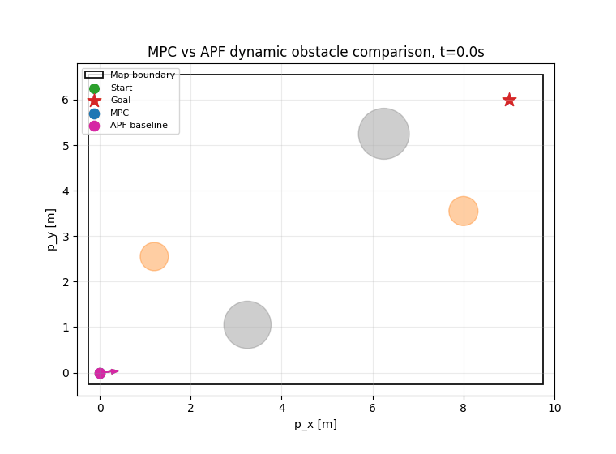

**Map 5.** Wide two-crossing passage with separated static gates.

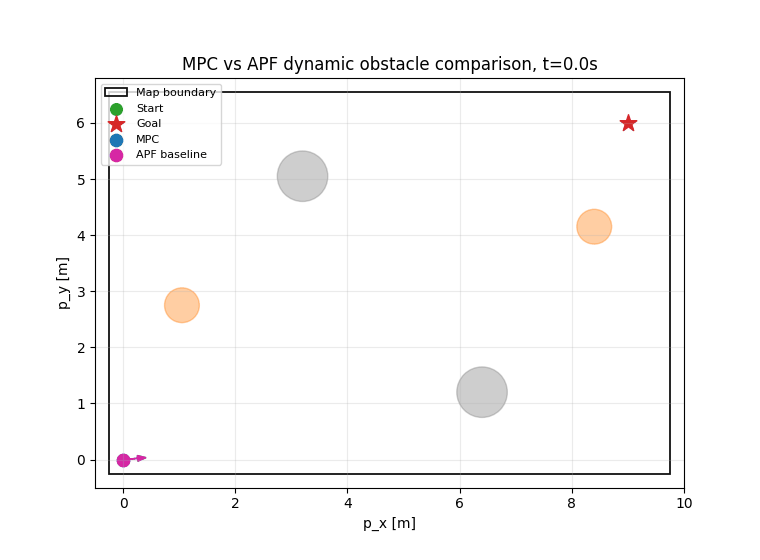

**Map 6.** Open map with two dynamic crossings and a stricter feasibility episode for MPC.

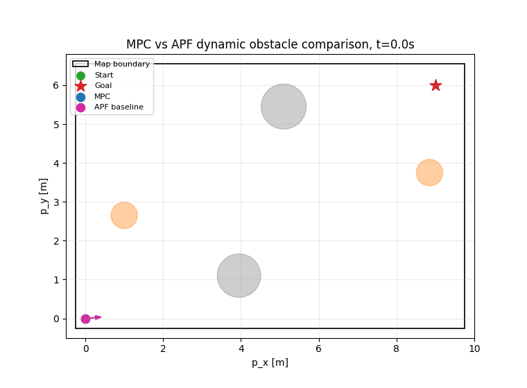

**Map 7.** Delayed moving obstacle near the goal approach.

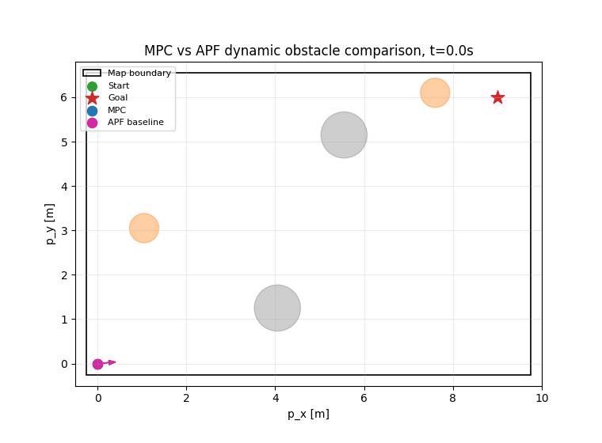

**Map 8.** Diagonal moving-obstacle path with a longer planned detour.

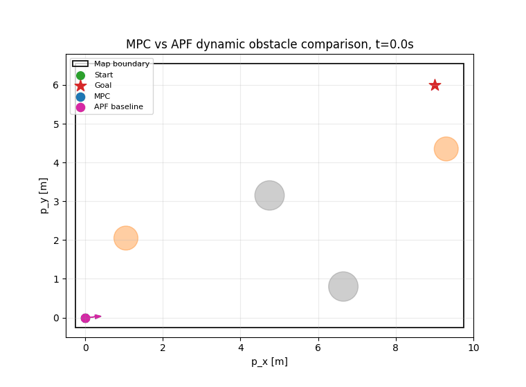

**Map 9.** Offset bottleneck with a vertical exit obstacle.

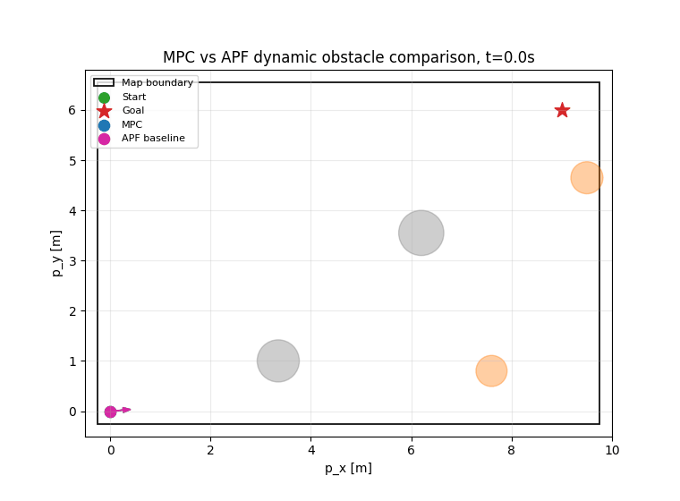

**Map 10.** Late crossing on the final approach to the goal.

All runs reached the goal with zero collisions and zero boundary violations. These omitted status columns are therefore summarized in text rather than repeated in the per-map table.

**Table 2.** Per-map MPC and APF comparison across the ten validation maps.

| Map | Method | Time to goal | Min clearance | Path length | Path efficiency | Control effort | Motion smoothness | Heading aggressiveness |
|---|---|---:|---:|---:|---:|---:|---:|---:|
| 1 | MPC | 8.85 | 0.344 | 10.708 | 1.010 | 7.102 | 0.609 | 3.901 |
| 1 | APF | 13.95 | 0.204 | 11.387 | 0.950 | 32.352 | 2.805 | 37.215 |
| 2 | MPC | 8.70 | 0.847 | 10.902 | 0.992 | 7.473 | 0.549 | 3.158 |
| 2 | APF | 11.25 | 0.590 | 11.112 | 0.973 | 18.997 | 1.046 | 15.209 |
| 3 | MPC | 8.55 | 0.527 | 10.704 | 1.011 | 7.151 | 0.500 | 3.271 |
| 3 | APF | 12.00 | 0.372 | 11.357 | 0.952 | 26.894 | 1.803 | 28.296 |
| 4 | MPC | 10.05 | 0.362 | 12.382 | 0.874 | 8.595 | 1.003 | 5.195 |
| 4 | APF | 16.65 | 0.249 | 13.567 | 0.797 | 42.088 | 3.701 | 40.321 |
| 5 | MPC | 8.55 | 0.283 | 10.711 | 1.010 | 7.336 | 0.531 | 3.583 |
| 5 | APF | 13.50 | 0.330 | 11.392 | 0.949 | 33.150 | 2.732 | 38.409 |
| 6 | MPC | 9.30 | 1.019 | 11.299 | 0.957 | 8.558 | 0.771 | 5.462 |
| 6 | APF | 13.20 | 0.326 | 12.282 | 0.881 | 25.393 | 1.627 | 18.723 |
| 7 | MPC | 8.85 | 0.692 | 10.901 | 0.992 | 7.481 | 0.703 | 4.170 |
| 7 | APF | 11.40 | 0.488 | 11.071 | 0.977 | 20.903 | 1.252 | 22.138 |
| 8 | MPC | 15.15 | 0.868 | 12.478 | 0.867 | 10.465 | 1.054 | 9.265 |
| 8 | APF | 13.65 | 0.477 | 12.224 | 0.885 | 29.301 | 1.796 | 28.926 |
| 9 | MPC | 8.85 | 1.069 | 11.015 | 0.982 | 7.660 | 0.617 | 3.638 |
| 9 | APF | 11.10 | 0.725 | 10.920 | 0.990 | 16.625 | 0.864 | 12.215 |
| 10 | MPC | 9.00 | 1.185 | 11.320 | 0.956 | 8.170 | 0.615 | 3.299 |
| 10 | APF | 11.10 | 0.605 | 10.990 | 0.984 | 17.776 | 0.883 | 14.247 |

**Table 3.** Average performance across ten validation maps.

| Method | Mean time to goal | Mean min clearance | Mean path length | Mean path efficiency | Mean control effort | Mean motion smoothness | Mean heading aggressiveness |
|---|---:|---:|---:|---:|---:|---:|---:|
| MPC | 9.585 | 0.720 | 11.242 | 0.965 | 7.999 | 0.695 | 4.494 |
| APF | 12.780 | 0.437 | 11.630 | 0.934 | 26.348 | 1.851 | 25.570 |

Both controllers solve all ten maps. MPC gives the stronger planned-behavior profile: higher average clearance, lower control effort, lower motion smoothness cost, and much lower heading aggressiveness. APF remains a valid reactive baseline and is slightly shorter on maps 9 and 10 and faster on map 8, but those runs still use higher steering effort and less planned motion. The MPC trade-off is computational cost from sampling and hard feasibility checks.

### MPC guarantees and limitations

The implemented MPC should not be interpreted as a proof of global asymptotic stability for all possible dynamic-obstacle configurations. Because the safe set changes with time and the wheel torques are bounded, there may exist configurations for which no feasible collision-free trajectory exists. Therefore, the appropriate guarantee is conditional: if the prediction model is accurate over the horizon and the constrained MPC problem remains feasible at each step, the controller preserves recursive feasibility by replanning from feasible predicted trajectories and keeps the robot inside the imposed safety constraints. The terminal cost and terminal distance constraint support practical convergence once obstacle avoidance no longer conflicts with goal tracking. The 10-map validation is therefore used as numerical evidence of practical safety and convergence, not as an unconditional proof for all environments.

---

## 10. Energy-Efficiency Analysis

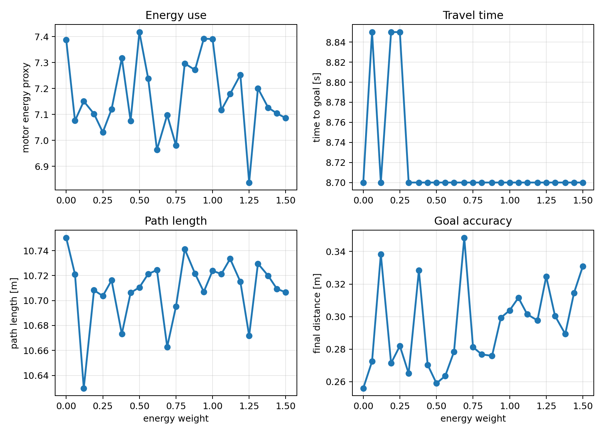

**Figure 7.** Energy penalty sweep on map 1 using 25 penalty weights from 0.00 to 1.50.

**Table 4.** Representative points from the energy-penalty sweep on map 1.

| Energy weight | Goal error | Time | Path length | Motor energy | Effort | Smoothness | Mean margin |
|---:|---:|---:|---:|---:|---:|---:|---:|
| 0.00 | 0.256 | 8.70 | 10.750 | 7.388 | 7.388 | 0.602 | 1.074 |
| 0.38 | 0.328 | 8.70 | 10.673 | 7.317 | 7.317 | 0.596 | 1.070 |
| 0.75 | 0.281 | 8.70 | 10.695 | 6.980 | 6.980 | 0.605 | 1.064 |
| 1.12 | 0.301 | 8.70 | 10.733 | 7.179 | 7.179 | 0.635 | 1.075 |
| 1.50 | 0.331 | 8.70 | 10.707 | 7.086 | 7.086 | 0.630 | 1.075 |

The wider coefficient range shows the practical trade-off more clearly. Moderate energy weights reduce the motor-energy proxy relative to the zero-weight case without changing the time to goal. Very high weights remain feasible in this scenario, but they can slightly increase travel time because the controller avoids aggressive torque usage. The trend is not perfectly monotonic because the optimizer is sampling-based and feasible candidates can change discretely from one weight to the next.

---

## 11. Project Structure

```text
project_4_mpc_obstacle_navigation/
├── README.md
├── requirements.txt
├── src/
│   ├── main.py
│   ├── robot_model.py
│   ├── environment.py
│   ├── mpc_controller.py
│   ├── potential_field_controller.py
│   ├── metrics.py
│   ├── visualization.py
│   └── experiments.py
├── figures/
├── animations/
└── configs/
```

**Table 5.** Source files and their roles.

| File | Purpose |
|---|---|
| `src/environment.py` | ten scenarios, robot parameters, obstacles, and validation |
| `src/robot_model.py` | differential-drive dynamics and rollout functions |
| `src/mpc_controller.py` | constrained sampling MPC with torque inputs |
| `src/potential_field_controller.py` | APF baseline |
| `src/experiments.py` | simulation loops and metrics |
| `src/visualization.py` | plots, robot schematic, and GIF generation |
| `src/main.py` | reproducible experiment pipeline |
| `configs/README.md` | note describing where parameters are defined |

---

## 12. How to Run

Install dependencies:

```bash
pip install -r requirements.txt
```

Run the project:

```bash
cd project_4_mpc_obstacle_navigation
python src/main.py
```

The command regenerates ten comparison GIFs in `animations/`, representative plots in `figures/`, and the energy-weight study in `figures/`.

---

## 13. Conclusion

This project implements a torque-based Model Predictive Controller for a differential-drive robot navigating among static and moving circular obstacles. The controller predicts future robot motion and future obstacle positions, rejects unsafe candidate trajectories, and optimizes wheel torques for goal tracking, smoothness, path efficiency, and motor-energy use.

The ten-map validation shows that the MPC controller reaches the goal in all tested scenarios while satisfying map boundaries and avoiding collisions. APF also reaches the goal in all scenarios, which makes the comparison fair, but MPC provides a better safety-efficiency trade-off: higher average clearance, lower effort, smoother motion, and lower heading aggressiveness.

The main limitation is computational cost. The sampling-based MPC is much slower than APF, and the guarantees are practical and scenario-tested rather than global. Future work could use a deterministic constrained optimizer, add uncertainty in obstacle prediction, and test denser multi-agent environments.

---

## 14. References

[1] Huang, J., Liu, Z., Zeng, J., Chi, X., & Su, H. (2023). Obstacle Avoidance for Unicycle-Modelled Mobile Robots with Time-varying Control Barrier Functions. arXiv:2307.08227.

---

## 15. AI Usage Declaration

This project used AI assistance to support code structuring, documentation drafting, experiment organization, and README editing. All mathematical formulations, simulation results, generated figures, and final project decisions were reviewed and validated by the authors.
